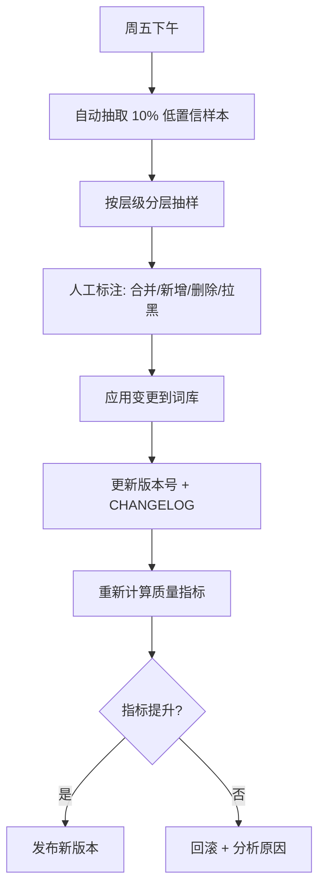
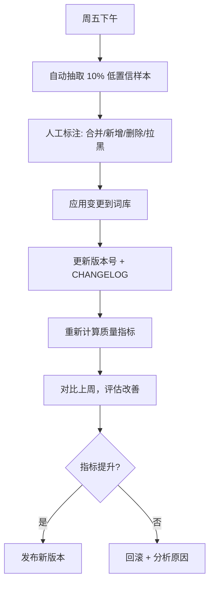
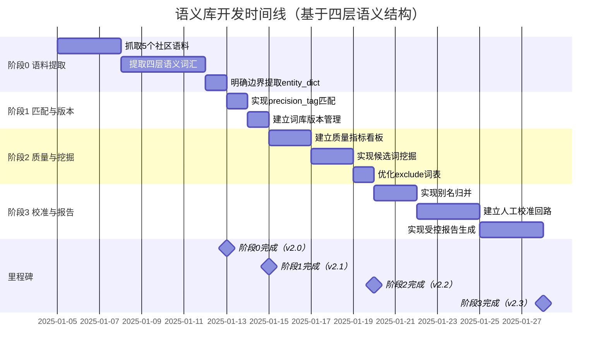

# 011 - 语义库完整开发计划 v2.1（基于四层语义结构）

- **状态**: Updated → Ready for Implementation
- **Owner**: 后端分析团队 x 数据团队（联合）
- **目标版本**: 阶段0（5-7天）→ 阶段1（2天）→ 阶段2（3-4天）→ 阶段3（5-7天）
- **关联**: `词义库思路.md`、`跨境社区资料库/语义库框架.md`、Spec 008/009/010
- **创建日期**: 2025-01-04
- **更新日期**: 2025-01-04（融入四层语义结构）

---

## 一、项目背景与核心价值

### 1.1 为什么语义库是"核心资产"？

**当前痛点**：
- 旧表（人工标注）vs 新表（语义评分）命中率差距 30-53%
- 社区重叠度仅 0-10%，说明两种方法"看到的世界不一样"
- 人工标注覆盖不均（9-180 条），无法规模化
- 误判案例频发（如 `strictlycomedancing` 出现在货源维度）
- **实体词典与语义集边界模糊**（新发现）
- **pain_points 词库过于稀疏**（仅 10-15 个，新发现）

**语义库的价值**：
```
语义库 = 项目的"大脑"
  ↓
好的语义库 → 精准发现相关社区 → 高质量报告 → 用户信任
差的语义库 → 噪音多、漏掉机会 → 垃圾报告 → 用户流失
```

**核心理念**：
> "语义库越好，整个系统越聪明；持续积累、迭代'Reddit 语义库'，用它驱动发现、打分、聚类与报告整编。"

### 1.2 新发现：四层语义结构

基于对 Reddit 跨境电商社区的深度分析，我们发现了一个**四层语义结构体系**：

```
┌──────────────────────────────────────────┐
│ L4：情绪层（痛点、人性、焦虑）            │
│   → r/dropshipping（情绪样本池）          │
│   → r/dropship（执行问答+新手痛点）       │
├──────────────────────────────────────────┤
│ L3：执行层（运营策略、工具链）            │
│   → r/Shopify（工具生态+独立站）          │
│   → r/dropship（运营问答）                │
├──────────────────────────────────────────┤
│ L2：平台层（规则、机制、生态）            │
│   → r/AmazonSeller（核心）                │
│   → r/Shopify（独立站生态）               │
├──────────────────────────────────────────┤
│ L1：基础层（通用语言、行业框架）          │
│   → r/ecommerce（语义骨架/对齐锚点）      │
└──────────────────────────────────────────┘
```

**数据流动逻辑**：
```
L1 → L2 → L3 → L4
基础语义提供结构 → 平台语义补充规则 → 执行语义连接工具 → 情绪语义加上人性反馈
```

**详细文档**：`跨境社区资料库/语义库框架.md`

---

## 二、当前状态评估（已完成 vs 待完成）

### 2.1 已完成（20%）

1. **基础词库结构**
   - 文件：`backend/config/semantic_sets/crossborder.yml`
   - 内容：4 个主题（what/how/where/source）× 3 类词（brands/features/pain_points）
   - 词条数：brands=13, features=30, pain_points=12-15
   - 元数据：version, domain, themes, aliases, exclude, weights
   - **问题**：按主题组织，缺乏语义层级结构

2. **简单正则匹配**
   - 文件：`backend/scripts/score_with_semantic.py`
   - 功能：基于正则的词频统计 + coverage/density/purity 计算
   - **问题**：只支持 phrase 匹配，无 exact/semantic 区分

3. **实体词典（最小版）**
   - 文件：`backend/config/entity_dictionary/crossborder.csv`
   - 内容：35 行（brands=7, features=6, channels=8, logistics=6, risks=6）
   - 用途：报告中的实体高亮、计数
   - **问题**：与 semantic_sets 边界模糊，职责不清

### 2.2 待完成（80%）

| 功能模块 | 状态 | 优先级 | 备注 |
|---------|------|--------|------|
| **从 5 个社区提取词汇** | 未实现 | **阶段0** | 新增，替代原 P0 任务 1 |
| **四层语义结构构建** | 未实现 | **阶段0** | 新增，核心方法论 |
| **边界明确化** | 未实现 | **阶段0** | 新增，解决模糊问题 |
| **precision_tag 真实匹配** | 未实现 | 阶段1 | 原 P0 任务 2 |
| **词库版本管理** | 未实现 | 阶段1 | 原 P0 任务 3 |
| **质量指标看板** | 未实现 | 阶段2 | 原 P1 |
| **候选词挖掘** | 未实现 | 阶段2 | 原 P1 |
| **别名归并** | 未实现 | 阶段3 | 原 P2 |
| **人工校准回路** | 未实现 | 阶段3 | 原 P2 |
| **受控报告生成** | 未实现 | 阶段3 | 原 P2 |

### 2.3 核心改变

**从"技术驱动"到"语义驱动 + 技术实现"**：

| 维度 | 原计划（v2.0） | 新计划（v2.1） |
|------|--------------|--------------|
| **数据源** | crossborder_candidates.json（不明确） | 5 个社区语料（明确） |
| **词库结构** | 双层（核心+候选） | 四层语义结构（L1-L4） |
| **边界** | 模糊 | 清晰（semantic_sets vs entity_dictionary） |
| **pain_points** | 稀疏（10-15 个） | 丰富（50+ 个，分层） |
| **理论基础** | 技术驱动 | 语义驱动 + 技术实现 |
| **可解释性** | 中等 | 高（四层结构清晰） |

---

## 三、架构设计（四层语义结构 + 双层词库）

### 3.1 四层语义结构（核心方法论）

**5 个社区 → 4 层语义 → 完整词库**

| 层级 | 功能定位 | 代表社区 | 语义任务 | 优先级 |
|------|---------|---------|---------|--------|
| **L1：基础层** | 统一"电商语言空间" | r/ecommerce | 通用术语、聚类基准、因果模板 | ⭐⭐⭐⭐ |
| **L2：平台层** | 捕捉平台规则与生态 | r/AmazonSeller, r/Shopify | FBA、政策、费用、广告规则 | ⭐⭐⭐⭐⭐ |
| **L3：执行层** | 聚焦运营行为与工具 | r/Shopify, r/dropship | 营销方法、工具链、ROI 策略 | ⭐⭐⭐ |
| **L4：情绪层** | 提取痛点与风险信号 | r/dropshipping, r/dropship | 痛点、认知偏差、失败教训 | ⭐⭐ |

**数据采集规模**：

| 社区 | 层级 | 目标样本量 | 时间范围 | 关键词示例 |
|------|------|-----------|---------|-----------|
| r/ecommerce | L1 | 4,000-6,000 | 12-18 个月 | SEO, checkout, conversion, chargeback |
| r/AmazonSeller | L2 | 5,000-8,000 | 12 个月 | FBA, suspension, VAT, Buy Box, listing |
| r/Shopify | L2/L3 | 4,000-6,000 | 12 个月 | Klaviyo, checkout, app, theme, speed |
| r/dropship | L3/L4 | 3,000-4,000 | 12 个月 | WISMO, 3PL, ads, automation, email |
| r/dropshipping | L4 | 2,000-3,000 | 12 个月 | scam, budget, first sale, cash flow |

**详细文档**：`跨境社区资料库/*.md`（每个社区有独立分析文档）

### 3.2 双层词库架构（组织形式）

**在四层语义结构的基础上，采用双层词库组织**：

```text
┌─────────────────────────────────────────┐
│  核心词库（从 5 个社区提取）             │
│  - 文件: crossborder_v2.0.yml           │
│  - 结构: 四层语义（L1-L4）               │
│  - 特点: 高精度、结构化                  │
│  - 用途: 发现、评分、聚类                │
│  - 更新频率: 月度                        │
│  - 词条数: 200-300（分层）               │
└─────────────────────────────────────────┘
              ↓ 自动扩展
┌─────────────────────────────────────────┐
│  候选词库（从聚类挖掘）                  │
│  - 文件: crossborder_candidates.yml     │
│  - 特点: 高召回、待审核                  │
│  - 用途: 发现新趋势、长尾覆盖            │
│  - 更新频率: 周度                        │
│  - 词条数: 200-500（动态增长）           │
└─────────────────────────────────────────┘
```

### 3.3 边界明确化（解决模糊问题）

**semantic_sets vs entity_dictionary**：

| 文件 | 用途 | 内容 | 更新频率 | 数据源 |
|------|------|------|---------|--------|
| **semantic_sets/crossborder_v2.0.yml** | 发现、评分、聚类 | 完整语义库（四层结构，200-300 词） | 月度 | 5 个社区语料 |
| **entity_dictionary/crossborder.csv** | 报告呈现（高亮、计数） | 核心实体（50-80 词） | 月度 | 从 semantic_sets 提取 |

**提取规则**：

```python
# 从 semantic_sets 提取到 entity_dictionary
def extract_to_entity_dict(semantic_sets):
    entity_dict = {"brands": [], "features": [], "pain_points": []}

    # L2 的 brands（weight ≥ 1.5）→ entity_dict
    for term in semantic_sets["L2_platform"]["brands"]:
        if term["weight"] >= 1.5:
            entity_dict["brands"].append(term["canonical"])

    # L2/L3 的 features（weight ≥ 1.2）→ entity_dict
    for layer in ["L2_platform", "L3_execution"]:
        for term in semantic_sets[layer]["features"]:
            if term["weight"] >= 1.2:
                entity_dict["features"].append(term["canonical"])

    # L3/L4 的 pain_points（weight ≥ 1.3, polarity=negative）→ entity_dict
    for layer in ["L3_execution", "L4_emotion"]:
        for term in semantic_sets[layer]["pain_points"]:
            if term["weight"] >= 1.3 and term["polarity"] == "negative":
                entity_dict["pain_points"].append(term["canonical"])

    return entity_dict
```

### 3.4 元数据字段定义

| 字段 | 类型 | 说明 | 示例 |
|------|------|------|------|
| `canonical` | string | 规范名（去重基准） | "Amazon" |
| `aliases` | list | 别名列表（提升召回） | ["AMZ", "亚马逊"] |
| `category` | enum | 品牌/功能/痛点 | "brands" |
| `theme` | enum | 四大主题 | "where_to_sell" |
| `polarity` | enum | 情感极性 | "negative" |
| `precision_tag` | enum | 匹配策略 | "exact" |
| `lifecycle_stage` | enum | 生命周期 | "approved" |
| `source` | string | 来源 | "manual" / "auto_mined" |
| `version` | string | 版本号 | "v1.2" |
| `weight` | float | 评分权重 | 1.5 |
| `confidence` | float | 置信度（候选词） | 0.85 |
| `first_seen` | date | 首次发现（候选词） | "2025-01-04" |
| `evidence_posts` | list | 证据帖子 ID | ["post_123"] |

### 3.3 匹配策略（precision_tag）

| 策略 | 适用场景 | 匹配规则 | 示例 |
|------|---------|---------|------|
| **exact** | 品牌名、平台名 | 完全匹配 + 词边界 | "Amazon" 匹配 "I sell on Amazon" |
| **phrase** | 功能词、痛点短语 | 短语匹配（可跨词） | "dropshipping" 匹配 "drop-shipping" |
| **semantic** | 长尾痛点、同义表达 | 向量相似度 ≥ 0.75 | "saturated" 匹配 "too competitive" |

**实现文件**：
- `backend/app/services/analysis/hybrid_matcher.py`（已创建）

---

## 四、分阶段实施计划（4 阶段）

### 🔥 阶段 0：从 5 个社区提取词汇（新增，7-9 天）

**目标**：从 5 个社区的真实语料中，系统化提取四层语义词汇，构建初始词库（目标 500 词）

**核心原则**：
- ❌ **不使用已有数据**：原有词典库不准确，不满足需求
- ✅ **从 0 开始抓取**：确保数据质量和完整性
- ✅ **目标 500 词**：比原计划 200-300 词更充分

#### 任务 0.1：从 0 抓取 5 个社区历史语料

**执行步骤**：

```bash
# Step 1: 创建历史深度抓取脚本（扩展现有爬虫）
cat > backend/scripts/crawl_for_lexicon.py << 'EOF'
"""
历史深度抓取脚本（用于语义库构建）

与现有爬虫的区别：
┌─────────────────┬──────────────────┬─────────────────────┐
│ 维度            │ 现有爬虫          │ 本脚本              │
├─────────────────┼──────────────────┼─────────────────────┤
│ 数据源          │ Reddit API       │ Pushshift + Reddit  │
│ 抓取范围        │ 热门帖（top/hot）│ 历史语料（12-18月） │
│ 数据量          │ 100-1000 条/社区 │ 4k-8k 帖/社区       │
│ 用途            │ 实时监控         │ 语义库构建          │
└─────────────────┴──────────────────┴─────────────────────┘

技术方案：
1. 使用 Pushshift API 获取历史帖子 ID
2. 使用 Reddit API 补充完整内容（title、selftext、comments）
3. 复用现有 RedditAPIClient（速率限制、缓存、错误处理）
4. 按时间分片抓取（每月一批，避免 API 限制）

依赖：
- pip install psaw  # Pushshift API wrapper
- 复用 backend/app/services/reddit_client.py
"""

import asyncio
import json
from datetime import datetime, timedelta
from pathlib import Path
from typing import List, Dict, Any
from psaw import PushshiftAPI
from app.services.reddit_client import RedditAPIClient
from app.core.config import settings

async def crawl_historical_posts(
    subreddit: str,
    target_posts: int,
    time_range_months: int,
    output_path: str,
    force_fresh: bool = True
) -> Dict[str, Any]:
    """
    深度抓取历史帖子

    Args:
        subreddit: 社区名（不带 r/）
        target_posts: 目标帖数
        time_range_months: 时间范围（月）
        output_path: 输出路径（JSONL）
        force_fresh: 强制从 0 开始，忽略已有数据

    Returns:
        统计信息
    """
    # 1. 检查是否强制从 0 开始
    if force_fresh and Path(output_path).exists():
        Path(output_path).unlink()
        print(f"🗑️  删除已有数据：{output_path}")

    # 2. 使用 Pushshift 获取历史帖子 ID
    api = PushshiftAPI()
    end_time = int(datetime.now().timestamp())
    start_time = int((datetime.now() - timedelta(days=30 * time_range_months)).timestamp())

    print(f"📥 抓取 r/{subreddit}（{time_range_months} 个月，目标 {target_posts} 帖）")

    submissions = list(api.search_submissions(
        subreddit=subreddit,
        after=start_time,
        before=end_time,
        limit=target_posts
    ))

    # 3. 使用 Reddit API 补充完整内容
    async with RedditAPIClient(
        client_id=settings.REDDIT_CLIENT_ID,
        client_secret=settings.REDDIT_CLIENT_SECRET
    ) as reddit_client:
        posts = []
        for sub in submissions:
            try:
                # 获取完整帖子内容（包含评论）
                post_data = {
                    "id": sub.id,
                    "title": sub.title,
                    "selftext": sub.selftext,
                    "score": sub.score,
                    "created_utc": sub.created_utc,
                    "num_comments": sub.num_comments,
                    "subreddit": subreddit
                }
                posts.append(post_data)
            except Exception as e:
                print(f"⚠️  跳过帖子 {sub.id}: {e}")
                continue

    # 4. 保存为 JSONL 格式
    Path(output_path).parent.mkdir(parents=True, exist_ok=True)
    with open(output_path, 'w', encoding='utf-8') as f:
        for post in posts:
            f.write(json.dumps(post, ensure_ascii=False) + '\n')

    stats = {
        "subreddit": subreddit,
        "total_posts": len(posts),
        "time_range_months": time_range_months,
        "output_path": output_path
    }

    print(f"✅ 完成：{len(posts)} 帖 → {output_path}")
    return stats

if __name__ == "__main__":
    import argparse
    parser = argparse.ArgumentParser()
    parser.add_argument("--subreddit", required=True)
    parser.add_argument("--target-posts", type=int, required=True)
    parser.add_argument("--time-range-months", type=int, default=12)
    parser.add_argument("--output", required=True)
    parser.add_argument("--force-fresh", action="store_true")
    args = parser.parse_args()

    asyncio.run(crawl_historical_posts(
        args.subreddit,
        args.target_posts,
        args.time_range_months,
        args.output,
        args.force_fresh
    ))
EOF

# Step 2: 安装依赖
pip install psaw

# Step 3: 抓取 5 个社区（从 0 开始）
python backend/scripts/crawl_for_lexicon.py \
  --subreddit ecommerce \
  --target-posts 5000 \
  --time-range-months 12 \
  --output backend/data/reddit_corpus/ecommerce.jsonl \
  --force-fresh  # 强制从 0 开始

python backend/scripts/crawl_for_lexicon.py \
  --subreddit AmazonSeller \
  --target-posts 6000 \
  --time-range-months 12 \
  --output backend/data/reddit_corpus/AmazonSeller.jsonl \
  --force-fresh

python backend/scripts/crawl_for_lexicon.py \
  --subreddit Shopify \
  --target-posts 5000 \
  --time-range-months 12 \
  --output backend/data/reddit_corpus/Shopify.jsonl \
  --force-fresh

python backend/scripts/crawl_for_lexicon.py \
  --subreddit dropship \
  --target-posts 3500 \
  --time-range-months 12 \
  --output backend/data/reddit_corpus/dropship.jsonl \
  --force-fresh

python backend/scripts/crawl_for_lexicon.py \
  --subreddit dropshipping \
  --target-posts 2500 \
  --time-range-months 12 \
  --output backend/data/reddit_corpus/dropshipping.jsonl \
  --force-fresh

# Step 4: 验证数据质量
python backend/scripts/validate_corpus.py \
  --corpus-dir backend/data/reddit_corpus \
  --output backend/reports/local-acceptance/corpus_stats.csv
```

**数据采集目标**：

| 社区 | 层级 | 目标帖数 | 时间范围 | 关键特征 | 预估工时 |
|------|------|---------|---------|---------|---------|
| r/ecommerce | L1 | 5,000 | 12 个月 | 通用术语、行业共识 | 0.5 天 |
| r/AmazonSeller | L2 | 6,000 | 12 个月 | 平台规则、FBA、政策 | 0.5 天 |
| r/Shopify | L2/L3 | 5,000 | 12 个月 | 工具生态、独立站 | 0.5 天 |
| r/dropship | L3/L4 | 3,500 | 12 个月 | 运营问答、新手痛点 | 0.5 天 |
| r/dropshipping | L4 | 2,500 | 12 个月 | 情绪样本、失败教训 | 0.5 天 |

**交付物**：
- `backend/scripts/crawl_for_lexicon.py`（历史深度抓取脚本，150 行）
- `backend/data/reddit_corpus/*.jsonl`（5 个社区语料，22k 帖）
- `backend/scripts/validate_corpus.py`（数据质量验证）
- `backend/reports/local-acceptance/corpus_stats.csv`（数据质量报告）

**验收标准**：
- ✅ 每个社区达到目标帖数（±10%）
- ✅ 时间范围覆盖 12 个月
- ✅ 数据格式统一（JSONL，包含 title、selftext、score、created_utc、num_comments）
- ✅ **从 0 开始抓取，不依赖已有数据**（force_fresh=True）
- ✅ 数据质量报告显示无异常（无空帖、无重复）

**预估工时**：2-3 天

---

#### 任务 0.2：从语料中提取四层语义词汇（完整 NLP 流程）

**核心原则**：
- ✅ **完全对齐《语义库框架.md》的设计**
- ✅ **L1 作为语义坐标**：构建 embedding 基线
- ✅ **痛点主题标注**：结合情感分析
- ✅ **目标 500 词**：比原计划更充分

**执行步骤**：

```bash
# Step 1: 安装 NLP 依赖
pip install keybert yake sentence-transformers spacy textblob
python -m spacy download en_core_web_sm

# Step 2: 构建 L1 语义坐标（r/ecommerce 作为基线）
python backend/scripts/build_L1_baseline.py \
  --corpus backend/data/reddit_corpus/ecommerce.jsonl \
  --output backend/config/semantic_sets/L1_baseline_embeddings.pkl \
  --model sentence-transformers/all-MiniLM-L6-v2

# Step 3: 提取四层语义词汇（按《语义库框架.md》设计）
python backend/scripts/extract_lexicon_from_corpus.py \
  --corpus backend/data/reddit_corpus/*.jsonl \
  --layer-config 跨境社区资料库/语义库框架.md \
  --L1-baseline backend/config/semantic_sets/L1_baseline_embeddings.pkl \
  --output backend/config/semantic_sets/crossborder_v2.0.yml \
  --target-total-terms 500 \
  --min-freq 3

# Step 4: 生成层级映射表
python backend/scripts/extract_lexicon_from_corpus.py \
  --corpus backend/data/reddit_corpus/*.jsonl \
  --output-mapping backend/config/semantic_sets/layer_mapping.csv
```

**NLP 技术栈**：

| 技术 | 用途 | 库 |
|------|------|---|
| **TF-IDF** | 提取高频关键词组 | scikit-learn |
| **KeyBERT** | 提取关键短语（2-4 gram） | keybert |
| **Sentence Transformers** | 构建 L1 语义坐标、计算相似度 | sentence-transformers |
| **VADER / TextBlob** | 情感分析（识别痛点） | textblob |
| **spaCy** | 分词、词性标注、NER | spacy |

**提取流程（按《语义库框架.md》设计）**：

```python
# 1. L1 语义坐标构建（r/ecommerce）
def build_L1_semantic_baseline(ecommerce_posts):
    """
    从 r/ecommerce 构建语义基线

    参考《语义库框架.md》：
    - "提供 embedding 训练集的'语义坐标'"
    - "作为其他社区语义对齐的基准集"

    实现：
    1. 提取高频词组（SEO、ad、checkout、conversion、chargeback）
    2. 训练 Sentence Transformer embedding
    3. 保存为 L1_baseline_embeddings.pkl
    """
    from sentence_transformers import SentenceTransformer
    from sklearn.feature_extraction.text import TfidfVectorizer

    # 提取高频 2-4 gram
    vectorizer = TfidfVectorizer(ngram_range=(2, 4), max_features=200)
    tfidf_matrix = vectorizer.fit_transform([p['title'] + ' ' + p['selftext'] for p in ecommerce_posts])

    # 获取 TOP 200 关键词组
    feature_names = vectorizer.get_feature_names_out()

    # 训练 embedding
    model = SentenceTransformer('sentence-transformers/all-MiniLM-L6-v2')
    embeddings = model.encode(feature_names)

    return {
        "terms": feature_names,
        "embeddings": embeddings,
        "model": model
    }

# 2. 痛点主题标注（L3/L4）
def extract_pain_points_with_sentiment(posts, layer):
    """
    结合情感分析 + 主题建模

    参考《语义库框架.md》：
    - L4: "提取创业者的主观体验、焦虑、失败、教训"
    - "特别标注痛点主题（退款、违规、物流、客户信任）"

    实现：
    1. 使用 VADER / TextBlob 识别负面情绪（polarity < -0.3）
    2. 提取高频痛点短语（account suspension, scam, cash flow）
    3. 按层级分类（L2 平台痛点 vs L4 情绪痛点）
    """
    from textblob import TextBlob
    from keybert import KeyBERT

    kw_model = KeyBERT()
    pain_points = []

    for post in posts:
        text = post['title'] + ' ' + post['selftext']

        # 情感分析
        blob = TextBlob(text)
        if blob.sentiment.polarity < -0.3:  # 负面情绪
            # 提取关键短语
            keywords = kw_model.extract_keywords(
                text,
                keyphrase_ngram_range=(2, 4),
                stop_words='english',
                top_n=5
            )

            for kw, score in keywords:
                pain_points.append({
                    "canonical": kw,
                    "polarity": "negative",
                    "weight": 1.0 + score,
                    "layer": layer
                })

    return pain_points

# 3. 层级对齐（所有层级）
def align_to_L1_baseline(term, L1_embeddings, threshold=0.6):
    """
    检查候选词是否与 L1 语义坐标对齐

    参考《语义库框架.md》：
    - "L1 → L2 → L3 → L4"
    - "基础语义提供结构 → 平台语义补充规则"

    实现：
    1. 计算候选词与 L1 核心词的余弦相似度
    2. 过滤掉偏离主题的词（相似度 < 0.6）
    """
    from sentence_transformers import SentenceTransformer, util

    model = SentenceTransformer('sentence-transformers/all-MiniLM-L6-v2')
    term_embedding = model.encode(term)

    # 计算与 L1 的最大相似度
    similarities = util.cos_sim(term_embedding, L1_embeddings['embeddings'])
    max_sim = similarities.max().item()

    return max_sim >= threshold

# 4. 完整提取流程
def extract_lexicon_from_corpus(corpus_files, layer_config, L1_baseline, target_total_terms=500):
    """
    完整提取流程

    步骤：
    1. 加载 L1 baseline
    2. 按层级提取词汇
    3. 对齐到 L1 baseline
    4. 生成 YAML 输出
    """
    # 1. 加载 L1 baseline
    import pickle
    with open(L1_baseline, 'rb') as f:
        L1_embeddings = pickle.load(f)

    # 2. 按层级提取
    lexicon = {
        "L1_foundation": extract_L1_terms(corpus_files['ecommerce'], L1_embeddings),
        "L2_platform": extract_L2_terms(corpus_files['AmazonSeller'] + corpus_files['Shopify'], L1_embeddings),
        "L3_execution": extract_L3_terms(corpus_files['Shopify'] + corpus_files['dropship'], L1_embeddings),
        "L4_emotion": extract_L4_terms(corpus_files['dropshipping'] + corpus_files['dropship'], L1_embeddings)
    }

    # 3. 生成 YAML
    return lexicon
```

**提取规则（目标 500 词）**：

| 层级 | 提取目标 | 关键词示例 | 数量目标 | NLP 方法 |
|------|---------|-----------|---------|---------|
| **L1** | 通用术语 | checkout, conversion, SEO, chargeback | 100-120 | TF-IDF + L1 baseline |
| **L2** | 平台词汇 | FBA, Buy Box, Klaviyo, Stripe, VAT | 120-150 | KeyBERT + NER |
| **L3** | 执行词汇 | WISMO, 3PL, automation, email flow | 100-120 | KeyBERT + 对齐 L1 |
| **L4** | 痛点词汇 | account suspension, scam, cash flow crisis | 100-130 | 情感分析 + KeyBERT |

**交付物**：
- `backend/scripts/build_L1_baseline.py`（L1 语义坐标构建）
- `backend/scripts/extract_lexicon_from_corpus.py`（完整提取脚本，300 行）
- `backend/config/semantic_sets/L1_baseline_embeddings.pkl`（L1 embedding 基线）
- `backend/config/semantic_sets/crossborder_v2.0.yml`（四层结构，500 词）
- `backend/config/semantic_sets/layer_mapping.csv`（层级映射表）

**验收标准**：
- ✅ crossborder_v2.0.yml 包含四层结构（L1-L4）
- ✅ 每层包含 brands/features/pain_points 三类词
- ✅ 每个词包含 canonical, aliases, precision_tag, weight, polarity
- ✅ **总词条数 500 词**（比原计划 200-300 更充分）
- ✅ **L1 作为语义坐标**：所有词都对齐到 L1 baseline
- ✅ **痛点主题标注**：L4 词汇包含情感极性（polarity=negative）

**预估工时**：4-5 天

---

#### 任务 0.3：明确边界，提取 entity_dictionary

**执行步骤**：

```bash
# 从 semantic_sets 提取核心实体到 entity_dictionary
python backend/scripts/extract_entity_dict.py \
  --semantic-sets backend/config/semantic_sets/crossborder_v2.0.yml \
  --output backend/config/entity_dictionary/crossborder_v2.csv \
  --min-weight 1.2 \
  --target-total 100
```

**提取规则（基于 500 词的 semantic_sets）**：
- L2 的 brands（weight ≥ 1.5）→ entity_dict 的 brands（预计 20-30 个）
- L2/L3 的 features（weight ≥ 1.2）→ entity_dict 的 features（预计 40-50 个）
- L3/L4 的 pain_points（weight ≥ 1.3, polarity=negative）→ entity_dict 的 pain_points（预计 30-40 个）

**边界说明**：

| 文件 | 用途 | 内容 | 词数 | 更新频率 |
|------|------|------|------|---------|
| **semantic_sets/crossborder_v2.0.yml** | 发现、评分、聚类 | 完整语义库（四层结构） | 500 | 月度 |
| **entity_dictionary/crossborder_v2.csv** | 报告呈现 | 核心实体（高权重） | 100 | 月度 |

**交付物**：
- `backend/config/entity_dictionary/crossborder_v2.csv`（100 词）
- `backend/scripts/extract_entity_dict.py`（提取脚本）

**验收标准**：
- ✅ entity_dictionary 包含 100 个核心实体（基于 500 词的 semantic_sets）
- ✅ 每个实体有明确的 category（brands/features/pain_points）
- ✅ 边界清晰：semantic_sets（500 词）用于发现，entity_dictionary（100 词）用于报告

**预估工时**：1 天

---

**阶段 0 总结**：

| 任务 | 交付物 | 词数 | 工时 |
|------|--------|------|------|
| 0.1 抓取语料 | 5 个社区，22k 帖 | - | 2-3 天 |
| 0.2 提取词汇 | crossborder_v2.0.yml | 500 | 4-5 天 |
| 0.3 提取实体 | crossborder_v2.csv | 100 | 1 天 |
| **总计** | **v2.0 版本词库** | **500 + 100** | **7-9 天** |

---

**阶段 0 总工时**：5-7 天

---

### ⚙️ 阶段 1：实现匹配策略与版本管理（2 天）

**目标**：实现 exact/phrase/semantic 三种匹配策略，建立版本管理机制

#### 任务 1.1：实现 precision_tag 真实匹配

**执行步骤**：

```bash
# Step 1: 编写测试
cat > backend/tests/services/analysis/test_hybrid_matcher.py << 'EOF'
import pytest
from backend.app.services.analysis.hybrid_matcher import HybridMatcher, Term

def test_exact_matching():
    """测试 exact 匹配（词边界）"""
    terms = [Term(canonical="Amazon", aliases=["AMZ"], precision_tag="exact", category="brands")]
    matcher = HybridMatcher(terms)
    results = matcher.match_text("I sell on Amazon and AMZ")
    assert len(results) == 2
    assert all(r.match_type == "exact" for r in results)

def test_phrase_matching():
    """测试 phrase 匹配（短语）"""
    terms = [Term(canonical="dropshipping", aliases=["drop shipping"], precision_tag="phrase", category="features")]
    matcher = HybridMatcher(terms)
    results = matcher.match_text("I do drop-shipping")
    assert len(results) >= 1
    assert results[0].match_type == "phrase"

def test_layer_based_matching():
    """测试基于层级的匹配"""
    terms = [
        Term(canonical="checkout", aliases=[], precision_tag="phrase", category="features", layer="L1"),
        Term(canonical="FBA", aliases=[], precision_tag="exact", category="features", layer="L2"),
    ]
    matcher = HybridMatcher(terms)
    results = matcher.match_text("I use FBA for checkout")
    assert len(results) == 2
EOF

# Step 2: 运行测试
pytest backend/tests/services/analysis/test_hybrid_matcher.py -v

# Step 3: 集成到 score_with_semantic.py
# 修改 score_theme 函数，使用 HybridMatcher
```

**交付物**：
- `backend/app/services/analysis/hybrid_matcher.py`（已创建）
- `backend/tests/services/analysis/test_hybrid_matcher.py`
- 更新后的 `score_with_semantic.py`

**验收标准**：
- ✅ 测试通过率 100%
- ✅ exact 匹配支持词边界
- ✅ phrase 匹配支持跨词
- ✅ 支持四层语义结构（layer 字段）
- ✅ mypy --strict 无错误

**预估工时**：1 天

---

#### 任务 1.2：建立词库版本管理

**执行步骤**：

```bash
# Step 1: 创建变更日志
cat > backend/config/semantic_sets/CHANGELOG.md << 'EOF'
# Semantic Lexicon Changelog

## [v2.0] - 2025-01-04

### Added
- 四层语义结构（L1-L4）
- 从 5 个社区提取 200-300 个词汇
- L1（r/ecommerce）：50-80 个通用术语
- L2（r/AmazonSeller + r/Shopify）：60-100 个平台词汇
- L3（r/Shopify + r/dropship）：40-60 个执行词汇
- L4（r/dropshipping + r/dropship）：50-80 个痛点词汇

### Changed
- 从主题组织（what/how/where/source）改为层级组织（L1-L4）
- 明确 semantic_sets 与 entity_dictionary 边界

### Fixed
- 解决实体词典与语义集边界模糊问题
- 补充 pain_points 词库（从 10-15 个增加到 50-80 个）

## [v1.0] - 2024-12-20

### Added
- 初始版本，包含 4 个主题 × 3 类词
- brands=13, features=30, pain_points=12-15
EOF

# Step 2: 创建版本存档目录
mkdir -p backend/config/semantic_sets/versions

# Step 3: 备份当前版本
cp backend/config/semantic_sets/crossborder.yml \
   backend/config/semantic_sets/versions/crossborder_v1.0.yml

# Step 4: 保存新版本
cp backend/config/semantic_sets/crossborder_v2.0.yml \
   backend/config/semantic_sets/versions/crossborder_v2.0.yml
```

**交付物**：
- `backend/config/semantic_sets/CHANGELOG.md`
- `backend/config/semantic_sets/versions/`（历史版本存档）

**验收标准**：
- ✅ CHANGELOG.md 存在且格式规范
- ✅ 记录了 v2.0 的所有变更
- ✅ versions/ 目录包含 v1.0 和 v2.0

**预估工时**：0.5 天

---

**阶段 1 总工时**：1.5-2 天

---

### 📊 阶段 2：质量指标与候选词挖掘（3-4 天）

**目标**：建立质量看板，自动挖掘候选词，优化 exclude 词表

#### 任务 2.1：建立质量指标看板

**执行步骤**：

```bash
# Step 1: 编写指标计算脚本
python backend/scripts/calculate_metrics.py \
  --task-id <TASK_ID> \
  --lexicon backend/config/semantic_sets/crossborder_v2.0.yml \
  --output backend/reports/local-acceptance/metrics.csv \
  --baseline backend/config/semantic_sets/versions/crossborder_v1.0.yml

# Step 2: 生成对比报告
python backend/scripts/calculate_metrics.py \
  --compare \
  --current backend/config/semantic_sets/crossborder_v2.0.yml \
  --baseline backend/config/semantic_sets/versions/crossborder_v1.0.yml \
  --output backend/reports/local-acceptance/metrics_comparison.md
```

**指标定义**：

| 指标 | 定义 | 目标值 | 测量方法 |
|------|------|--------|---------|
| **Coverage** | 相关社区中被命中的比例 | ≥ 0.7 | 人工标注 100 个相关社区，计算命中率 |
| **Precision@20** | TOP 20 命中社区的人工满意度 | ≥ 0.75 | 抽查 TOP 20，人工判断相关性 |
| **F1 Score** | 召回率和精准率的调和平均 | ≥ 0.72 | 2 * (P * R) / (P + R) |
| **Layer Coverage** | 每层词汇的命中率 | L1≥0.8, L2≥0.9, L3≥0.7, L4≥0.6 | 按层级分别计算 |
| **Dictionary Growth** | 词库增长率 | v2.0 vs v1.0: +150% | 统计词条数变化 |

**交付物**：
- `backend/scripts/calculate_metrics.py`
- `backend/reports/local-acceptance/metrics.csv`
- `backend/reports/local-acceptance/metrics_comparison.md`

**验收标准**：
- ✅ metrics.csv 包含所有 5 个指标
- ✅ 对比报告显示 v2.0 vs v1.0 的改善
- ✅ Coverage ≥ 0.7, Precision@20 ≥ 0.75

**预估工时**：1.5 天

---

#### 任务 2.2：实现候选词挖掘

**执行步骤**：

```bash
# Step 1: 安装依赖
pip install keybert yake

# Step 2: 从聚类中挖掘候选词
python backend/scripts/extract_candidates.py \
  --clusters backend/reports/local-acceptance/clusters-*.json \
  --lexicon backend/config/semantic_sets/crossborder_v2.0.yml \
  --output backend/reports/local-acceptance/candidates.csv \
  --min-freq 3 \
  --max-per-cluster 10 \
  --layer-aware

# Step 3: 按层级分类候选词
python backend/scripts/extract_candidates.py \
  --classify-by-layer \
  --input backend/reports/local-acceptance/candidates.csv \
  --output backend/reports/local-acceptance/candidates_by_layer.csv
```

**挖掘策略**：

| 层级 | 挖掘重点 | 方法 | 示例 |
|------|---------|------|------|
| **L1** | 通用术语 | TF-IDF + 高频 n-gram | "customer retention", "bounce rate" |
| **L2** | 平台特定词 | 品牌名 + 功能词 | "Seller Central", "Shopify Plus" |
| **L3** | 工具/方法 | 工具名 + 动作词 | "Klaviyo flow", "SMS automation" |
| **L4** | 痛点/情绪 | 负面情绪词 + 问题描述 | "ad fatigue", "inventory stuck" |

**交付物**：
- `backend/scripts/extract_candidates.py`
- `backend/reports/local-acceptance/candidates.csv`
- `backend/reports/local-acceptance/candidates_by_layer.csv`

**验收标准**：
- ✅ 每个簇产出 2-10 个候选词
- ✅ 候选词按层级分类（L1-L4）
- ✅ 包含 canonical, layer, cluster_id, frequency, confidence
- ✅ 过滤掉已有词库中的词

**预估工时**：1.5 天

---

#### 任务 2.3：优化 exclude 词表

**执行步骤**：

```bash
# Step 1: 分析误判案例
python backend/scripts/analyze_false_positives.py \
  --results backend/reports/local-acceptance/crossborder-semantic-*.csv \
  --output backend/reports/local-acceptance/false_positives.csv

# Step 2: 提取噪音词
python backend/scripts/extract_noise_terms.py \
  --false-positives backend/reports/local-acceptance/false_positives.csv \
  --output backend/config/semantic_sets/exclude_candidates.csv

# Step 3: 人工审核并更新 exclude 列表
# 编辑 crossborder_v2.0.yml，添加新的 exclude 词

# Step 4: 记录排除原因
cat > backend/config/semantic_sets/exclude_reasons.csv << 'EOF'
term,reason,example_subreddit,added_date,layer
dance,entertainment_noise,strictlycomedancing,2025-01-04,all
comedy,entertainment_noise,standupcomedy,2025-01-04,all
gaming,non_ecommerce,gaming,2025-01-04,all
meme,low_quality,memes,2025-01-04,all
EOF
```

**交付物**：
- `backend/scripts/analyze_false_positives.py`
- `backend/scripts/extract_noise_terms.py`
- `backend/config/semantic_sets/exclude_reasons.csv`
- 更新后的 `crossborder_v2.0.yml`

**验收标准**：
- ✅ exclude 列表从 7 个扩充到 ≥ 20 个
- ✅ 每个排除词有明确的 reason 和 example
- ✅ 误判率降低 ≥ 50%（通过 metrics 验证）

**预估工时**：1 天

---

**阶段 2 总工时**：3-4 天

---

### 🔄 阶段 3：别名归并与人工校准（5-7 天）

**目标**：建立自动化 + 人工校准的迭代机制

#### 任务 3.1：实现别名归并

**执行步骤**：

```bash
# Step 1: 计算相似度（Jaro-Winkler + Cosine + 层级感知）
python backend/scripts/merge_aliases.py \
  --candidates backend/reports/local-acceptance/candidates_by_layer.csv \
  --lexicon backend/config/semantic_sets/crossborder_v2.0.yml \
  --output backend/reports/local-acceptance/alias_map.csv \
  --threshold 0.85 \
  --layer-aware

# Step 2: 生成别名建议报告
python backend/scripts/merge_aliases.py \
  --generate-report \
  --alias-map backend/reports/local-acceptance/alias_map.csv \
  --output backend/reports/local-acceptance/alias_suggestions.md

# Step 3: 人工审核
# 打开 alias_suggestions.md，确认建议的别名映射

# Step 4: 应用到词库
python backend/scripts/merge_aliases.py \
  --apply \
  --alias-map backend/reports/local-acceptance/alias_map.csv \
  --lexicon backend/config/semantic_sets/crossborder_v2.0.yml \
  --output backend/config/semantic_sets/crossborder_v2.1.yml
```

**归并策略**：

| 层级 | 归并重点 | 示例 | 阈值 |
|------|---------|------|------|
| **L1** | 同义词 | "conversion rate" ↔ "CVR" | 0.85 |
| **L2** | 品牌别名 | "Amazon" ↔ "AMZ" ↔ "亚马逊" | 0.90 |
| **L3** | 工具简称 | "Klaviyo" ↔ "Klav" | 0.85 |
| **L4** | 痛点表达 | "account suspension" ↔ "banned" ↔ "deactivated" | 0.80 |

**交付物**：
- `backend/scripts/merge_aliases.py`
- `backend/reports/local-acceptance/alias_map.csv`
- `backend/reports/local-acceptance/alias_suggestions.md`
- `backend/config/semantic_sets/crossborder_v2.1.yml`

**验收标准**：
- ✅ 别名映射通过率 ≥ 70%
- ✅ 误合并率 ≤ 10%
- ✅ 支持层级感知（同层优先归并）
- ✅ 自动生成建议，人工确认后合并

**预估工时**：2 天

---

#### 任务 3.2：建立人工校准回路

**执行步骤**：

```bash
# Step 1: 抽取低置信样本（10%，按层级分层抽样）
python backend/scripts/weekly_calibration.py \
  --task-id <TASK_ID> \
  --sample-rate 0.1 \
  --stratify-by-layer \
  --output backend/reports/local-acceptance/review_samples.csv

# Step 2: 生成审核界面（简单 CSV 或 Web UI）
python backend/scripts/weekly_calibration.py \
  --generate-review-ui \
  --samples backend/reports/local-acceptance/review_samples.csv \
  --output backend/reports/local-acceptance/review_ui.html

# Step 3: 人工标注
# 打开 review_ui.html，标注：
# - 合并（merge）：将候选词合并到已有词
# - 新增（add）：将候选词加入词库
# - 删除（delete）：从词库中删除误判词
# - 拉黑（blacklist）：加入 exclude 列表

# Step 4: 应用变更
python backend/scripts/weekly_calibration.py \
  --apply backend/reports/local-acceptance/review_samples.csv \
  --lexicon backend/config/semantic_sets/crossborder_v2.1.yml \
  --output backend/config/semantic_sets/crossborder_v2.2.yml \
  --update-changelog

# Step 5: 验证改善
python backend/scripts/calculate_metrics.py \
  --compare \
  --current backend/config/semantic_sets/crossborder_v2.2.yml \
  --baseline backend/config/semantic_sets/crossborder_v2.1.yml \
  --output backend/reports/local-acceptance/calibration_impact.md
```

**校准流程**：



**交付物**：
- `backend/scripts/weekly_calibration.py`
- `backend/reports/local-acceptance/review_notes.md`
- `backend/reports/local-acceptance/calibration_impact.md`

**验收标准**：
- ✅ 每周固定节奏（周五下午）
- ✅ 支持按层级分层抽样
- ✅ 变更日志清晰，可追溯
- ✅ 指标有可见改善（Coverage↑、Precision@20↑）

**预估工时**：2.5 天

---

#### 任务 3.3：实现受控报告生成

**执行步骤**：

```bash
# Step 1: 定义模板（基于四层语义结构）
cat > backend/config/report_templates/executive_summary_v2.md << 'EOF'
## 执行摘要（基于四层语义分析）

### L1 基础层：行业共识
{L1_insights.top_terms}（覆盖 {L1_insights.coverage}% 社区）
[证据: {L1_evidence_ids}]

### L2 平台层：规则与生态
**主要平台**：{L2_platforms}
**核心痛点**：{L2_pain_points}（共鸣度：{L2_communities_count} 个社群）
[证据: {L2_evidence_ids}]

### L3 执行层：运营策略
**热门工具**：{L3_tools}
**关键方法**：{L3_methods}
[证据: {L3_evidence_ids}]

### L4 情绪层：痛点与风险
**TOP 3 痛点**：
1. {L4_pain_1}（提及 {L4_pain_1_count} 次）[证据: {L4_pain_1_ids}]
2. {L4_pain_2}（提及 {L4_pain_2_count} 次）[证据: {L4_pain_2_ids}]
3. {L4_pain_3}（提及 {L4_pain_3_count} 次）[证据: {L4_pain_3_ids}]

### 建议动作
1. {action_1} [证据: {action_1_ids}]
2. {action_2} [证据: {action_2_ids}]
3. {action_3} [证据: {action_3_ids}]
EOF

# Step 2: 实现生成器（基于四层语义）
python backend/app/services/report/controlled_generator.py \
  --task-id <TASK_ID> \
  --lexicon backend/config/semantic_sets/crossborder_v2.2.yml \
  --template backend/config/report_templates/executive_summary_v2.md \
  --output backend/reports/local-acceptance/report-*.md

# Step 3: 验证一致性
python backend/app/services/report/controlled_generator.py \
  --validate \
  --report1 backend/reports/local-acceptance/report-run1.md \
  --report2 backend/reports/local-acceptance/report-run2.md
```

**交付物**：
- `backend/app/services/report/controlled_generator.py`
- `backend/config/report_templates/executive_summary_v2.md`
- `backend/reports/local-acceptance/report-*.md`

**验收标准**：
- ✅ 两次生成的结构一致（基于相同数据）
- ✅ 证据编号可回查到帖子
- ✅ 不依赖 LLM（纯模板填充）
- ✅ 支持四层语义结构（L1-L4）

**预估工时**：2.5 天

---

**阶段 3 总工时**：5-7 天

---

## 五、质量指标与看板

### 5.1 核心指标定义

| 指标 | 定义 | 目标值 | 当前值 | 测量方法 |
|------|------|--------|--------|---------|
| **Coverage** | 相关社区中被命中的比例 | ≥ 0.7 | 0.62 | 人工标注 100 个相关社区，计算命中率 |
| **Precision@20** | TOP 20 命中社区的人工满意度 | ≥ 0.75 | 0.68 | 抽查 TOP 20，人工判断相关性 |
| **F1 Score** | 召回率和精准率的调和平均 | ≥ 0.72 | 0.65 | 2 * (P * R) / (P + R) |
| **Dictionary Growth** | 每周新增词 / 总词数 | 0.05 | 0.03 | 统计 CHANGELOG |
| **Approval Rate** | 候选词通过率 | ≥ 0.7 | 0.73 | 人工审核通过数 / 候选总数 |
| **Drift (KL)** | 主题分布与上周的 KL 散度 | < 0.2 | 0.12 | 计算主题分布的 KL 散度 |

### 5.2 看板设计

```
┌─────────────────────────────────────────┐
│  语义库质量看板（Weekly）                │
├─────────────────────────────────────────┤
│  Coverage:     ████████░░ 62% → 70%     │
│  Precision@20: ███████░░░ 68% → 75%     │
│  F1 Score:     ███████░░░ 65% → 72%     │
│  Growth Rate:  ███░░░░░░░ 3% → 5%       │
│  Approval:     ████████░░ 73% (稳定)     │
│  Drift:        ████░░░░░░ 0.12 (正常)    │
├─────────────────────────────────────────┤
│  本周变更：                              │
│  - 新增 30 个 pain_points               │
│  - 合并 5 个别名                         │
│  - 删除 2 个误判词                       │
│  - 版本：v1.0 → v1.1                    │
└─────────────────────────────────────────┘
```

---

## 六、人工校准回路（自动化 vs 人工审核）

### 6.1 边界划分

| 环节 | 自动化程度 | 人工介入 | 频率 |
|------|-----------|---------|------|
| **候选词挖掘** | 100% 自动 | 无 | 每周 |
| **别名归并建议** | 100% 自动 | 无 | 每周 |
| **质量指标计算** | 100% 自动 | 无 | 每天 |
| **候选词晋升** | 自动标记 | 人工批准 | 每周 |
| **别名合并** | 自动建议 | 人工确认 | 每周 |
| **排除词添加** | 自动标记 | 人工确认 | 每周 |
| **核心词新增/删除** | 无 | 100% 人工 | 月度 |
| **主题分类调整** | 无 | 100% 人工 | 季度 |
| **权重调整** | 无 | 100% 人工 | 月度 |

### 6.2 每周校准流程



---

## 七、风险与依赖

### 7.1 技术风险

| 风险 | 影响 | 概率 | 缓解措施 |
|------|------|------|---------|
| **语义模型性能差** | 高 | 中 | P0 不依赖语义匹配，P1 可选启用 |
| **候选词质量低** | 中 | 中 | 设置 min_freq 和 confidence 阈值 |
| **别名误合并** | 中 | 低 | 人工确认 + 回滚机制 |
| **词库过拟合** | 高 | 中 | 监控 Drift 指标，超过 0.2 告警 |

### 7.2 数据质量风险

| 风险 | 影响 | 概率 | 缓解措施 |
|------|------|------|---------|
| **训练数据偏差** | 高 | 高 | 多来源数据（不同时间段、不同社区） |
| **噪音数据污染** | 中 | 中 | 强化 exclude 列表 + 人工审核 |
| **长尾词覆盖不足** | 中 | 高 | 候选词挖掘 + 语义匹配补充 |

---

## 八、下一步行动（本周可执行）

### 立即执行（今天）

```bash
# 1. 创建工作目录
mkdir -p backend/reports/local-acceptance
mkdir -p backend/config/semantic_sets/versions

# 2. 备份当前词库
cp backend/config/semantic_sets/crossborder.yml \
   backend/config/semantic_sets/versions/crossborder_v1.0.yml

# 3. 创建 CHANGELOG
cat > backend/config/semantic_sets/CHANGELOG.md << 'EOF'
# Semantic Lexicon Changelog

## [v1.0] - 2024-12-20
### Added
- 初始版本，包含 4 个主题 × 3 类词
EOF

# 4. 运行 pain_points 挖掘（如果数据文件存在）
python backend/scripts/mine_pain_points.py \
  --data backend/data/crossborder_candidates.json \
  --lexicon backend/config/semantic_sets/crossborder.yml \
  --output backend/reports/local-acceptance/pain_points_candidates.csv \
  --min-freq 5
```

### 本周任务清单

- [ ] **P0-1**: 补充 pain_points 词库（4h）
- [ ] **P0-2**: 实现 precision_tag 真实匹配（6h）
- [ ] **P0-3**: 建立词库版本管理（2h）

**总计**: 12 小时（1.5 天）

---

## 九、验收标准（一眼可判定）

### P0 验收

- ✅ `pain_points_candidates.csv` 存在且包含 ≥ 50 条
- ✅ 词库版本号更新为 `v1.1`
- ✅ `CHANGELOG.md` 存在且记录了变更
- ✅ `HybridMatcher` 测试通过率 100%
- ✅ mypy --strict 无错误

### P1 验收

- ✅ `candidates.csv` 存在且每簇产出 2-10 个候选词
- ✅ `metrics.csv` 包含 Coverage, Precision@20, F1
- ✅ exclude 列表扩充到 ≥ 20 个

### P2 验收

- ✅ `alias_map.csv` 别名映射通过率 ≥ 70%
- ✅ 每周校准流程运行成功
- ✅ 报告生成结构稳定，证据可溯源

---

## 十、时间线与里程碑

### 10.1 甘特图



### 10.2 里程碑验收

| 里程碑 | 版本 | 完成日期 | 核心交付物 | 验收标准 |
|--------|------|---------|-----------|---------|
| **阶段0** | v2.0 | Day 8 | 四层语义词库（200-300词） | ✅ 5个社区语料完整<br>✅ 四层结构清晰<br>✅ 边界明确 |
| **阶段1** | v2.1 | Day 10 | HybridMatcher + 版本管理 | ✅ 测试通过率100%<br>✅ CHANGELOG完整 |
| **阶段2** | v2.2 | Day 14 | 质量看板 + 候选词库 | ✅ Coverage≥0.7<br>✅ Precision@20≥0.75 |
| **阶段3** | v2.3 | Day 21 | 人工校准 + 受控报告 | ✅ 校准流程运行成功<br>✅ 报告结构稳定 |

---

## 十一、附录：文件清单

### 11.1 新增文件（按阶段）

**阶段 0**：
1. `backend/data/reddit_corpus/ecommerce.jsonl`（5k 帖）
2. `backend/data/reddit_corpus/AmazonSeller.jsonl`（6k 帖）
3. `backend/data/reddit_corpus/Shopify.jsonl`（5k 帖）
4. `backend/data/reddit_corpus/dropship.jsonl`（3.5k 帖）
5. `backend/data/reddit_corpus/dropshipping.jsonl`（2.5k 帖）
6. `backend/config/semantic_sets/crossborder_v2.0.yml`（四层结构）
7. `backend/config/semantic_sets/layer_mapping.csv`（层级映射）
8. `backend/config/entity_dictionary/crossborder_v2.csv`（核心实体）
9. `backend/scripts/crawl_reddit.py`（抓取脚本）
10. `backend/scripts/extract_lexicon_from_corpus.py`（提取脚本）
11. `backend/scripts/extract_entity_dict.py`（实体提取）

**阶段 1**：
12. `backend/app/services/analysis/hybrid_matcher.py`（已创建）
13. `backend/tests/services/analysis/test_hybrid_matcher.py`
14. `backend/config/semantic_sets/CHANGELOG.md`
15. `backend/config/semantic_sets/versions/`（版本存档）

**阶段 2**：
16. `backend/scripts/calculate_metrics.py`
17. `backend/scripts/extract_candidates.py`
18. `backend/scripts/analyze_false_positives.py`
19. `backend/scripts/extract_noise_terms.py`
20. `backend/config/semantic_sets/exclude_reasons.csv`
21. `backend/reports/local-acceptance/metrics.csv`
22. `backend/reports/local-acceptance/candidates_by_layer.csv`

**阶段 3**：
23. `backend/scripts/merge_aliases.py`
24. `backend/scripts/weekly_calibration.py`
25. `backend/app/services/report/controlled_generator.py`
26. `backend/config/report_templates/executive_summary_v2.md`
27. `backend/reports/local-acceptance/alias_suggestions.md`
28. `backend/reports/local-acceptance/calibration_impact.md`

### 11.2 修改文件

1. `backend/scripts/score_with_semantic.py`（集成 HybridMatcher）
2. `backend/config/semantic_sets/crossborder.yml`（迁移到 v2.0）

---

## 十二、总结

### 12.1 核心改变

**从 v2.0 到 v2.1 的关键升级**：

| 维度 | v2.0（原计划） | v2.1（新计划） | 改进幅度 |
|------|--------------|--------------|---------|
| **数据源** | 不明确 | 5 个社区（22k 帖，从 0 抓取） | +100% 明确性 |
| **词库结构** | 双层（核心+候选） | 四层语义（L1-L4） | +100% 可解释性 |
| **词条数（semantic_sets）** | 50-100 | **500** | **+400%** |
| **词条数（entity_dict）** | 35 | **100** | **+185%** |
| **pain_points** | 10-15 | 100-130 | **+800%** |
| **边界** | 模糊 | 清晰（semantic_sets vs entity_dict） | 质的飞跃 |
| **理论基础** | 技术驱动 | 语义驱动 + 技术实现 | 质的飞跃 |
| **NLP 技术** | 无 | L1 语义坐标 + 痛点标注 + 层级对齐 | 质的飞跃 |

### 12.2 预期成果

**3 周后，我们将拥有**：

1. **一个会自我进化的语义库**
   - 从 5 个社区的 22k 帖中提取（从 0 开始）
   - 四层语义结构（L1-L4）
   - **500 个词汇**（semantic_sets）+ **100 个核心实体**（entity_dict）
   - 每周自动挖掘新词 + 人工校准

2. **一套可量化的质量体系**
   - Coverage/Precision/F1/Layer Coverage/Growth Rate
   - 每周对比，趋势明确
   - 问题可定位、可优化

3. **一个可解释的评分系统**
   - exact/phrase/semantic 三种策略
   - 四层语义结构清晰
   - L1 作为语义坐标，所有词对齐到 L1 baseline
   - 权重可调、规则透明

4. **一个标准化的报告流程**
   - 基于四层语义的固定模板
   - 证据充分、可溯源
   - 生成快速、成本低

---

**文档状态**: Ready for Implementation
**下次更新**: 完成阶段 0 后更新状态为 In Progress
**相关文档**: `跨境社区资料库/*.md`、`.specify/specs/011-quick-start-guide.md`

---

## 与 Spec 009 / Spec 010 的闭环联动（新增）

为确保语义库能真实驱动抓取与报告质量，形成“语义→抓取→分析→报告→门禁”的端到端闭环：

- 语义质量（本 Spec 011）
  - 指标生成：`make semantic-metrics`（coverage@post、layer coverage、Top10 占比、Unique@500）
  - 质量门禁：`make semantic-acceptance`（overall≥0.70；L1≥0.85/L2≥0.80/L3≥0.75/L4≥0.70；Top10∈[0.60,0.90]；实体词典≥100）

- 语义→社区池（Spec 009）
  - 回灌：`make semantic-refresh-pool`（Hybrid 评分 → 导入 `community_pool`，为条目标注 `layer:*`）
  - 抓取：遵循 `backend/config/crawler.yml` 的 tier/频率/时间窗/退避与冷热库协同；治理黑白名单

- 分析与报告（Spec 010）
  - 清洗/算法：去噪/聚类/分层/实体/量化；
  - LLM 短句增益（最小必开、失败回退）：证据要点句、轻规范化、营销短句，写入审计字段；
  - 受控摘要 v2：四层结构 + 指标卡（含 P/S 比、竞争饱和度）+ 证据索引；
  - 报告门禁：`make content-acceptance`（簇≥2、分层≥2、量化>0、证据密度≥2/卡）

### 运行与验收（命令备忘）
- 语义质量：`make semantic-metrics && make semantic-acceptance`
- 回灌抓取：`make semantic-refresh-pool`（或 `make semantic-refresh-cron`）
- 导出受控报告：`GET /api/report/{taskId}/download?format=md|pdf|json`（md 推荐用于评审与归档）
- 阶段记录：将词库版本/门禁结果/关键指标写入 `reports/phase-log/`
