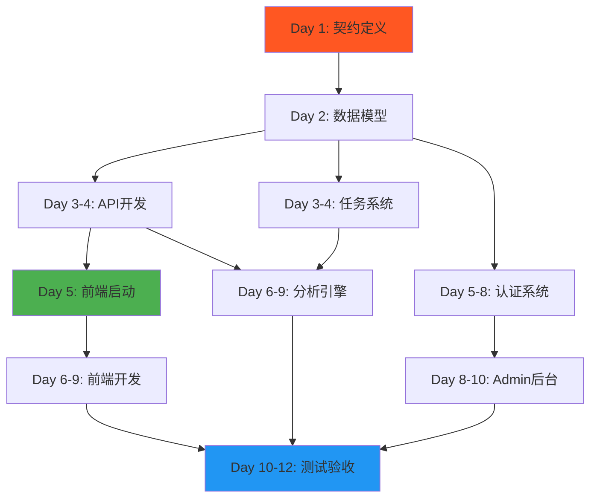

# Reddit Signal Scanner - 3人并行开发方案

> **创建日期**: 2025-10-10
> **目标工期**: 12天
> **开发策略**: 真实API驱动，无Mock开发
> **团队规模**: 3人（2后端 + 1前端）

---

## 👥 角色定义

### 后端开发A（资深后端）

**主要职责**：核心系统架构
- 数据模型设计与实现（PRD-01）
- API层开发（PRD-02）
- 分析引擎核心逻辑（PRD-03）

**技能要求**：
- 精通 FastAPI + SQLAlchemy
- 熟悉 PostgreSQL + JSONB
- 理解 NLP 和数据分析

**关键交付**：
- Day 2: 数据模型完成
- Day 5: 4个核心API完成
- Day 9: 分析引擎完成

---

### 后端开发B（中级后端）

**主要职责**：支撑系统
- 任务队列系统（PRD-04）
- 用户认证系统（PRD-06）
- Admin后台API（PRD-07）

**技能要求**：
- 熟悉 Celery + Redis
- 理解 JWT 认证机制
- 掌握异步编程

**关键交付**：
- Day 5: 任务系统完成
- Day 8: 认证系统完成
- Day 10: Admin后台完成

---

### 前端开发（全栈前端）

**主要职责**：全部UI + 测试框架
- 3个核心页面（PRD-05）
- SSE客户端实现
- 端到端测试框架（PRD-08）

**技能要求**：
- React 18 + TypeScript 5
- SSE/EventSource 使用
- 前端测试（Jest/Vitest）

**关键交付**：
- Day 7: 输入页面完成
- Day 9: 等待页面完成
- Day 11: 报告页面完成

---

## 📅 12天详细时间线

### Day 0: 环境准备

| 后端A | 后端B | 前端 |
|-------|-------|------|
| Python 3.11环境 | Python 3.11环境 | Node.js 18环境 |
| PostgreSQL + Redis | PostgreSQL + Redis | Vite + React项目初始化 |
| mypy + pytest配置 | mypy + pytest配置 | TypeScript + ESLint配置 |

**当日产出**：所有工具可用，质量门禁配置完成

---

### Day 1: 契约定义与数据模型启动

| 后端A | 后端B | 前端 |
|-------|-------|------|
| **上午**: 学习PRD-01 | **上午**: 学习PRD-01 | **上午**: 学习PRD-01 |
| **下午**: 定义所有Pydantic Schema | **下午**: 协助Schema设计 | **下午**: 学习PRD-02/05 |
| **晚上**: 开始实现User/Task模型 | **晚上**: 学习PRD-04 | **晚上**: 项目结构搭建 |

**关键产出**：
- ✅ 所有Schema定义完成并锁定
- ✅ 数据模型开始实现

**协作要点**：
- 下午2-4点：全员Workshop，定义Schema
- Schema确定后不得随意修改

---

### Day 2: 数据模型完成

| 后端A | 后端B | 前端 |
|-------|-------|------|
| 完成4个数据模型 | 学习Celery架构 | 学习API设计文档 |
| Alembic迁移脚本 | 搭建Redis环境 | 准备API类型定义 |
| 数据库测试 | 学习PRD-04任务系统 | 等待API ready |

**关键产出**：
- ✅ 数据模型100%完成
- ✅ 数据库迁移可用
- ✅ 后端B环境准备完成

**当晚集成**：
```bash
# 后端A
alembic upgrade head
pytest backend/tests/test_models.py
```

---

### Day 3: API开发 + 任务系统并行

| 后端A | 后端B | 前端 |
|-------|-------|------|
| **核心**: POST /api/analyze | **核心**: Celery基础配置 | 继续学习PRD |
| 实现任务创建逻辑 | Redis broker配置 | 准备前端路由 |
| Pydantic request/response | Worker启动脚本 | **等待API** |

**关键产出**：
- ✅ 第1个API端点可用
- ✅ Celery可以接收任务

---

### Day 4: API继续 + 任务系统完成

| 后端A | 后端B | 前端 |
|-------|-------|------|
| GET /api/status/{task_id} | 实现任务状态管理 | **等待API** |
| SSE端点开发 | 实现任务进度推送 | 学习SSE客户端 |
| GET /api/report/{task_id} | 任务系统测试 | 项目结构优化 |

**关键产出**：
- ✅ 4个核心API端点完成
- ✅ 任务系统100%完成

**当晚集成**：
```bash
# 后端A + 后端B联调
curl -X POST http://localhost:8000/api/analyze
curl http://localhost:8000/api/status/{task_id}
```

---

### Day 5: API完成 + 前端启动 🚀

| 后端A | 后端B | 前端 |
|-------|-------|------|
| API文档生成（OpenAPI） | 开始认证系统（JWT） | **开始开发**：输入页面 |
| API测试完善 | User注册/登录API | 调用真实API测试 |
| 开始分析引擎设计 | Token生成和验证 | 表单验证 |

**关键里程碑**：
- ✅ **前端可以开始开发**（基于真实API）
- ✅ API层100%完成

**协作要点**：
- 早上9点：后端A给前端演示API
- 前端获得API文档和测试token
- 前端开始调用真实后端

---

### Day 6: 分析引擎 + 认证 + 前端并行

| 后端A | 后端B | 前端 |
|-------|-------|------|
| 分析引擎 - 社区发现 | 完成JWT认证 | 输入页面完成 |
| 关键词提取（TF-IDF） | 用户管理API | 开始等待页面 |
| 社区评分算法 | 权限中间件 | SSE客户端实现 |

**关键产出**：
- ✅ 分析引擎第1步完成
- ✅ 认证系统可用

---

### Day 7: 分析引擎 + 认证测试 + 前端继续

| 后端A | 后端B | 前端 |
|-------|-------|------|
| 分析引擎 - 数据采集 | 认证系统测试 | 等待页面完成 |
| Reddit API集成 | 集成到主API | 开始报告页面 |
| 缓存优先逻辑 | 开始Admin后台 | 进度条组件 |

**关键产出**：
- ✅ 数据采集模块完成
- ✅ 前端2个页面完成

---

### Day 8: 分析引擎 + Admin + 前端继续

| 后端A | 后端B | 前端 |
|-------|-------|------|
| 分析引擎 - 信号提取 | Admin后台API | 报告页面开发 |
| 痛点/竞品/机会识别 | Dashboard接口 | 数据可视化 |
| 多维度排序 | 监控数据接口 | 导出功能 |

**关键产出**：
- ✅ 信号提取完成
- ✅ Admin后台API完成

---

### Day 9: 分析引擎完成 + 前端收尾 🎯

| 后端A | 后端B | 前端 |
|-------|-------|------|
| 完成4步流水线集成 | Admin后台完善 | 报告页面完成 |
| 端到端测试 | 完整测试 | 3个页面联调 |
| 性能优化 | Bug修复 | UI优化 |

**关键里程碑**：
- ✅ **核心功能100%完成**
- ✅ 前端3个页面全部完成

---

### Day 10: 集成测试 + Admin完成

| 后端A | 后端B | 前端 |
|-------|-------|------|
| E2E测试 | Admin后台完成 | 测试框架搭建 |
| 性能测试 | Admin前端集成 | 前端测试编写 |
| Bug修复 | 完整测试 | Bug修复 |

**关键产出**：
- ✅ E2E测试通过
- ✅ Admin后台完成

---

### Day 11: 测试与优化

| 后端A | 后端B | 前端 |
|-------|-------|------|
| 完整测试覆盖 | 完整测试覆盖 | 前端测试完成 |
| 性能优化 | 性能优化 | UI/UX优化 |
| 文档完善 | 文档完善 | 文档完善 |

**关键产出**：
- ✅ 测试覆盖率>80%
- ✅ 所有模块优化完成

---

### Day 12: 最终验收 ✅

| 后端A | 后端B | 前端 |
|-------|-------|------|
| PRD-01/02/03验收 | PRD-04/06/07验收 | PRD-05/08验收 |
| mypy --strict检查 | mypy --strict检查 | TypeScript检查 |
| 性能指标确认 | 性能指标确认 | 性能指标确认 |

**最终检查清单**：
```bash
□ 8个PRD 100%实现
□ mypy --strict 0错误
□ 测试覆盖率>80%
□ API响应<200ms
□ 分析完成<300s
□ 所有质量门禁通过
```

---

## 🔗 依赖关系图



---

## 📌 关键协作节点

### 🔴 Day 1下午：Schema定义Workshop

**时间**: 14:00-16:00
**参与者**: 全员必须参加
**产出**:
```python
# 必须定义完成的Schema
- UserSchema
- TaskSchema (含TaskStatus枚举)
- AnalysisSchema
- InsightsSchema (pain_points/competitors/opportunities)
- 所有API Request/Response模型
```

**规则**:
- Schema一旦确定，不得随意修改
- 需要修改必须全员讨论
- 所有人签字确认

---

### 🟡 Day 5早上：API交接会

**时间**: 09:00-09:30
**参与者**: 后端A + 前端
**内容**:
1. 后端A演示4个API端点
2. 前端获取API文档（OpenAPI）
3. 前端获取测试token
4. 确认接口字段定义
5. 前端开始开发

---

### 🟢 Day 9晚上：功能验收会

**时间**: 18:00-19:00
**参与者**: 全员
**检查清单**:
```bash
□ 完整流程可以跑通
□ 输入 → 分析 → 报告 完整链路
□ SSE实时更新正常
□ 认证系统可用
□ Admin后台可访问
```

---

## ⏰ 每日工作节奏

### 早上（09:00-09:15）

**15分钟站会**
```bash
每人汇报：
1. 昨天完成了什么
2. 今天计划做什么
3. 有什么阻塞

Tech Lead记录阻塞项并安排解决
```

---

### 白天（09:15-18:00）

**专注开发时间**
- 各自按照时间线执行
- 遇到问题随时沟通
- 不等站会，立即解决阻塞

---

### 晚上（18:00-20:00）

**集成与同步**
```bash
18:00 - 代码合并到main
18:30 - 运行CI/CD
19:00 - 集成测试
19:30 - 修复问题
20:00 - 当日结束
```

---

## 🚨 阻塞处理策略

### 前端等待后端API

**情况**: Day 3-4，前端无法开发
**解决**:
```bash
1. 学习PRD文档
2. 准备项目结构
3. 学习SSE客户端实现
4. 准备UI组件（不依赖API的部分）
```

---

### 后端A被阻塞

**情况**: 数据模型设计有争议
**解决**:
```bash
1. 立即召集三方会议
2. 参考PRD-01定义
3. 30分钟内必须决策
4. Tech Lead拍板
```

---

### 集成失败

**情况**: Day 5前端调用API失败
**解决**:
```bash
1. 检查API文档和实际实现是否一致
2. 检查CORS配置
3. 检查类型定义
4. 后端A和前端pair debugging
5. 当天必须解决
```

---

## ✅ 质量保证机制

### 代码质量

```bash
# 后端（每次commit前）
mypy --strict backend/app
black backend/app
isort backend/app
pytest backend/tests

# 前端（每次commit前）
npm run type-check
npm run lint
npm run test
```

---

### 集成测试

```bash
# 每晚8点自动运行
pytest tests/integration/ -v
```

---

### 性能测试

```bash
# Day 10开始
pytest tests/performance/ -v

# 检查指标
- API响应时间 <200ms
- 分析完成时间 <300s
- 缓存命中率 >60%
```

---

## 📊 进度追踪

### 每日进度看板

| Day | 后端A进度 | 后端B进度 | 前端进度 | 风险 |
|-----|----------|----------|---------|------|
| 1 | ⬜⬜⬜⬜⬜ | ⬜⬜⬜⬜⬜ | ⬜⬜⬜⬜⬜ | 🟢 |
| 2 | ⬛⬛⬜⬜⬜ | ⬛⬜⬜⬜⬜ | ⬜⬜⬜⬜⬜ | 🟢 |
| 5 | ⬛⬛⬛⬛⬜ | ⬛⬛⬛⬜⬜ | ⬛⬜⬜⬜⬜ | 🟡 |
| 9 | ⬛⬛⬛⬛⬛ | ⬛⬛⬛⬛⬜ | ⬛⬛⬛⬛⬜ | 🟢 |
| 12 | ⬛⬛⬛⬛⬛ | ⬛⬛⬛⬛⬛ | ⬛⬛⬛⬛⬛ | ✅ |

每天晚上更新进度，识别风险。

---

## 💡 成功关键因素

### 1. Schema契约严格锁定

```bash
❌ 错误做法：边开发边改Schema
✅ 正确做法：Day 1确定，后续不变
```

---

### 2. 每日集成测试

```bash
❌ 错误做法：等到最后集成
✅ 正确做法：每天晚上集成测试
```

---

### 3. 清晰的依赖关系

```bash
前端依赖后端API（Day 5可用）
分析引擎依赖任务系统（Day 5可用）
Admin依赖认证系统（Day 8可用）
```

---

### 4. 快速沟通机制

```bash
❌ 错误做法：问题积累到站会
✅ 正确做法：发现问题立即沟通
```

---

## 🎯 最终验收标准

### 功能完整性

```bash
□ PRD-01: 4表架构 ✅
□ PRD-02: 4个API端点 ✅
□ PRD-03: 4步分析流水线 ✅
□ PRD-04: Celery任务系统 ✅
□ PRD-05: 3个前端页面 ✅
□ PRD-06: JWT认证 ✅
□ PRD-07: Admin后台 ✅
□ PRD-08: 测试框架 ✅
```

---

### 质量指标

```bash
□ mypy --strict: 0错误
□ 后端测试覆盖率: >80%
□ 前端测试覆盖率: >70%
□ API响应时间: <200ms
□ 分析完成时间: <300s
□ 无 # type: ignore
□ 无 Any 类型
```

---

### 性能指标

```bash
□ 数据库查询优化（索引创建）
□ Redis缓存命中率 >60%
□ SSE连接稳定性测试通过
□ 并发100用户测试通过
```

---

## 🔧 工具和环境

### 开发环境

```bash
# 后端
Python 3.11
PostgreSQL 15
Redis 7.0
Celery 5.3

# 前端
Node.js 18
React 18
TypeScript 5.2
Vite 5.0

# 通用
Git 2.40+
Docker 24.0（可选）
```

---

### 推荐IDE配置

```json
// .vscode/settings.json
{
  "python.linting.mypyEnabled": true,
  "python.linting.mypyArgs": ["--strict"],
  "editor.formatOnSave": true,
  "python.formatting.provider": "black",
  "[typescript]": {
    "editor.defaultFormatter": "esbenp.prettier-vscode"
  }
}
```

---

## 📞 沟通渠道

### 日常沟通

- **Slack/钉钉**: 随时沟通
- **每日站会**: 早上9:00，15分钟
- **技术讨论**: 需要时随时拉会

---

### 紧急情况

```bash
优先级P0（阻塞开发）：
  → 立即@Tech Lead
  → 拉三方紧急会议
  → 30分钟内解决

优先级P1（影响进度）：
  → 站会提出
  → 当天解决

优先级P2（不紧急）：
  → 记录到Issue
  → 排期处理
```

---

**记住**: "并行开发的关键是清晰的契约和频繁的集成。"

**Let's ship it in 12 days! 🚀**

---

最后更新: 2025-10-10
维护者: Reddit Signal Scanner 开发团队
