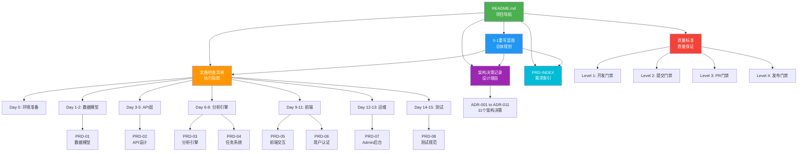

# Reddit Signal Scanner - 文档阅读指南 📚

> **创建日期**: 2025-10-10
> **用途**: 帮助开发团队快速定位所需文档，理解文档关系
> **更新频率**: 随项目演进更新

---

## 🗺️ 文档全景地图

### 本仓库文档结构 (RedditSignalScanner/)

```
RedditSignalScanner/
├── 📖 README.md                          # [必读] 导航中枢
├── 🎯 核心蓝图文档 (4份)
│   ├── 2025-10-10-Reddit信号扫描器0-1重写蓝图.md    # 主蓝图
│   ├── 2025-10-10-实施检查清单.md                   # 执行清单
│   ├── 2025-10-10-架构决策记录ADR.md                # 决策记录
│   └── 2025-10-10-质量标准与门禁规范.md             # 质量标准
├── 📋 参考文档 (2份)
│   ├── 2025-10-09-敏捷开发避坑与高效交付指南.md     # 流程指南
│   └── AGENTS.md                                     # Agent系统
└── 📁 PRD/ (12份)
    ├── PRD-INDEX.md                      # [必读] PRD索引
    ├── ARCHITECTURE.md                   # 架构边界
    ├── PRD-01-数据模型.md                # P0 优先级
    ├── PRD-02-API设计.md                 # P0 优先级
    ├── PRD-03-分析引擎.md                # P0 优先级
    ├── PRD-04-任务系统.md                # P0 优先级
    ├── PRD-05-前端交互.md                # P1 优先级
    ├── PRD-06-用户认证.md                # P1 优先级
    ├── PRD-07-Admin后台.md               # P2 优先级
    ├── PRD-08-端到端测试规范.md          # P1 优先级
    └── PRD实施计划_基于依赖关系.md       # 实施计划
```

### 最小化Navigator协同文档

```
最小化Navigator/
├── docs/PRD/                             # [参考] 需求详情
│   └── (与上述PRD相同，作为详细参考)
├── docs/strategy/
│   └── 2025-10-08-项目全面深度核查报告.md    # [避坑] 历史问题
├── docs/archive/
│   └── tech_debt_backlog_2025-10-09.md   # [避坑] 技术债务
└── backend/app/services/
    ├── signal_extractor.py               # [参考] 算法逻辑
    └── result_ranker.py                  # [参考] 排序逻辑
```

---

## 👥 分角色阅读路径

### 1️⃣ 新人开发者（第一天入职）

**阅读时长**: 2小时
**目标**: 理解项目全貌，准备开发环境

```bash
# 必读文档（按顺序）
1. README.md                                    # 10分钟 - 项目导航
2. 2025-10-10-Reddit信号扫描器0-1重写蓝图.md    # 30分钟 - 只读"执行摘要"和"核心设计原则"
3. 2025-10-10-质量标准与门禁规范.md             # 30分钟 - 只读"零容忍原则"和"质量门禁"
4. PRD/PRD-INDEX.md                             # 20分钟 - 了解功能全貌
5. 2025-10-10-架构决策记录ADR.md                # 30分钟 - 浏览11个ADR标题

# 实操任务
□ 配置开发环境（参考蓝图 Phase 0）
□ 运行质量检查工具验证环境
□ 阅读Day 0检查清单
```

### 2️⃣ 后端开发者

**阅读时长**: 根据开发阶段
**目标**: 掌握后端架构和实施细节

#### Day 1-2: 数据模型开发
```bash
# 主线文档
1. 2025-10-10-实施检查清单.md                   # Day 1-2章节
2. PRD/PRD-01-数据模型.md                       # 完整阅读
3. 2025-10-10-架构决策记录ADR.md                # ADR-001, ADR-005, ADR-009

# 协同参考（最小化Navigator）
4. docs/strategy/核查报告.md                    # "数据模型问题"章节
5. backend/app/models/                          # 参考现有模型（但不照搬）

# 质量检查
□ mypy --strict 通过
□ 单元测试覆盖率 >80%
```

#### Day 3-5: API层开发
```bash
# 主线文档
1. 2025-10-10-实施检查清单.md                   # Day 3-5章节
2. PRD/PRD-02-API设计.md                        # 完整阅读
3. 2025-10-10-架构决策记录ADR.md                # ADR-002, ADR-008

# 协同参考
4. 最小化Navigator/backend/app/api/            # 了解API膨胀问题（反面教材）

# 性能目标
□ API响应时间 <200ms
□ SSE连接稳定
```

#### Day 6-8: 分析引擎开发
```bash
# 主线文档
1. 2025-10-10-实施检查清单.md                   # Day 6-8章节
2. PRD/PRD-03-分析引擎.md                       # 完整阅读
3. PRD/PRD-04-任务系统.md                       # 完整阅读
4. 2025-10-10-架构决策记录ADR.md                # ADR-003, ADR-006

# 算法参考（最小化Navigator）
5. backend/app/services/signal_extractor.py    # 提取算法逻辑
6. backend/app/services/result_ranker.py       # 排序算法

# 避坑指南
7. docs/strategy/核查报告.md                    # "数据流转问题"章节

# 性能目标
□ 完整分析 <270秒
□ 缓存命中率 >60%
```

### 3️⃣ 前端开发者

**阅读时长**: Day 9开始
**目标**: 构建交互式UI

#### Day 9-11: 前端开发
```bash
# 主线文档
1. 2025-10-10-实施检查清单.md                   # Day 9-11章节
2. PRD/PRD-05-前端交互.md                       # 完整阅读
3. 2025-10-10-架构决策记录ADR.md                # ADR-007

# API集成参考
4. PRD/PRD-02-API设计.md                        # API端点定义
5. 2025-10-10-质量标准与门禁规范.md             # TypeScript类型规范

# 质量目标
□ TypeScript编译 0错误
□ 前端测试覆盖 >70%
□ SSE客户端稳定工作
```

### 4️⃣ 架构师/Tech Lead

**阅读时长**: 3小时（完整阅读）
**目标**: 把控技术方向，Code Review

```bash
# 核心文档（完整阅读）
1. README.md                                    # 15分钟
2. 2025-10-10-Reddit信号扫描器0-1重写蓝图.md    # 60分钟
3. 2025-10-10-架构决策记录ADR.md                # 45分钟 - 所有11个ADR
4. 2025-10-10-质量标准与门禁规范.md             # 30分钟
5. PRD/ARCHITECTURE.md                          # 20分钟
6. PRD/PRD-INDEX.md                             # 20分钟

# 历史问题分析（最小化Navigator）
7. docs/strategy/核查报告.md                    # 30分钟
8. docs/archive/tech_debt_backlog.md            # 20分钟

# 职责清单
□ 每日Code Review（对照质量标准）
□ 技术决策（参考ADR格式）
□ 风险识别（对照历史问题）
□ 架构验收（对照PRD符合度）
```

### 5️⃣ QA测试人员

**阅读时长**: Day 14开始
**目标**: 端到端测试和质量验收

```bash
# 测试文档
1. PRD/PRD-08-端到端测试规范.md                 # 完整阅读
2. 2025-10-10-质量标准与门禁规范.md             # "测试质量标准"章节
3. 2025-10-10-实施检查清单.md                   # Day 14-15章节

# 功能验收参考
4. PRD/PRD-01 到 PRD-07                         # 各模块验收标准

# 测试目标
□ 端到端流程100%通过
□ 性能指标达标
□ PRD符合度100%
```

---

## 📅 分阶段阅读清单

### Phase 0: 环境准备（Day 0）

| 文档 | 优先级 | 阅读时间 | 用途 |
|------|--------|---------|------|
| README.md | 🔴 必读 | 10分钟 | 项目导航 |
| 2025-10-10-实施检查清单.md (Day 0) | 🔴 必读 | 20分钟 | 环境搭建步骤 |
| 2025-10-10-质量标准与门禁规范.md (Level 1) | 🔴 必读 | 15分钟 | 配置IDE和工具 |

**验收标准**: 所有工具安装成功，质量门禁可运行

---

### Phase 1: 数据层（Day 1-2）

| 文档 | 优先级 | 阅读时间 | 用途 |
|------|--------|---------|------|
| PRD/PRD-01-数据模型.md | 🔴 必读 | 45分钟 | 数据表结构定义 |
| 2025-10-10-实施检查清单.md (Day 1-2) | 🔴 必读 | 30分钟 | 开发步骤 |
| ADR-001, ADR-005, ADR-009 | 🟡 推荐 | 20分钟 | 设计决策理由 |
| 最小化Navigator/PRD-01 | 🟢 可选 | 30分钟 | 详细需求参考 |

**验收标准**: 4表架构完成，mypy --strict 0错误

---

### Phase 2: API层（Day 3-5）

| 文档 | 优先级 | 阅读时间 | 用途 |
|------|--------|---------|------|
| PRD/PRD-02-API设计.md | 🔴 必读 | 50分钟 | API端点规范 |
| 2025-10-10-实施检查清单.md (Day 3-5) | 🔴 必读 | 40分钟 | 开发步骤 |
| ADR-002, ADR-008 | 🟡 推荐 | 15分钟 | SSE和JWT决策 |

**验收标准**: 4个核心端点完成，响应时间<200ms

---

### Phase 3: 分析引擎（Day 6-8）

| 文档 | 优先级 | 阅读时间 | 用途 |
|------|--------|---------|------|
| PRD/PRD-03-分析引擎.md | 🔴 必读 | 60分钟 | 引擎设计 |
| PRD/PRD-04-任务系统.md | 🔴 必读 | 40分钟 | Celery任务 |
| 2025-10-10-实施检查清单.md (Day 6-8) | 🔴 必读 | 50分钟 | 开发步骤 |
| ADR-003, ADR-006 | 🟡 推荐 | 20分钟 | 缓存和任务队列 |
| 最小化Navigator/services/*.py | 🟡 推荐 | 60分钟 | 算法逻辑参考 |

**验收标准**: 4步流水线工作，处理时间<270秒

---

### Phase 4: 前端开发（Day 9-11）

| 文档 | 优先级 | 阅读时间 | 用途 |
|------|--------|---------|------|
| PRD/PRD-05-前端交互.md | 🔴 必读 | 50分钟 | UI设计规范 |
| PRD/PRD-06-用户认证.md | 🔴 必读 | 45分钟 | 认证流程 |
| 2025-10-10-实施检查清单.md (Day 9-11) | 🔴 必读 | 40分钟 | 开发步骤 |
| ADR-007 | 🟡 推荐 | 10分钟 | React技术栈 |

**验收标准**: 3页面完成，TypeScript 0错误

---

### Phase 5: 运维管理（Day 12-13）

| 文档 | 优先级 | 阅读时间 | 用途 |
|------|--------|---------|------|
| PRD/PRD-07-Admin后台.md | 🔴 必读 | 40分钟 | Admin功能 |
| 2025-10-10-实施检查清单.md (Day 12-13) | 🔴 必读 | 30分钟 | 开发步骤 |

**验收标准**: Admin界面可访问，监控数据实时更新

---

### Phase 6: 测试验收（Day 14-15）

| 文档 | 优先级 | 阅读时间 | 用途 |
|------|--------|---------|------|
| PRD/PRD-08-端到端测试规范.md | 🔴 必读 | 55分钟 | 测试策略 |
| 2025-10-10-实施检查清单.md (Day 14-15) | 🔴 必读 | 45分钟 | 验收清单 |
| 2025-10-10-质量标准与门禁规范.md (Level 4) | 🔴 必读 | 30分钟 | 发布门禁 |
| ADR-010 | 🟡 推荐 | 10分钟 | 测试金字塔 |

**验收标准**: 8个PRD 100%完成，所有质量指标达标

---

## 🔗 文档依赖关系图



---

## 🤝 与最小化Navigator的协同阅读策略

### 协同原则

| RedditSignalScanner | 最小化Navigator | 协同方式 |
|---------------------|-----------------|---------|
| 🎯 主线执行文档 | 📚 深度参考资料 | 主辅配合 |
| 新架构蓝图 | 历史经验库 | 避免重蹈覆辙 |
| 实施清单 | 算法逻辑 | 逻辑复用，架构重建 |
| 质量标准 | 技术债务 | 对照检查，预防问题 |

### 具体协同场景

#### 场景1: 数据模型设计（Day 1-2）

```bash
# 第1步：阅读RedditSignalScanner
1. PRD/PRD-01-数据模型.md                       # 4表架构设计
2. ADR-001                                      # 为什么用4表而非多表

# 第2步：对照最小化Navigator
3. Navigator/docs/strategy/核查报告.md         # "10+表导致JOIN复杂"问题
4. Navigator/backend/app/models/               # 现有表结构（反面教材）

# 第3步：设计决策
✅ 采用4表架构（RedditSignalScanner）
✅ 参考现有字段定义（Navigator）
❌ 避免表过多（Navigator的教训）
```

#### 场景2: 分析引擎开发（Day 6-8）

```bash
# 第1步：理解新架构
1. RedditSignalScanner/PRD-03-分析引擎.md       # 4步流水线
2. RedditSignalScanner/ADR-003                  # 缓存优先架构

# 第2步：提取有效算法
3. Navigator/backend/services/signal_extractor.py   # 信号提取算法（已验证）
4. Navigator/backend/services/result_ranker.py      # 排序算法（已验证）

# 第3步：避免历史问题
5. Navigator/docs/strategy/核查报告.md         # "signals vs insights字段不匹配"

# 第4步：实施策略
✅ 用Navigator的算法逻辑（提取思想）
✅ 用RedditSignalScanner的架构（全新管道）
✅ 修复字段不匹配问题（Pydantic验证）
```

#### 场景3: API设计（Day 3-5）

```bash
# 第1步：阅读新规范
1. RedditSignalScanner/PRD-02-API设计.md        # 4个核心端点
2. RedditSignalScanner/ADR-002                  # SSE优先设计

# 第2步：了解历史问题
3. Navigator/docs/strategy/核查报告.md         # "59个API端点膨胀"
4. Navigator/backend/app/api/                   # 现有API（反面教材）

# 第3步：设计原则
✅ 仅实现4个核心端点（简单原则）
❌ 不添加非必要端点（避免膨胀）
✅ SSE替代轮询（性能优化）
```

---

## 🔍 文档快速查找指南

### 按问题类型查找

| 问题类型 | 查找文档 | 章节 |
|---------|---------|------|
| 🤔 不知道从哪开始 | README.md | "快速开始" |
| 🏗️ 架构设计疑问 | 架构决策记录ADR.md | 对应ADR编号 |
| 📋 今天做什么 | 实施检查清单.md | 对应Day章节 |
| 🔧 环境配置问题 | 实施检查清单.md | Day 0章节 |
| ⚠️ 质量检查失败 | 质量标准与门禁规范.md | "质量问题升级" |
| 🐛 类型错误 | 质量标准与门禁规范.md | "类型安全标准" |
| 📊 数据表设计 | PRD/PRD-01-数据模型.md | "数据库Schema" |
| 🌐 API端点定义 | PRD/PRD-02-API设计.md | "API端点列表" |
| ⚙️ 分析引擎逻辑 | PRD/PRD-03-分析引擎.md | "4步流水线" |
| 🎨 前端UI设计 | PRD/PRD-05-前端交互.md | "页面设计" |
| 🧪 测试策略 | PRD/PRD-08-测试规范.md | "测试金字塔" |
| 🚫 历史问题避坑 | Navigator/核查报告.md | 问题清单 |
| 🔬 算法参考 | Navigator/services/*.py | 具体文件 |

### 按开发阶段查找

| 开发阶段 | 主要文档 | 次要文档 |
|---------|---------|---------|
| 环境准备 | 实施清单 Day 0 | 质量标准 Level 1 |
| 数据模型 | PRD-01 | ADR-001, ADR-005, ADR-009 |
| API开发 | PRD-02 | ADR-002, ADR-008 |
| 引擎开发 | PRD-03, PRD-04 | ADR-003, ADR-006 |
| 前端开发 | PRD-05, PRD-06 | ADR-007 |
| 运维管理 | PRD-07 | - |
| 测试验收 | PRD-08 | ADR-010, 质量标准 Level 4 |

---

## ❓ 常见问题FAQ

### Q1: 第一次接触项目，从哪里开始？

**A**: 按以下顺序：
1. 阅读 `README.md`（10分钟）
2. 阅读"0-1重写蓝图"的"执行摘要"（15分钟）
3. 阅读"质量标准"的"零容忍原则"（10分钟）
4. 执行 Day 0 环境准备清单

### Q2: 如何知道今天该做什么？

**A**:
```bash
# 每天早上第一件事
cat 2025-10-10-实施检查清单.md | grep "Day X"
```
根据当前Day数，查看对应章节的任务清单。

### Q3: 代码写完了，怎么验证质量？

**A**: 按质量门禁流程：
1. Level 1: IDE实时检查（自动）
2. Level 2: git commit前的pre-commit hook（自动）
3. Level 3: PR时的CI检查（自动）
4. Level 4: 发布前的完整验收（手动运行脚本）

### Q4: PRD文档太长，必须全读吗？

**A**: 分情况：
- **开发前**: 完整阅读对应PRD（确保理解需求）
- **开发中**: 快速查阅特定章节（解决具体问题）
- **验收时**: 对照PRD逐项检查（确保符合度100%）

### Q5: 最小化Navigator的代码能直接复制吗？

**A**: ❌ **不能直接复制**，但可以：
- ✅ 提取算法思想（如信号提取逻辑）
- ✅ 参考字段定义（如JSONB结构）
- ✅ 学习业务逻辑（如评分算法）
- ❌ 不复制架构设计（新架构更简洁）

### Q6: 遇到历史问题怎么办？

**A**: 查找对应的避坑文档：
1. `最小化Navigator/docs/strategy/核查报告.md` - 已知问题清单
2. `最小化Navigator/docs/archive/tech_debt_backlog.md` - 技术债务
3. `ADR文档` - 为什么做出不同的设计决策

### Q7: 质量检查失败了怎么办？

**A**:
```bash
# 第1步：查看具体错误
mypy --strict <file> --show-error-codes

# 第2步：查找解决方案
grep "错误码" 2025-10-10-质量标准与门禁规范.md

# 第3步：如果仍不清楚
查看 ADR-004（类型安全零容忍原则）
```

### Q8: 多个文档内容矛盾怎么办？

**A**: 优先级顺序：
1. **最高优先级**: RedditSignalScanner的实施清单和PRD（执行标准）
2. **次优先级**: ADR决策记录（设计理由）
3. **参考优先级**: 最小化Navigator文档（历史参考）

如有冲突，以RedditSignalScanner为准。

### Q9: 如何高效阅读PRD文档？

**A**: 采用"三遍阅读法"：
- **第1遍**: 快速浏览目录和"关键要点"（5分钟）
- **第2遍**: 精读"核心功能"和"验收标准"（20分钟）
- **第3遍**: 开发时查阅"实现细节"（按需）

### Q10: 文档更新频率是多少？

**A**:
- **实施清单**: 每日更新（填写完成状态）
- **质量周报**: 每周更新
- **ADR**: 重大决策时新增
- **PRD**: 原则上不变（除非需求变更）

---

## 📌 最佳实践建议

### 1. 建立阅读习惯

```bash
# 每天开始前（5分钟）
□ 查看今日任务清单
□ 回顾昨日遇到的问题
□ 确认今日需要参考的文档

# 每天结束后（10分钟）
□ 填写实施清单的完成状态
□ 记录遇到的问题和解决方案
□ 规划明日任务
```

### 2. 做好文档标注

```bash
# 建议在文档中标注
✅ 已理解并应用
⚠️ 需要注意的要点
❓ 仍有疑问，需要讨论
📌 关键决策点
```

### 3. 团队知识共享

```bash
# 每周团队会议
□ 分享本周文档阅读心得
□ 讨论文档中不清晰的部分
□ 提议文档改进建议
```

### 4. 保持文档同步

```bash
# 当发现问题时
1. 在对应文档中添加注释
2. 创建Issue记录问题
3. 提交PR改进文档
```

---

## 🎓 进阶阅读路径

### 深入理解架构

**适合**: 技术负责人、架构师
```bash
1. 完整阅读所有11个ADR（90分钟）
2. 对比Navigator核查报告中的问题（30分钟）
3. 理解为什么做出不同的设计选择（30分钟）
4. 绘制系统架构图（60分钟）
```

### 深入理解质量体系

**适合**: QA、Tech Lead
```bash
1. 完整阅读质量标准文档（60分钟）
2. 实际运行所有质量检查工具（30分钟）
3. 理解4级门禁的触发时机（20分钟）
4. 设计质量监控dashboard（90分钟）
```

### 深入理解业务逻辑

**适合**: 产品经理、业务开发
```bash
1. 完整阅读PRD-03分析引擎（60分钟）
2. 阅读Navigator的算法实现（90分钟）
3. 理解信号提取的业务价值（30分钟）
4. 设计优化方案（60分钟）
```

---

## 📞 获取帮助

### 文档相关问题

| 问题类型 | 联系方式 |
|---------|---------|
| 文档不清晰 | 创建Issue: docs/clarity |
| 文档过时 | 创建Issue: docs/outdated |
| 文档缺失 | 创建Issue: docs/missing |
| 建议改进 | 创建Issue: docs/improvement |

### 技术问题

| 问题类型 | 查找资源 |
|---------|---------|
| 类型错误 | 质量标准文档 + ADR-004 |
| 性能问题 | PRD对应章节 + 核查报告 |
| 架构疑问 | ADR对应决策 + ARCHITECTURE.md |
| 测试问题 | PRD-08 + ADR-010 |

---

## 🔄 文档维护

### 更新原则

1. **实施清单**: 每天更新进度
2. **ADR**: 重大决策时新增，禁止修改历史ADR
3. **质量标准**: 季度review，小幅调整
4. **PRD**: 需求变更时更新，需团队评审

### 版本控制

```bash
# 所有文档变更必须走Git流程
git add <文档>
git commit -m "docs: 更新XX文档的YY章节"
git push
```

---

## 📊 阅读进度追踪

### 个人阅读checklist

```markdown
## 新人Onboarding（第一天）

- [ ] README.md
- [ ] 0-1重写蓝图（执行摘要）
- [ ] 质量标准（零容忍原则）
- [ ] PRD-INDEX
- [ ] 架构决策记录（浏览）

## 按开发阶段

### Day 0
- [ ] 实施清单 Day 0

### Day 1-2
- [ ] PRD-01
- [ ] 实施清单 Day 1-2
- [ ] ADR-001, ADR-005, ADR-009

### Day 3-5
- [ ] PRD-02
- [ ] 实施清单 Day 3-5
- [ ] ADR-002, ADR-008

### Day 6-8
- [ ] PRD-03
- [ ] PRD-04
- [ ] 实施清单 Day 6-8
- [ ] ADR-003, ADR-006

### Day 9-11
- [ ] PRD-05
- [ ] PRD-06
- [ ] 实施清单 Day 9-11
- [ ] ADR-007

### Day 12-13
- [ ] PRD-07
- [ ] 实施清单 Day 12-13

### Day 14-15
- [ ] PRD-08
- [ ] 实施清单 Day 14-15
- [ ] 质量标准（Level 4）
- [ ] ADR-010
```

---

**记住**: "文档是代码的一部分，不是可选项。"

**让我们用好文档，写好代码！** 🚀

---

最后更新: 2025-10-10
维护者: Reddit Signal Scanner 开发团队
