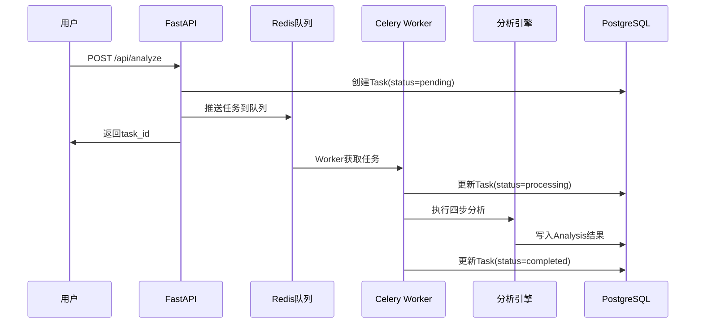

# PRD-04: 任务系统架构

## 1. 问题陈述

### 1.1 背景
Reddit Signal Scanner承诺"5分钟分析"，这要求系统能够处理长时间运行的分析任务，而不受HTTP请求超时限制。用户点击"开始分析"后，系统必须在后台异步执行复杂的四步算法，同时保持API层的响应性。

**核心挑战**：
- HTTP请求通常30秒超时，但分析需要5分钟
- 需要支持并发多用户分析任务
- 必须处理任务失败和重试逻辑
- 系统重启后任务状态必须可恢复

### 1.2 目标
设计一个基于Celery + Redis的异步任务系统：
- **立即响应**：API层瞬间返回task_id，任务在后台执行
- **状态追踪**：用户可实时查询任务进度
- **故障恢复**：任务失败自动重试，系统重启后可恢复
- **资源控制**：限制并发任务数，防止系统过载
- **诚实监控**：真实记录任务耗时和失败率

### 1.3 非目标
- **不支持**任务取消功能（分析一旦开始必须完成）
- **不支持**任务优先级调度（所有任务平等处理）
- **不支持**分布式任务（单机Redis队列足够）
- **不支持**实时任务进度细节（只提供阶段性状态）

## 2. 解决方案

### 2.1 核心设计：生产者-消费者模式

基于成熟的Celery + Redis架构，实现HTTP层与分析引擎的完全解耦：

```
HTTP请求 → FastAPI → Redis队列 → Celery Worker → 分析引擎 → PostgreSQL
    ↓           ↓         ↓            ↓              ↓
  即时响应    创建任务   异步执行    状态更新      结果存储
```

**职责分离**：
- **FastAPI**：接收请求，创建Task记录，推送到队列，立即响应
- **Redis队列**：作为任务缓冲区，保证任务不丢失
- **Celery Worker**：从队列获取任务，执行分析引擎
- **PostgreSQL**：存储任务状态和分析结果

### 2.2 数据流



### 2.3 关键决策

#### 决策1：选择Celery而非简单线程池
**理由**：Celery提供完整的任务管理、重试、监控功能，避免重新发明轮子。
**代价**：增加Redis依赖，但换取了生产级的稳定性。

#### 决策2：任务状态存储在PostgreSQL而非Redis
**理由**：PostgreSQL提供ACID保证，任务状态不会因为Redis重启而丢失。
**代价**：额外的数据库写入，但保证了数据一致性。

#### 决策3：动态Worker进程配置
**理由**：Worker数量应该基于服务器资源动态调整，而不是硬编码。
**实现**：通过配置文件管理，默认基于CPU核心数计算。
**公式**：worker_count = min(cpu_cores, max_workers_limit)

## 3. 技术规范

### 3.1 Celery配置

```python
# config/celery_config.py
from celery import Celery
import os
import multiprocessing

def get_worker_count():
    """基于系统资源动态计算Worker数量"""
    # 从环境变量或配置文件获取
    configured_workers = os.getenv('CELERY_WORKER_COUNT')
    if configured_workers:
        return int(configured_workers)
    
    # 基于CPU核心数计算
    cpu_count = multiprocessing.cpu_count()
    # 公式: min(cpu_cores, 4) 避免过多Worker
    return min(cpu_count, 4)

app = Celery(
    'reddit_scanner',
    broker='redis://localhost:6379/1',  # 队列存储
    backend='redis://localhost:6379/2', # 结果存储
    include=['tasks.analysis_task']
)

# 任务配置
app.conf.update(
    task_serializer='json',
    accept_content=['json'],
    result_serializer='json',
    timezone='UTC',
    enable_utc=True,
    
    # 重试配置
    task_default_retry_delay=60,  # 失败后60秒重试
    task_max_retries=3,           # 最多重试3次
    
    # Worker配置（动态）
    worker_concurrency=get_worker_count(),  # 基于CPU核心数
    worker_prefetch_multiplier=1,           # 每次只取1个任务
    
    # 任务路由
    task_routes={
        'tasks.analysis_task': {'queue': 'analysis'},
    },
)
```

### 3.2 任务定义

```python
# tasks/analysis_task.py
from celery import Task
from app.core.database import get_db
from app.services.analysis_engine import AnalysisEngine

class AnalysisTask(Task):
    """分析任务基类，提供错误处理和状态管理"""
    
    def on_failure(self, exc, task_id, args, kwargs, einfo):
        """任务失败时更新数据库状态"""
        with get_db() as db:
            db.execute(
                "UPDATE task SET status = 'failed', error_message = ? WHERE id = ?",
                (str(exc), args[0])
            )

@app.task(base=AnalysisTask, bind=True)
def run_analysis(self, task_id: str):
    """执行分析任务的核心函数"""
    try:
        # 更新状态为processing
        with get_db() as db:
            db.execute(
                "UPDATE task SET status = 'processing', started_at = datetime('now') WHERE id = ?",
                (task_id,)
            )
        
        # 执行分析
        engine = AnalysisEngine()
        result = engine.analyze(task_id)
        
        # 保存结果并更新状态为completed
        with get_db() as db:
            db.execute(
                "UPDATE task SET status = 'completed', completed_at = datetime('now') WHERE id = ?",
                (task_id,)
            )
            
        return result
        
    except Exception as exc:
        # 记录错误并重试
        self.retry(exc=exc, countdown=60, max_retries=3)
```

### 3.3 API集成

```python
# api/v1/endpoints/analyze.py
from fastapi import APIRouter, HTTPException
from tasks.analysis_task import run_analysis
import uuid

router = APIRouter()

@router.post("/analyze")
async def create_analysis_task(request: AnalyzeRequest):
    """创建分析任务"""
    task_id = str(uuid.uuid4())
    
    # 创建任务记录
    with get_db() as db:
        db.execute(
            "INSERT INTO task (id, user_id, product_description, status, created_at) VALUES (?, ?, ?, 'pending', datetime('now'))",
            (task_id, request.user_id, request.product_description)
        )
    
    # 推送到队列（异步执行）
    run_analysis.delay(task_id)
    
    return {"task_id": task_id, "status": "pending"}

@router.get("/status/{task_id}")
async def get_task_status(task_id: str):
    """查询任务状态"""
    with get_db() as db:
        task = db.execute(
            "SELECT status, created_at, started_at, completed_at, error_message FROM task WHERE id = ?",
            (task_id,)
        ).fetchone()
    
    if not task:
        raise HTTPException(status_code=404, detail="任务未找到")
    
    return {
        "task_id": task_id,
        "status": task["status"],
        "created_at": task["created_at"],
        "started_at": task["started_at"],
        "completed_at": task["completed_at"],
        "error_message": task["error_message"]
    }
```

### 3.4 监控配置

```python
# config/monitoring.py
CELERY_MONITORING = {
    # 队列长度监控
    "max_queue_length": 50,  # 队列超过50个任务时告警
    
    # 任务耗时监控
    "max_task_duration": 600,  # 超过10分钟的任务需要调查
    
    # 失败率监控
    "max_failure_rate": 0.1,   # 失败率超过10%时告警
    
    # Worker健康检查
    "worker_heartbeat_timeout": 60,  # Worker 60秒无心跳认为异常
}
```

## 4. 验收标准

### 4.1 功能要求

**任务创建**：
- ✅ POST /api/analyze 在200ms内返回task_id
- ✅ 任务记录立即写入database(status=pending)
- ✅ 任务推送到Redis队列成功

**任务执行**：
- ✅ Worker从队列获取任务并开始执行
- ✅ 任务状态正确更新为processing
- ✅ 分析引擎成功执行四步算法
- ✅ 结果写入Analysis表，状态更新为completed

**错误处理**：
- ✅ 分析失败时自动重试（最多3次）
- ✅ 重试失败后任务状态为failed
- ✅ 错误信息正确记录到error_message字段

**状态查询**：
- ✅ GET /api/status/{task_id} 返回实时状态
- ✅ 包含创建时间、开始时间、完成时间
- ✅ 任务不存在时返回404错误

### 4.2 性能指标

| 指标 | 目标值 | 测量方法 |
|------|---------|----------|
| 任务创建响应时间 | < 200ms | Apache Bench测试 |
| 队列吞吐量 | 100任务/分钟 | Redis监控 |
| 任务完成时间 | < 5分钟 | 数据库时间戳计算 |
| 系统并发任务 | 2个同时 | Worker进程监控 |
| 任务失败重试 | 3次后停止 | Celery日志分析 |

### 4.3 测试用例

```python
# tests/test_task_system.py
def test_task_creation():
    """测试任务创建流程"""
    response = client.post("/api/analyze", json={
        "user_id": "test-user",
        "product_description": "测试产品"
    })
    assert response.status_code == 200
    assert "task_id" in response.json()

def test_task_status_query():
    """测试任务状态查询"""
    # 创建任务
    task_id = create_test_task()
    
    # 查询状态
    response = client.get(f"/api/status/{task_id}")
    assert response.status_code == 200
    assert response.json()["status"] in ["pending", "processing", "completed"]

def test_task_failure_retry():
    """测试任务失败重试机制"""
    # 模拟分析引擎异常
    with patch('app.services.analysis_engine.AnalysisEngine.analyze') as mock:
        mock.side_effect = Exception("模拟错误")
        
        task_id = create_test_task()
        time.sleep(10)  # 等待重试完成
        
        # 验证重试3次后失败
        with get_db() as db:
            task = db.execute("SELECT status FROM task WHERE id = ?", (task_id,)).fetchone()
            assert task["status"] == "failed"
```

## 5. 风险管理

### 5.1 技术风险

**风险1：Redis宕机导致队列丢失**
- **影响**：进行中的任务丢失，需要手动重启
- **缓解**：配置Redis持久化(AOF)，定期备份
- **降级方案**：紧急情况下可以直接调用分析引擎绕过队列

**风险2：Worker进程崩溃**
- **影响**：任务卡在processing状态，无法继续
- **缓解**：配置进程监控(supervisor)，自动重启Worker
- **降级方案**：手动重置卡住任务状态，重新入队

**风险3：任务耗时超预期**
- **影响**：5分钟承诺无法兑现，用户体验差
- **缓解**：监控任务平均耗时，及时优化分析算法
- **降级方案**：超时任务自动终止，返回部分结果

### 5.2 依赖项

**Redis服务**：
- 版本要求：Redis 6.0+
- 内存要求：至少1GB可用内存
- 网络要求：与应用服务器低延迟连接

**Celery库**：
- 版本要求：Celery 5.2+
- Python版本：Python 3.8+
- 依赖库：kombu, billiard, pytz

**PostgreSQL数据库**：
- Task表必须已创建
- 数据库连接池配置正确
- 索引创建完成

### 5.3 降级方案

**完全降级：服务不可用模式**
```python
# 当Celery服务不可用时的正确处理方式
@router.post("/analyze")
async def create_analysis_task(request: AnalyzeRequest):
    """创建分析任务（包含队列不可用检查）"""
    
    # 检查任务队列是否可用
    try:
        # 检查Redis连接
        redis_client.ping()
        # 检查Celery Worker状态
        inspect = app.control.inspect()
        active_workers = inspect.active()
        
        if not active_workers:
            raise HTTPException(
                status_code=503,
                detail="分析服务暂时不可用，请稍后重试"
            )
            
    except Exception:
        raise HTTPException(
            status_code=503, 
            detail="分析服务暂时不可用，请稍后重试",
            headers={"Retry-After": "300"}  # 5分钟后重试
        )
    
    # 正常的任务创建流程
    task_id = str(uuid.uuid4())
    
    with get_db() as db:
        db.execute(
            "INSERT INTO task (id, user_id, product_description, status, created_at) VALUES (?, ?, ?, 'pending', datetime('now'))",
            (task_id, request.user_id, request.product_description)
        )
    
    # 推送到队列
    run_analysis.delay(task_id)
    
    return {"task_id": task_id, "status": "pending"}
```

**部分降级：减少分析深度**
```python
# 当系统负载过高时减少分析范围
DEGRADED_MODE_CONFIG = {
    "max_communities": 10,  # 从20减少到10个社区
    "analysis_timeout": 180,  # 3分钟超时
    "skip_detailed_nlp": True  # 跳过深度NLP分析
}
```

---

## 总结

这个任务系统设计基于成熟的Celery + Redis架构，**诚实地处理了异步执行的复杂性**。我们不假装能在HTTP请求中完成5分钟的分析，而是用工程的方法解决了这个问题：

1. **职责清晰**：API层专注响应速度，Worker层专注分析质量
2. **故障恢复**：完整的重试机制和状态管理
3. **监控完整**：从队列长度到任务耗时的全方位监控
4. **降级优雅**：多层降级方案应对各种异常情况

**这不是一个"聪明"的设计，而是一个"可靠"的设计。**它承认了分布式系统的复杂性，然后用标准化的工具和模式来管理这些复杂性。