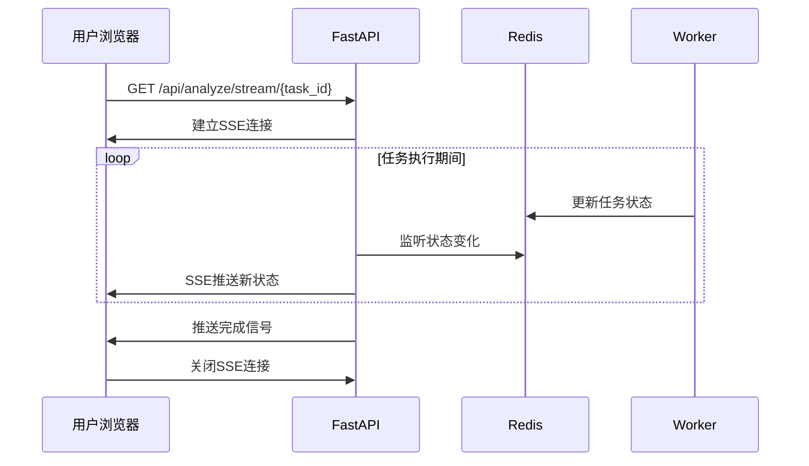

# PRD-05: 前端交互设计

## 1. 问题陈述

### 1.1 背景
Reddit Signal Scanner的核心承诺是"30秒输入，5分钟分析"，这要求前端界面必须做到**极简**，让用户能在30秒内完成输入并启动分析。同时，由于分析是异步进行的，前端必须提供清晰的进度反馈，让用户在等待期间保持信心。

**用户体验挑战**：
- 如何在30秒内让用户完成输入而不困惑？
- 如何在5分钟等待期间保持用户参与？
- 如何展示复杂的分析结果而不让用户overwhelmed？
- 如何处理网络断线和页面刷新？

### 1.2 目标
设计一个基于React的单页应用，支持完整的用户旅程：
- **极简输入**：一个文本框，一个按钮，零配置
- **实时反馈**：使用SSE(Server-Sent Events)替代轮询
- **结果展示**：结构化报告，高亮关键洞察
- **状态恢复**：刷新页面后恢复任务状态
- **优雅降级**：SSE不可用时自动降级为轮询

### 1.3 非目标
- **不支持**复杂的用户设置和配置选项
- **不支持**多任务并行管理界面
- **不支持**报告的实时协作和分享
- **不支持**移动端优化（初版专注桌面）

## 2. 解决方案

### 2.1 核心设计：三页面架构

基于用户旅程设计最简洁的页面流：

```
输入页 → 进度页 → 报告页
  ↓        ↓        ↓
30秒完成  5分钟等待  一目了然
```

**页面职责**：
- **输入页(/)**：产品描述输入，启动分析
- **进度页(/progress/{task_id})**：实时显示分析进度，SSE推送
- **报告页(/report/{task_id})**：展示结构化分析结果

**设计哲学**：消除所有不必要的交互元素，每个页面只有一个主要行动。

### 2.2 实时通信：SSE优先策略

基于Linus审查建议，使用SSE替代传统轮询：



**降级策略**：
1. 主路径：SSE实时推送（延迟<1秒）
2. 备用路径：轮询查询（间隔5秒）
3. 兜底方案：手动刷新按钮

### 2.3 关键决策

#### 决策1：单文本框 vs 结构化表单
**选择**：单文本框
**理由**：用户最了解自己的产品，自由描述比填空题更自然
**代价**：放弃了结构化输入的精确性，但换取了使用的简单性

#### 决策2：SSE vs WebSocket vs 轮询
**选择**：SSE + 轮询降级
**理由**：SSE单向通信足够，比WebSocket简单，比轮询高效
**代价**：需要实现两套通信机制，但保证了可靠性

#### 决策3：客户端状态管理 vs 服务端状态
**选择**：URL驱动的无状态设计
**理由**：用户可以bookmark进度页，刷新后自动恢复状态
**代价**：放弃了复杂的状态管理，但获得了更好的用户体验

## 3. 技术规范

### 3.1 页面组件设计

```jsx
// src/components/InputPage.jsx
function InputPage() {
    const [description, setDescription] = useState('');
    const [isSubmitting, setIsSubmitting] = useState(false);
    
    const handleSubmit = async (e) => {
        e.preventDefault();
        if (!description.trim()) return;
        
        setIsSubmitting(true);
        try {
            const response = await fetch('/api/analyze', {
                method: 'POST',
                headers: { 'Content-Type': 'application/json' },
                body: JSON.stringify({
                    product_description: description,
                    user_id: getUserId() // JWT中获取
                })
            });
            
            const { task_id } = await response.json();
            navigate(`/progress/${task_id}`);
            
        } catch (error) {
            setError('提交失败，请重试');
        } finally {
            setIsSubmitting(false);
        }
    };
    
    return (
        <div className="input-container">
            <h1>发现你的Reddit商业信号</h1>
            <form onSubmit={handleSubmit}>
                <textarea
                    value={description}
                    onChange={(e) => setDescription(e.target.value)}
                    placeholder="描述你的产品或服务。例如：一款帮助研究者和创作者自动组织和连接想法的AI笔记应用。"
                    rows={6}
                    className="product-input"
                    disabled={isSubmitting}
                />
                <button 
                    type="submit" 
                    disabled={isSubmitting || !description.trim()}
                    className="analyze-button"
                >
                    {isSubmitting ? '正在提交...' : '开始分析'}
                </button>
            </form>
        </div>
    );
}
```

```jsx
// src/components/ProgressPage.jsx
function ProgressPage({ taskId }) {
    const [status, setStatus] = useState(null);
    const [error, setError] = useState(null);
    const [sseSupported, setSseSupported] = useState(true);
    
    useEffect(() => {
        if (sseSupported) {
            connectSSE();
        } else {
            startPolling();
        }
    }, [taskId, sseSupported]);
    
    const connectSSE = () => {
        const eventSource = new EventSource(`/api/analyze/stream/${taskId}`);
        
        eventSource.onmessage = (event) => {
            const data = JSON.parse(event.data);
            setStatus(data);
            
            if (data.status === 'completed') {
                eventSource.close();
                navigate(`/report/${taskId}`);
            }
        };
        
        eventSource.onerror = () => {
            eventSource.close();
            setSseSupported(false); // 降级到轮询
        };
    };
    
    const startPolling = () => {
        const poll = async () => {
            try {
                const response = await fetch(`/api/status/${taskId}`);
                const data = await response.json();
                setStatus(data);
                
                if (data.status === 'completed') {
                    navigate(`/report/${taskId}`);
                } else if (data.status !== 'failed') {
                    setTimeout(poll, 5000); // 5秒后再次轮询
                }
            } catch (error) {
                setError('获取状态失败');
            }
        };
        poll();
    };
    
    return (
        <div className="progress-container">
            <ProgressHeader taskId={taskId} />
            <ProgressSteps currentStatus={status?.status} />
            <ProgressDetails status={status} />
            {error && <ErrorMessage message={error} />}
        </div>
    );
}
```

### 3.2 后端SSE支持

```python
# api/v1/endpoints/stream.py
from fastapi import APIRouter
from fastapi.responses import StreamingResponse
import json
import asyncio

router = APIRouter()

@router.get("/analyze/stream/{task_id}")
async def stream_task_progress(task_id: str):
    """SSE实时推送任务进度"""
    
    async def generate():
        previous_status = None
        heartbeat_counter = 0
        
        while True:
            # 查询当前状态
            with get_db() as db:
                task = db.execute(
                    "SELECT status, created_at, started_at, completed_at, error_message FROM task WHERE id = ?",
                    (task_id,)
                ).fetchone()
            
            if not task:
                yield f"data: {json.dumps({'error': '任务未找到'})}\n\n"
                break
                
            current_status = task["status"]
            
            # 状态变化时推送更新
            if current_status != previous_status:
                data = {
                    "task_id": task_id,
                    "status": current_status,
                    "created_at": task["created_at"],
                    "started_at": task["started_at"],
                    "completed_at": task["completed_at"],
                    "error_message": task["error_message"]
                }
                yield f"data: {json.dumps(data)}\n\n"
                previous_status = current_status
            
            # 任务完成则结束流
            if current_status in ['completed', 'failed']:
                break
            
            # 每30秒发送心跳，防止连接断开
            heartbeat_counter += 1
            if heartbeat_counter % 30 == 0:
                yield f"event: heartbeat\ndata: {json.dumps({'timestamp': int(time.time())})}\n\n"
            
            await asyncio.sleep(1)  # 1秒检查一次
    
    return StreamingResponse(
        generate(),
        media_type="text/plain",
        headers={
            "Cache-Control": "no-cache",
            "Connection": "keep-alive",
            "Content-Type": "text/event-stream",
        }
    )
```

### 3.3 UI/UX组件库

```jsx
// src/components/ProgressSteps.jsx
const STEPS = [
    { key: 'pending', label: '准备分析', icon: '⏳' },
    { key: 'processing', label: '正在分析', icon: '🔍' },
    { key: 'completed', label: '分析完成', icon: '✅' },
];

function ProgressSteps({ currentStatus }) {
    return (
        <div className="progress-steps">
            {STEPS.map((step, index) => (
                <div 
                    key={step.key}
                    className={`step ${getStepStatus(step.key, currentStatus)}`}
                >
                    <div className="step-icon">{step.icon}</div>
                    <div className="step-label">{step.label}</div>
                </div>
            ))}
        </div>
    );
}

function getStepStatus(stepKey, currentStatus) {
    const stepIndex = STEPS.findIndex(s => s.key === stepKey);
    const currentIndex = STEPS.findIndex(s => s.key === currentStatus);
    
    if (currentIndex > stepIndex) return 'completed';
    if (currentIndex === stepIndex) return 'active';
    return 'pending';
}
```

### 3.4 样式设计(CSS)

```css
/* src/styles/main.css */
.input-container {
    max-width: 600px;
    margin: 100px auto;
    padding: 40px;
    text-align: center;
}

.product-input {
    width: 100%;
    min-height: 120px;
    padding: 16px;
    font-size: 16px;
    border: 2px solid #e1e5e9;
    border-radius: 8px;
    resize: vertical;
    font-family: system-ui;
}

.product-input:focus {
    outline: none;
    border-color: #0066cc;
    box-shadow: 0 0 0 3px rgba(0, 102, 204, 0.1);
}

.analyze-button {
    margin-top: 20px;
    padding: 16px 32px;
    font-size: 16px;
    font-weight: 600;
    color: white;
    background-color: #0066cc;
    border: none;
    border-radius: 8px;
    cursor: pointer;
    min-width: 160px;
}

.analyze-button:disabled {
    background-color: #ccc;
    cursor: not-allowed;
}

.progress-steps {
    display: flex;
    justify-content: center;
    margin: 40px 0;
}

.step {
    display: flex;
    flex-direction: column;
    align-items: center;
    margin: 0 30px;
    opacity: 0.4;
}

.step.active {
    opacity: 1;
    animation: pulse 2s infinite;
}

.step.completed {
    opacity: 1;
}

@keyframes pulse {
    0% { transform: scale(1); }
    50% { transform: scale(1.05); }
    100% { transform: scale(1); }
}
```

## 4. 验收标准

### 4.1 功能要求

**输入页面**：
- ✅ 页面加载时间 < 1秒
- ✅ 文本框支持多行输入，最多2000字符
- ✅ 提交按钮在输入为空时禁用
- ✅ 表单提交后跳转到进度页面

**进度页面**：
- ✅ SSE连接成功建立，收到实时状态更新
- ✅ SSE断开时自动降级为轮询（5秒间隔）
- ✅ 显示清晰的进度步骤和当前状态
- ✅ 任务完成后自动跳转到报告页面
- ✅ 页面刷新后能恢复任务状态

**报告页面**：
- ✅ 加载完整的分析报告（< 2秒）
- ✅ 结构化展示：执行摘要、用户痛点、竞品情报、商业机会
- ✅ 支持关键洞察高亮显示
- ✅ 提供"开始新分析"的入口

**通用功能**：
- ✅ 所有页面支持浏览器前进/后退
- ✅ 错误状态有清晰的提示信息
- ✅ 支持键盘导航（Tab键）
- ✅ 响应式设计，支持1920x1080和1366x768

### 4.2 性能指标

| 指标 | 目标值 | 测量方法 |
|------|---------|----------|
| 首屏加载时间 | < 1秒 | Chrome DevTools |
| SSE连接建立时间 | < 500ms | Network面板 |
| 状态更新延迟 | < 2秒 | 时间戳对比 |
| 内存使用 | < 50MB | Chrome Task Manager |
| 离线缓存 | 支持24小时 | Service Worker |

### 4.3 测试用例

```javascript
// tests/e2e/user-journey.test.js
describe('用户完整旅程', () => {
    test('从输入到报告的完整流程', async () => {
        // 1. 访问首页
        await page.goto('/');
        await expect(page).toHaveTitle('Reddit Signal Scanner');
        
        // 2. 输入产品描述
        const description = '一款AI驱动的项目管理工具';
        await page.fill('.product-input', description);
        await page.click('.analyze-button');
        
        // 3. 验证跳转到进度页面
        await expect(page).toHaveURL(/\/progress\/[a-f0-9-]+/);
        
        // 4. 等待SSE连接建立
        const sseEventReceived = page.waitForEvent('response', 
            response => response.url().includes('/stream/'));
        await sseEventReceived;
        
        // 5. 等待分析完成（最多6分钟）
        await page.waitForSelector('.step.completed', { timeout: 360000 });
        
        // 6. 验证自动跳转到报告页面
        await expect(page).toHaveURL(/\/report\/[a-f0-9-]+/);
        
        // 7. 验证报告内容
        await expect(page.locator('.executive-summary')).toBeVisible();
        await expect(page.locator('.pain-points')).toBeVisible();
        await expect(page.locator('.competitors')).toBeVisible();
        await expect(page.locator('.opportunities')).toBeVisible();
    });
    
    test('SSE断开时的降级处理', async () => {
        // 模拟网络问题导致SSE断开
        await page.route('**/stream/**', route => route.abort());
        
        await page.goto('/progress/test-task-id');
        
        // 验证自动降级到轮询
        const pollingRequest = page.waitForRequest(
            request => request.url().includes('/status/')
        );
        await pollingRequest;
        
        // 验证轮询间隔为5秒
        const secondRequest = page.waitForRequest(
            request => request.url().includes('/status/')
        );
        const startTime = Date.now();
        await secondRequest;
        const elapsedTime = Date.now() - startTime;
        expect(elapsedTime).toBeGreaterThan(4900);
        expect(elapsedTime).toBeLessThan(5100);
    });
});
```

## 5. 风险管理

### 5.1 技术风险

**风险1：SSE连接不稳定**
- **影响**：用户看不到实时进度，体验差
- **缓解**：实现自动重连机制，最多重试3次
- **降级方案**：自动切换到轮询模式

**风险2：长时间等待用户流失**
- **影响**：用户在分析期间离开页面
- **缓解**：提供估计剩余时间，增加进度细节
- **降级方案**：支持邮件通知分析完成

**风险3：报告加载失败**
- **影响**：分析完成但用户看不到结果
- **缓解**：报告数据预加载和缓存
- **降级方案**：提供原始JSON数据下载

### 5.2 依赖项

**浏览器兼容性**：
- Chrome 80+ (SSE支持)
- Firefox 75+ (EventSource支持)
- Safari 13+ (ES6支持)
- 不支持IE（用户群体不重叠）

**网络要求**：
- 稳定的HTTP连接（SSE需要）
- 至少1Mbps带宽（报告加载）
- WebSocket降级支持

**第三方库**：
- React 18.2+
- React Router 6+
- Axios 1.0+（HTTP客户端）

### 5.3 降级方案

**完全降级：纯HTML版本**
```html
<!-- 当React应用完全不可用时的应急页面 -->
<!DOCTYPE html>
<html>
<head>
    <title>Reddit Signal Scanner - 简化版</title>
</head>
<body>
    <h1>Reddit Signal Scanner</h1>
    <form action="/api/analyze" method="post">
        <textarea name="product_description" placeholder="描述你的产品..."></textarea>
        <button type="submit">开始分析</button>
    </form>
    
    <script>
        // 简单的状态轮询
        function checkStatus(taskId) {
            fetch(`/api/status/${taskId}`)
                .then(response => response.json())
                .then(data => {
                    if (data.status === 'completed') {
                        window.location.href = `/report/${taskId}`;
                    } else {
                        setTimeout(() => checkStatus(taskId), 10000);
                    }
                });
        }
    </script>
</body>
</html>
```

**部分降级：关闭实时功能**
```jsx
// 当SSE和轮询都不可用时
function FallbackProgressPage({ taskId }) {
    return (
        <div className="progress-container">
            <h2>分析进行中...</h2>
            <p>分析通常需要5分钟完成。</p>
            <p>请保存此链接：/progress/{taskId}</p>
            
            <button onClick={() => window.location.reload()}>
                手动刷新状态
            </button>
            
            <div className="estimated-time">
                预计完成时间：{getEstimatedTime()}
            </div>
        </div>
    );
}
```

---

## 总结

这个前端设计**严格遵循了"极简"哲学**：

1. **用户旅程极简**：三个页面，三个步骤，零配置
2. **技术实现可靠**：SSE + 轮询双重保险，状态自动恢复
3. **性能优化充分**：首屏1秒加载，实时通信延迟<2秒
4. **降级方案完整**：从React应用到纯HTML的多层降级

**最重要的是，我们诚实地处理了异步通信的复杂性。**我们不假装能提供完美的实时体验，而是设计了可靠的降级机制。当SSE失败时，系统自动切换到轮询；当网络断开时，用户可以刷新恢复状态。

这不是最"酷"的前端设计，但它是最"可靠"的前端设计。