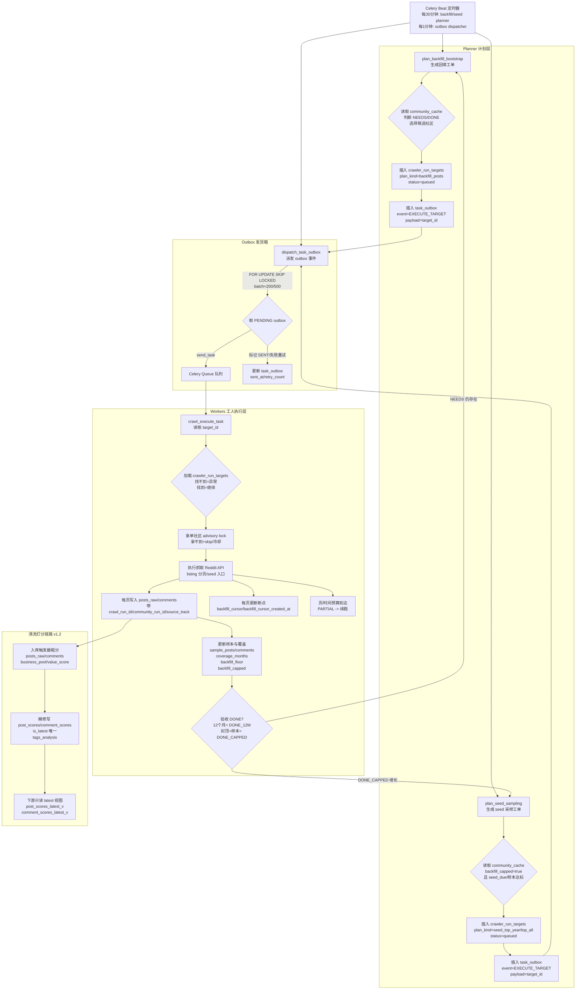

# Reddit Signal Scanner - 数据库全景架构地图 (Data Atlas 2025)

**日期**: 2025-12-29
**版本**: v3.1 (Facts v2 & Control Tower Ready)
**维护者**: David (System Architect)

---

## 0. 口径说明（先定唯一事实）

- 本 Atlas 基于 **金库** `reddit_signal_scanner` 导出，作为结构真相（表/字段/约束/索引）。
- **Dev/Test** 库结构与金库保持一致；默认写入 Dev：`reddit_signal_scanner_dev`。
- 任何结构变更以本 Atlas 为准，变更后需同步到 Dev/Test。

## 1. 核心设计哲学 (Design Philosophy)

本架构经过 2025-12 的深度重构（Phase A-E），确立了以下核心原则：

1.  **事实与观点分离 (Separation of Facts & Opinions)**
    *   **Fact (不可变)**: `posts_raw`, `comments`。记录 Reddit 上真实发生的内容，不做任何主观修改。
    *   **Opinion (版本化)**: `post_scores`, `post_semantic_labels`。记录 AI 或规则对内容的理解、打分和标签。允许存在多个版本（Rule v1, AI v2）。

2.  **控制塔模式 (Control Tower)**
    *   `community_pool` 不再只是白名单，而是**状态机**。通过 `status` (active/lab/paused/candidate/banned) 和价值指标 (`core_post_ratio`) 动态指挥爬虫和分析引擎。

3.  **全链路审计 (Audit Trail)**
    *   每一条从“草根”晋升为“核心”的数据，都在 `data_audit_events` 留有案底。
    *   被系统拒绝的“垃圾”，都在 `posts_quarantine` 和 `noise_labels` 中归档，作为未来的负样本资产。

4.  **单一真相源 (SSOT)**
    *   行业分类只认 `business_categories` + `community_category_map`。
    *   `community_pool.categories` 仅缓存展示，不允许直接写入（触发器拦截 + 审计）。

---

## 1.5 运行链路总览（与抓取SOP一致）


---

## 2. 架构全景图 (ER Diagram)

```mermaid
erDiagram
    %% Domain 1: Community Control Tower
    COMMUNITY_POOL ||--o{ COMMUNITY_CACHE : "monitors"
    COMMUNITY_POOL ||--o{ POSTS_RAW : "owns (community_id)"
    COMMUNITY_POOL ||--o{ COMMUNITY_CATEGORY_MAP : "classified_by"
    COMMUNITY_CATEGORY_MAP }o--|| BUSINESS_CATEGORIES : "dictionary"
    
    %% Domain 2: Raw Facts (The Source)
    POSTS_RAW ||--o{ COMMENTS : "has"
    POSTS_RAW }o--|| AUTHORS : "created_by"
    POSTS_RAW ||--o{ POSTS_QUARANTINE : "rejects_to"
    
    %% Domain 3: Interpretation Layer (The Brain)
    POSTS_RAW ||--o{ POST_SCORES : "evaluated_as (1:N versions)"
    POSTS_RAW ||--o{ POST_SEMANTIC_LABELS : "tagged_with"
    POSTS_RAW ||--o{ POST_EMBEDDINGS : "vectorized_as"
    
    %% Domain 4: Audit & Noise
    POSTS_RAW ||--o{ DATA_AUDIT_EVENTS : "audited_by"
    POSTS_RAW ||--o{ NOISE_LABELS : "flagged_as"
    
    %% Domain 5: Analytics
    POSTS_RAW ||--o{ MV_MONTHLY_TREND : "aggregates_to"

    classDef core fill:#f96,stroke:#333,stroke-width:2px;
    classDef meta fill:#9cf,stroke:#333,stroke-width:2px;
    classDef logic fill:#cfc,stroke:#333,stroke-width:2px;
    
    class POSTS_RAW,COMMENTS,AUTHORS core;
    class COMMUNITY_POOL,COMMUNITY_CACHE meta;
    class POST_SCORES,POST_SEMANTIC_LABELS logic;
```

---

## 3. 数据表详解 (Table Reference)

### 3.1 核心事实层 (Raw Facts)

#### `posts_raw` (冷库/主表)
> **定义**: Reddit 帖子的原始镜像。只进不出（除非物理清洗），承载所有业务外键。
*   **id** (BigInt, PK): 内部唯一 ID。
*   **community_id** (Int, FK): **[New]** 关联 `community_pool`，强归属。
*   **source_post_id** (String): Reddit 原始 ID (t3_xxxxx)。
*   **title / body**: 原始文本。
*   **value_score / business_pool**: **[Legacy]** 这里的字段仅作快速筛选，真实分值以 `post_scores` 为准。
*   **score_source / score_version**: **[New]** 记录最近一次打分的来源（如 `ai_gemini_flash_lite`）。
*   **字段清单（当前DB）**: `id`, `source`, `source_post_id`, `version`, `created_at`, `fetched_at`, `valid_from`, `valid_to`, `is_current`, `author_id`, `author_name`, `title`, `body`, `body_norm`, `text_norm_hash`, `url`, `subreddit`, `score`, `num_comments`, `is_deleted`, `edit_count`, `lang`, `metadata`, `is_duplicate`, `duplicate_of_id`, `spam_category`, `value_score`, `business_pool`, `community_id`, `score_source`, `score_version`, `first_seen_at`, `source_track`, `crawl_run_id`, `community_run_id`。
*   **封口规则**:
    *   新写入必须有 `community_id`；无法映射则入 `posts_quarantine` 并写审计。
    *   同一 `(source, source_post_id)` 只允许 1 条 `is_current=true`（唯一索引守门）。

#### `comments` (评论表)
> **定义**: 帖子的衍生内容，补充市场反馈。
*   **id** (BigInt, PK)
*   **post_id** (BigInt, FK): 关联 `posts_raw`。
*   **author_id**: 软关联（无 FK），仅用于追溯。
*   **body**: 评论内容。
*   **score**: 点赞数。
*   **字段清单（当前DB）**: `id`, `reddit_comment_id`, `source`, `source_post_id`, `subreddit`, `parent_id`, `depth`, `body`, `author_id`, `author_name`, `author_created_utc`, `created_utc`, `score`, `is_submitter`, `distinguished`, `edited`, `permalink`, `removed_by_category`, `awards_count`, `captured_at`, `expires_at`, `post_id`, `value_score`, `business_pool`, `is_deleted`, `lang`, `source_track`, `first_seen_at`, `fetched_at`, `crawl_run_id`, `community_run_id`。

#### `posts_quarantine` (隔离区)
> **定义**: 被触发器（Gatekeeper）拦截的“残次品”。
*   **original_payload** (JSONB): 原始数据全貌。
*   **reject_reason**: 拦截原因（如 `short_content`, `ghost_content`）。
*   **用途**: 负样本训练库，防止垃圾污染主表。
*   **边界**: 仅作证据仓/排障仓，不进入消费链路；不做可追溯映射。
*   **字段清单（当前DB）**: `id`, `source`, `source_post_id`, `subreddit`, `title`, `body`, `author_name`, `created_at`, `rejected_at`, `reject_reason`, `original_payload`。

---

### 3.2 智能理解层 (Interpretation Layer)

#### `post_scores` (核心评分表 v2)
> **定义**: **Facts v2 架构的核心**。存储对帖子的价值判断，支持多版本并存。
*   **post_id** (BigInt, FK)
*   **rule_version** (String): 规则版本（如 `rulebook_v1`）。
*   **llm_version** (String): 模型版本（如 `v1-openai/gpt-oss-120b`）。
*   **value_score** (Numeric): 商业价值分 (0-10)。
*   **tags_analysis** (JSONB): **核心资产**。包含 LLM 提取的所有结构化信息（痛点、场景、意图）。
*   **is_latest** (Boolean): 标记该帖子在当前规则下的最新评分。
*   **字段清单（当前DB）**: `id`, `post_id`, `llm_version`, `rule_version`, `scored_at`, `is_latest`, `value_score`, `opportunity_score`, `business_pool`, `sentiment`, `purchase_intent_score`, `tags_analysis`, `entities_extracted`, `calculation_log`。

#### `post_semantic_labels` (语义标签表)
> **定义**: 扁平化的标签存储，用于快速倒排索引。
*   **l1_category**: 一级分类（如 `ask_question`）。
*   **l2_business**: 商业意图（如 `complain`）。
*   **tags**: 标签数组（痛点、产品词）。
*   **rule_version / llm_version**: **[New]** 规则/模型版本追踪。
*   **source_model / feature_version**: **[New]** 来源追踪。
*   **字段清单（当前DB）**: `id`, `post_id`, `l1_category`, `l2_business`, `l3_scene`, `matched_rule_ids`, `top_terms`, `raw_scores`, `sentiment_score`, `confidence`, `created_at`, `updated_at`, `l1_secondary`, `tags`, `rule_version`, `llm_version`。

#### `post_embeddings` (向量表)
*   **embedding** (Vector 1024): 语义向量。
*   **source_model**: 模型名称（如 `BAAI/bge-m3`）。
*   **字段清单（当前DB）**: `post_id`, `model_version`, `embedding`, `created_at`, `source_model`, `feature_version`。

---

### 3.3 社区控制塔 (Control Tower)

#### `community_pool` (社区资产表)
> **定义**: 系统的调度中心和资产目录。
*   **核心状态**:
    *   `is_active` (Boolean): 是否在抓取池。
    *   `status` (Enum): `active`, `lab`, `paused`, `candidate`, `banned`。
*   **分类规范**:
    *   **8 大标准分类**: `Ecommerce_Business`, `Family_Parenting`, `Food_Coffee_Lifestyle`, `Frugal_Living`, `Home_Lifestyle`, `Minimal_Outdoor`, `Tools_EDC`, `AI_Workflow`。
    *   **SSOT**: `community_category_map` 为唯一写入口；`community_pool.categories` 仅缓存展示。
    *   **保护**: 直写 `community_pool.categories` 会被触发器拦截并审计。
    *   **别名兼容**: `E-commerce_Ops` 仅作为历史别名，写入统一归一为 `Ecommerce_Business`。
*   **黑名单**: `is_blacklisted`, `blacklist_reason`。
*   **统计口径**: 抓取/分析口径默认只看 `is_active=true` 且 `is_blacklisted=false`，黑名单不计入“活跃抓取”统计。
*   **价值指标**: `core_post_ratio`, `avg_value_score`, `recent_core_posts_30d`, `semantic_quality_score`。
*   **字段清单（当前DB）**: `id`, `name`, `tier`, `categories`, `description_keywords`, `daily_posts`, `avg_comment_length`, `user_feedback_count`, `discovered_count`, `is_active`, `created_at`, `updated_at`, `priority`, `is_blacklisted`, `blacklist_reason`, `downrank_factor`, `created_by`, `updated_by`, `deleted_at`, `deleted_by`, `semantic_quality_score`, `health_status`, `last_evaluated_at`, `auto_tier_enabled`, `name_key`, `status`, `core_post_ratio`, `avg_value_score`, `recent_core_posts_30d`, `stats_updated_at`, `vertical`, `history_depth_months`, `min_posts_target`。

#### `community_cache` (状态表)
> **定义**: 记录每个社区的抓取状态、水位线和调度参数。
*   **字段清单（当前DB）**: `community_name`, `last_crawled_at`, `ttl_seconds`, `posts_cached`, `hit_count`, `last_hit_at`, `crawl_priority`, `created_at`, `updated_at`, `crawl_frequency_hours`, `is_active`, `empty_hit`, `success_hit`, `failure_hit`, `avg_valid_posts`, `quality_tier`, `last_seen_post_id`, `last_seen_created_at`, `total_posts_fetched`, `dedup_rate`, `member_count`, `crawl_quality_score`, `community_key`, `backfill_floor`, `last_attempt_at`, `backfill_status`, `coverage_months`, `sample_posts`, `sample_comments`, `backfill_capped`, `backfill_cursor`, `backfill_cursor_created_at`, `backfill_updated_at`。
*   **断点规则**: 空页 `no_more_pages` 不更新 `backfill_cursor_created_at/backfill_updated_at`，只记录 `last_attempt_at`（避免“无数据”污染推进口径）。

#### `crawler_run_targets` (抓取任务单)
> **定义**: 每条抓取计划的执行单，执行器以此为唯一入口。
*   **关键字段**: `plan_kind`, `idempotency_key`, `dedupe_key`, `status`。
*   **约束**: `dedupe_key` 在 `queued/running` 状态唯一（DB 硬闸门）。

#### `community_category_map` (社区-分类映射)
> **定义**: 社区与行业分类的权威映射表（SSOT）。
*   **约束**: `(community_id, category_key)` 唯一；`category_key` 外键到 `business_categories.key`；每个 community 最多 1 条 `is_primary=true`。
*   **字段清单（当前DB）**: `community_id`, `category_key`, `is_primary`, `created_at`。

#### `business_categories` (分类字典)
> **定义**: 分类 Key 字典表（现有 8 个 Key，已包含 `AI_Workflow`）。
*   **字段清单（当前DB）**: `key`, `display_name`, `description`, `is_active`, `created_at`, `updated_at`。

---

### 3.4 审计与噪音 (Audit & Noise)

#### `data_audit_events` (统一审计表)
> **定义**: 系统的“黑匣子”，记录所有关键状态变更。
*   **event_type**: 如 `promote_core` (AI提拔), `downgrade_community` (人工降级)。
*   **reason**: 变更理由（AI 的 Reason 字段）。
*   **old_value / new_value**: 变更前后的快照。
*   **字段清单（当前DB）**: `id`, `event_type`, `target_type`, `target_id`, `old_value`, `new_value`, `reason`, `source_component`, `created_at`。

#### `noise_labels` (负样本金库)
> **定义**: 已确认的噪音分类。
*   **noise_type**: `pure_social` (纯水), `rage_rant` (暴躁), `meme_only` (梗图) 等。
*   **用途**: 训练反垃圾分类器。
*   **字段清单（当前DB）**: `id`, `content_type`, `content_id`, `noise_type`, `reason`, `created_at`。

---

### 3.5 报表与视图 (Reporting)

#### `mv_monthly_trend` (月度趋势视图)
*   **逻辑**: 聚合 `posts_raw` 和 `comments`。
*   **过滤**: **强制过滤** `business_pool IN ('core', 'lab')`。
*   **用途**: 确保趋势图不受垃圾贴干扰，只反映真实市场热度。
*   **字段清单（当前DB）**: `month_start`, `posts_cnt`, `comments_cnt`, `score_sum`, `posts_velocity_mom`, `comments_velocity_mom`, `score_velocity_mom`。

#### `posts_latest` (查询视图)
*   **逻辑**: `posts_raw` 的最新版本快照。
*   **字段**: 包含了 `value_score`, `community_id` 等所有最新扩充的字段。
*   **字段清单（当前DB）**: `id`, `source`, `source_post_id`, `version`, `created_at`, `fetched_at`, `valid_from`, `valid_to`, `is_current`, `author_id`, `author_name`, `title`, `body`, `body_norm`, `text_norm_hash`, `url`, `subreddit`, `community_id`, `score`, `num_comments`, `is_deleted`, `edit_count`, `lang`, `metadata`, `value_score`, `business_pool`, `score_source`, `score_version`。

### 3.6 数据清理与护栏 (Hygiene & Guardrails)

#### 软/硬孤儿清理（content_labels / content_entities）
*   **硬孤儿**：指向不存在内容（posts_hot/comments 均找不到）必须清零。
*   **软孤儿**（30 天排障窗）：`posts_hot` 过期且超过 30 天窗口，或 `comments.removed_by_category IS NOT NULL` 且超过 30 天窗口。
*   **边界**：不包含 `posts_quarantine`（隔离区不进入可消费映射）。

#### 删除护栏
*   关键表 DELETE 需要显式设置：`SET LOCAL app.allow_delete = '1'`（测试库自动跳过）。

#### 分类缓存护栏
*   `community_pool.categories` 直写被拦截并写审计。
*   回写只允许通过 `sync_community_pool_categories_from_map()`。

---

## 4. 实时统计 SQL 模板（只读）
> 说明：复制执行即可，或直接运行 `scripts/db_realtime_stats.sql` / `make db-realtime-stats`。

```sql
-- Realtime DB stats templates (read-only)
-- Usage (local):
--   psql -d reddit_signal_scanner_dev -U postgres -h localhost -f scripts/db_realtime_stats.sql
--   (如需对照金库，替换为 reddit_signal_scanner)

-- 1) Community status / tier / blacklist / health
SELECT status, COUNT(*) AS cnt
FROM community_pool
GROUP BY status
ORDER BY cnt DESC, status;

SELECT tier, COUNT(*) AS cnt
FROM community_pool
GROUP BY tier
ORDER BY cnt DESC, tier;

SELECT is_blacklisted, COUNT(*) AS cnt
FROM community_pool
GROUP BY is_blacklisted
ORDER BY is_blacklisted DESC;

SELECT health_status, COUNT(*) AS cnt
FROM community_pool
GROUP BY health_status
ORDER BY cnt DESC, health_status;

-- 2) Category coverage
SELECT category_key,
       COUNT(*) AS total_cnt,
       COUNT(*) FILTER (WHERE is_primary) AS primary_cnt
FROM community_category_map
GROUP BY category_key
ORDER BY total_cnt DESC, category_key;

-- 3) Primary count check (0 or >1 are anomalies)
SELECT community_id,
       COUNT(*) FILTER (WHERE is_primary) AS primary_cnt
FROM community_category_map
GROUP BY community_id
HAVING COUNT(*) FILTER (WHERE is_primary) <> 1
ORDER BY primary_cnt DESC, community_id;

-- 4) Category cache drift (map -> cache)
SELECT cp.id,
       cp.name,
       COALESCE(cp.categories, '[]'::jsonb) AS cache_categories,
       COALESCE(m.map_categories, '[]'::jsonb) AS map_categories
FROM community_pool cp
LEFT JOIN LATERAL (
    SELECT to_jsonb(array_agg(category_key ORDER BY is_primary DESC, category_key)) AS map_categories
    FROM community_category_map
    WHERE community_id = cp.id
) m ON true
WHERE COALESCE(cp.categories, '[]'::jsonb) <> COALESCE(m.map_categories, '[]'::jsonb)
ORDER BY cp.id
LIMIT 100;

-- 5) posts_raw community_id completeness
SELECT COUNT(*) AS null_community_id
FROM posts_raw
WHERE community_id IS NULL;

-- 6) SCD2 current duplicates (should be 0)
SELECT source, source_post_id, COUNT(*) AS current_cnt
FROM posts_raw
WHERE is_current = true
GROUP BY source, source_post_id
HAVING COUNT(*) > 1
ORDER BY current_cnt DESC, source, source_post_id
LIMIT 200;

-- 7) Score latest uniqueness (should be 0)
SELECT post_id, COUNT(*) AS latest_cnt
FROM post_scores
WHERE is_latest = true
GROUP BY post_id
HAVING COUNT(*) > 1
ORDER BY latest_cnt DESC, post_id
LIMIT 200;

SELECT comment_id, COUNT(*) AS latest_cnt
FROM comment_scores
WHERE is_latest = true
GROUP BY comment_id
HAVING COUNT(*) > 1
ORDER BY latest_cnt DESC, comment_id
LIMIT 200;

-- 8) Hard orphan counts (should be 0)
SELECT COUNT(*) AS hard_orphan_labels
FROM content_labels cl
LEFT JOIN posts_hot ph
  ON cl.content_type = 'post' AND ph.id = cl.content_id
LEFT JOIN comments c
  ON cl.content_type = 'comment' AND c.id = cl.content_id
WHERE (cl.content_type = 'post' AND ph.id IS NULL)
   OR (cl.content_type = 'comment' AND c.id IS NULL);

SELECT COUNT(*) AS hard_orphan_entities
FROM content_entities ce
LEFT JOIN posts_hot ph
  ON ce.content_type = 'post' AND ph.id = ce.content_id
LEFT JOIN comments c
  ON ce.content_type = 'comment' AND c.id = ce.content_id
WHERE (ce.content_type = 'post' AND ph.id IS NULL)
   OR (ce.content_type = 'comment' AND c.id IS NULL);

-- 9) Soft orphan counts (retention window: 30 days)
SELECT COUNT(*) AS soft_orphan_labels
FROM content_labels cl
LEFT JOIN posts_hot ph
  ON cl.content_type = 'post' AND ph.id = cl.content_id
LEFT JOIN comments c
  ON cl.content_type = 'comment' AND c.id = cl.content_id
WHERE cl.created_at < (NOW() - (30 * interval '1 day'))
  AND (
    (cl.content_type = 'post' AND ph.id IS NOT NULL AND ph.expires_at < (NOW() - (30 * interval '1 day')))
    OR
    (cl.content_type = 'comment' AND c.id IS NOT NULL AND c.removed_by_category IS NOT NULL)
  );

SELECT COUNT(*) AS soft_orphan_entities
FROM content_entities ce
LEFT JOIN posts_hot ph
  ON ce.content_type = 'post' AND ph.id = ce.content_id
LEFT JOIN comments c
  ON ce.content_type = 'comment' AND c.id = ce.content_id
WHERE ce.created_at < (NOW() - (30 * interval '1 day'))
  AND (
    (ce.content_type = 'post' AND ph.id IS NOT NULL AND ph.expires_at < (NOW() - (30 * interval '1 day')))
    OR
    (ce.content_type = 'comment' AND c.id IS NOT NULL AND c.removed_by_category IS NOT NULL)
  );

-- 10) MV refresh recency (from maintenance_audit)
SELECT task_name,
       MAX(ended_at) AS last_run_at,
       MAX(affected_rows) AS last_affected_rows
FROM maintenance_audit
WHERE task_name IN (
    'refresh_mv_monthly_trend',
    'refresh_posts_latest',
    'refresh_post_comment_stats'
)
GROUP BY task_name
ORDER BY task_name;

-- 11) Active target dedupe (should be 0)
SELECT COUNT(*) AS active_dup_keys
FROM (
    SELECT dedupe_key
    FROM crawler_run_targets
    WHERE status IN ('queued', 'running')
      AND dedupe_key IS NOT NULL
    GROUP BY dedupe_key
    HAVING COUNT(*) > 1
) t;
```

## 5. 总结 (Summary)

截至 2025-12-26，数据库已完成从“单体存储”到**“多层智能数仓”**的进化。
*   **底层**：有隔离区保护 (`quarantine`)。
*   **中层**：有强血缘追踪 (`score_source`, `audit`)。
*   **顶层**：有版本化的智能评分 (`post_scores`) 和纯净的趋势视图 (`mv_monthly_trend`)。
*   **封口**：分类 SSOT + 删除护栏 + 孤儿清理定型 + 回填状态/断点 + 任务去重。

这是一套**可信、可管、可进化**的数据基础设施。


## 附录：全库表结构快照（自动生成）

生成日期: 2025-12-26

- 数据表数量: 52
- 视图数量: 8
- 物化视图数量: 5

**视图列表**

`cleanup_stats`, `comment_scores_latest_v`, `comments_core_lab_v`, `post_scores_latest_v`, `v_analyses_stats`, `v_comment_semantic_tasks`, `v_post_semantic_tasks`, `vw_community_quality`

**物化视图列表**

`mv_analysis_entities`, `mv_analysis_labels`, `mv_monthly_trend`, `post_comment_stats`, `posts_latest`

### 表结构

#### `alembic_version`

| 字段 | 类型 | 允许空 | 默认值 |
| --- | --- | --- | --- |
| `version_num` | `character varying(32)` | NO |  |

#### `analyses`

| 字段 | 类型 | 允许空 | 默认值 |
| --- | --- | --- | --- |
| `id` | `uuid` | NO | gen_random_uuid() |
| `task_id` | `uuid` | NO |  |
| `insights` | `jsonb` | NO |  |
| `sources` | `jsonb` | NO |  |
| `confidence_score` | `numeric(3,2)` | YES |  |
| `analysis_version` | `integer` | NO | 1 |
| `created_at` | `timestamp with time zone` | NO | CURRENT_TIMESTAMP |
| `action_items` | `jsonb` | YES |  |

#### `analytics_community_history`

| 字段 | 类型 | 允许空 | 默认值 |
| --- | --- | --- | --- |
| `report_date` | `date` | NO | CURRENT_DATE |
| `subreddit` | `character varying(100)` | NO |  |
| `active_users_24h` | `integer` | YES |  |
| `posts_24h` | `integer` | YES |  |
| `pain_points_count` | `integer` | YES |  |
| `commercial_density` | `numeric(5,2)` | YES |  |
| `c_score` | `numeric(5,2)` | YES |  |

#### `authors`

| 字段 | 类型 | 允许空 | 默认值 |
| --- | --- | --- | --- |
| `author_id` | `character varying(100)` | NO |  |
| `author_name` | `character varying(100)` | YES |  |
| `created_utc` | `timestamp with time zone` | YES |  |
| `is_bot` | `boolean` | NO | false |
| `first_seen_at_global` | `timestamp with time zone` | NO | CURRENT_TIMESTAMP |

#### `beta_feedback`

| 字段 | 类型 | 允许空 | 默认值 |
| --- | --- | --- | --- |
| `id` | `uuid` | NO |  |
| `task_id` | `uuid` | NO |  |
| `user_id` | `uuid` | NO |  |
| `satisfaction` | `integer` | NO |  |
| `missing_communities` | `text[]` | NO | '{}'::text[] |
| `comments` | `text` | NO | ''::text |
| `created_at` | `timestamp with time zone` | NO | CURRENT_TIMESTAMP |
| `updated_at` | `timestamp with time zone` | NO | CURRENT_TIMESTAMP |

#### `business_categories`

| 字段 | 类型 | 允许空 | 默认值 |
| --- | --- | --- | --- |
| `key` | `character varying(50)` | NO |  |
| `display_name` | `character varying(100)` | YES |  |
| `description` | `text` | YES |  |
| `is_active` | `boolean` | YES | true |
| `created_at` | `timestamp with time zone` | YES | now() |
| `updated_at` | `timestamp with time zone` | YES | now() |

#### `cleanup_logs`

| 字段 | 类型 | 允许空 | 默认值 |
| --- | --- | --- | --- |
| `id` | `uuid` | NO | gen_random_uuid() |
| `executed_at` | `timestamp with time zone` | NO | CURRENT_TIMESTAMP |
| `total_records_cleaned` | `integer` | NO |  |
| `breakdown` | `jsonb` | NO |  |
| `duration_seconds` | `integer` | YES |  |
| `success` | `boolean` | NO | true |
| `error_message` | `text` | YES |  |

#### `comment_scores`

| 字段 | 类型 | 允许空 | 默认值 |
| --- | --- | --- | --- |
| `id` | `uuid` | NO | gen_random_uuid() |
| `comment_id` | `bigint` | NO |  |
| `llm_version` | `character varying(50)` | NO |  |
| `rule_version` | `character varying(50)` | NO |  |
| `scored_at` | `timestamp with time zone` | YES | now() |
| `is_latest` | `boolean` | YES | true |
| `value_score` | `numeric(4,2)` | YES |  |
| `opportunity_score` | `numeric(4,2)` | YES |  |
| `business_pool` | `character varying(20)` | YES |  |
| `sentiment` | `numeric(4,3)` | YES |  |
| `purchase_intent_score` | `numeric(4,2)` | YES |  |
| `tags_analysis` | `jsonb` | YES | '{}'::jsonb |
| `entities_extracted` | `jsonb` | YES | '[]'::jsonb |
| `calculation_log` | `jsonb` | YES | '{}'::jsonb |

#### `comments`

| 字段 | 类型 | 允许空 | 默认值 |
| --- | --- | --- | --- |
| `id` | `bigint` | NO | nextval('comments_id_seq'::regclass) |
| `reddit_comment_id` | `character varying(32)` | NO |  |
| `source` | `character varying(50)` | NO | 'reddit'::character varying |
| `source_post_id` | `character varying(100)` | NO |  |
| `subreddit` | `character varying(100)` | NO |  |
| `parent_id` | `character varying(32)` | YES |  |
| `depth` | `integer` | NO | 0 |
| `body` | `text` | NO |  |
| `author_id` | `character varying(100)` | YES |  |
| `author_name` | `character varying(100)` | YES |  |
| `author_created_utc` | `timestamp with time zone` | YES |  |
| `created_utc` | `timestamp with time zone` | NO |  |
| `score` | `integer` | NO | 0 |
| `is_submitter` | `boolean` | NO | false |
| `distinguished` | `character varying(32)` | YES |  |
| `edited` | `boolean` | NO | false |
| `permalink` | `text` | YES |  |
| `removed_by_category` | `character varying(64)` | YES |  |
| `awards_count` | `integer` | NO | 0 |
| `captured_at` | `timestamp with time zone` | NO | CURRENT_TIMESTAMP |
| `expires_at` | `timestamp with time zone` | YES |  |
| `post_id` | `bigint` | NO |  |
| `value_score` | `smallint` | YES |  |
| `business_pool` | `character varying(10)` | YES | 'lab'::character varying |
| `is_deleted` | `boolean` | YES | false |
| `lang` | `character varying(10)` | YES |  |
| `source_track` | `character varying(32)` | YES | 'incremental'::character varying |
| `first_seen_at` | `timestamp with time zone` | YES | now() |
| `fetched_at` | `timestamp with time zone` | YES | now() |
| `crawl_run_id` | `uuid` | YES |  |
| `community_run_id` | `uuid` | YES |  |

#### `community_audit`

| 字段 | 类型 | 允许空 | 默认值 |
| --- | --- | --- | --- |
| `id` | `integer` | NO | nextval('community_audit_id_seq'::regclass) |
| `community_id` | `bigint` | NO |  |
| `action` | `text` | NO |  |
| `metrics` | `jsonb` | YES |  |
| `reason` | `text` | YES |  |
| `actor` | `text` | YES |  |
| `created_at` | `timestamp with time zone` | YES | now() |

#### `community_cache`

| 字段 | 类型 | 允许空 | 默认值 |
| --- | --- | --- | --- |
| `community_name` | `character varying(100)` | NO |  |
| `last_crawled_at` | `timestamp with time zone` | YES |  |
| `ttl_seconds` | `integer` | NO | 3600 |
| `posts_cached` | `integer` | NO | 0 |
| `hit_count` | `integer` | NO | 0 |
| `last_hit_at` | `timestamp with time zone` | YES |  |
| `crawl_priority` | `integer` | NO | 50 |
| `created_at` | `timestamp with time zone` | NO | CURRENT_TIMESTAMP |
| `updated_at` | `timestamp with time zone` | NO | CURRENT_TIMESTAMP |
| `crawl_frequency_hours` | `integer` | NO | 2 |
| `is_active` | `boolean` | NO | true |
| `empty_hit` | `integer` | NO | 0 |
| `success_hit` | `integer` | NO | 0 |
| `failure_hit` | `integer` | NO | 0 |
| `avg_valid_posts` | `integer` | NO | 0 |
| `quality_tier` | `character varying(20)` | NO |  |
| `last_seen_post_id` | `character varying(100)` | YES |  |
| `last_seen_created_at` | `timestamp with time zone` | YES |  |
| `total_posts_fetched` | `integer` | NO | 0 |
| `dedup_rate` | `numeric(5,2)` | YES |  |
| `member_count` | `integer` | YES |  |
| `crawl_quality_score` | `numeric(3,2)` | NO | 0.0 |
| `community_key` | `character varying(100)` | NO | lower(regexp_replace((community_name)::text, '^r/'::text, ''::text)) |
| `backfill_floor` | `timestamp with time zone` | YES |  |
| `last_attempt_at` | `timestamp with time zone` | YES |  |
| `backfill_status` | `character varying(32)` | YES |  |
| `coverage_months` | `smallint` | YES |  |
| `sample_posts` | `integer` | YES |  |
| `sample_comments` | `integer` | YES |  |
| `backfill_capped` | `boolean` | YES |  |
| `backfill_cursor` | `text` | YES |  |
| `backfill_cursor_created_at` | `timestamp with time zone` | YES |  |
| `backfill_updated_at` | `timestamp with time zone` | YES |  |

#### `community_category_map`

| 字段 | 类型 | 允许空 | 默认值 |
| --- | --- | --- | --- |
| `community_id` | `integer` | NO |  |
| `category_key` | `character varying(50)` | NO |  |
| `is_primary` | `boolean` | YES | false |
| `created_at` | `timestamp with time zone` | YES | now() |

#### `community_import_history`

| 字段 | 类型 | 允许空 | 默认值 |
| --- | --- | --- | --- |
| `id` | `integer` | NO | nextval('community_import_history_id_seq'::regclass) |
| `filename` | `character varying(255)` | NO |  |
| `uploaded_by` | `character varying(255)` | NO |  |
| `uploaded_by_user_id` | `uuid` | YES |  |
| `dry_run` | `boolean` | NO | false |
| `status` | `character varying(32)` | NO |  |
| `total_rows` | `integer` | NO | 0 |
| `valid_rows` | `integer` | NO | 0 |
| `invalid_rows` | `integer` | NO | 0 |
| `duplicate_rows` | `integer` | NO | 0 |
| `imported_rows` | `integer` | NO | 0 |
| `error_details` | `jsonb` | YES |  |
| `summary_preview` | `jsonb` | YES |  |
| `created_at` | `timestamp with time zone` | NO | CURRENT_TIMESTAMP |
| `updated_at` | `timestamp with time zone` | NO | CURRENT_TIMESTAMP |
| `created_by` | `uuid` | YES |  |
| `updated_by` | `uuid` | YES |  |

#### `community_pool`

| 字段 | 类型 | 允许空 | 默认值 |
| --- | --- | --- | --- |
| `id` | `integer` | NO | nextval('community_pool_id_seq'::regclass) |
| `name` | `character varying(100)` | NO |  |
| `tier` | `character varying(20)` | NO |  |
| `categories` | `jsonb` | NO |  |
| `description_keywords` | `jsonb` | NO |  |
| `daily_posts` | `integer` | NO | 0 |
| `avg_comment_length` | `integer` | NO | 0 |
| `user_feedback_count` | `integer` | NO | 0 |
| `discovered_count` | `integer` | NO | 0 |
| `is_active` | `boolean` | NO | true |
| `created_at` | `timestamp with time zone` | NO | CURRENT_TIMESTAMP |
| `updated_at` | `timestamp with time zone` | NO | CURRENT_TIMESTAMP |
| `priority` | `character varying(20)` | NO | 'medium'::character varying |
| `is_blacklisted` | `boolean` | NO | false |
| `blacklist_reason` | `character varying(255)` | YES |  |
| `downrank_factor` | `numeric(3,2)` | YES |  |
| `created_by` | `uuid` | YES |  |
| `updated_by` | `uuid` | YES |  |
| `deleted_at` | `timestamp with time zone` | YES |  |
| `deleted_by` | `uuid` | YES |  |
| `semantic_quality_score` | `numeric(3,2)` | NO |  |
| `health_status` | `character varying(20)` | NO | 'unknown'::character varying |
| `last_evaluated_at` | `timestamp with time zone` | YES |  |
| `auto_tier_enabled` | `boolean` | NO | true |
| `name_key` | `character varying(100)` | NO | lower(regexp_replace((name)::text, '^r/'::text, ''::text)) |
| `status` | `character varying(20)` | YES | 'active'::character varying |
| `core_post_ratio` | `numeric(5,4)` | YES | 0 |
| `avg_value_score` | `numeric(4,2)` | YES | 0 |
| `recent_core_posts_30d` | `integer` | YES | 0 |
| `stats_updated_at` | `timestamp with time zone` | YES |  |
| `vertical` | `character varying(50)` | YES |  |
| `history_depth_months` | `integer` | YES | 24 |
| `min_posts_target` | `integer` | YES | 3000 |

#### `community_roles_map`

| 字段 | 类型 | 允许空 | 默认值 |
| --- | --- | --- | --- |
| `subreddit` | `character varying(100)` | NO |  |
| `role` | `character varying(50)` | YES |  |

#### `content_entities`

| 字段 | 类型 | 允许空 | 默认值 |
| --- | --- | --- | --- |
| `id` | `bigint` | NO | nextval('content_entities_id_seq'::regclass) |
| `content_type` | `character varying(7)` | NO |  |
| `content_id` | `bigint` | NO |  |
| `entity` | `character varying(255)` | NO |  |
| `entity_type` | `character varying(8)` | NO | 'other'::character varying |
| `count` | `integer` | NO | 1 |
| `created_at` | `timestamp with time zone` | NO | CURRENT_TIMESTAMP |
| `source_model` | `character varying(50)` | YES | 'unknown'::character varying |
| `feature_version` | `integer` | YES | 1 |

#### `content_labels`

| 字段 | 类型 | 允许空 | 默认值 |
| --- | --- | --- | --- |
| `id` | `bigint` | NO | nextval('content_labels_id_seq'::regclass) |
| `content_type` | `character varying(7)` | NO |  |
| `content_id` | `bigint` | NO |  |
| `category` | `character varying(255)` | NO |  |
| `aspect` | `character varying(255)` | NO | 'other'::character varying |
| `confidence` | `integer` | YES |  |
| `created_at` | `timestamp with time zone` | NO | CURRENT_TIMESTAMP |
| `sentiment_score` | `double precision` | YES |  |
| `sentiment_label` | `character varying(20)` | YES |  |
| `source_model` | `character varying(50)` | YES | 'unknown'::character varying |
| `feature_version` | `integer` | YES | 1 |

#### `crawl_metrics`

| 字段 | 类型 | 允许空 | 默认值 |
| --- | --- | --- | --- |
| `id` | `integer` | NO | nextval('crawl_metrics_id_seq'::regclass) |
| `metric_date` | `date` | NO |  |
| `metric_hour` | `integer` | NO |  |
| `cache_hit_rate` | `numeric(5,2)` | NO |  |
| `valid_posts_24h` | `integer` | NO |  |
| `created_at` | `timestamp with time zone` | NO | CURRENT_TIMESTAMP |
| `total_communities` | `integer` | NO |  |
| `successful_crawls` | `integer` | NO |  |
| `empty_crawls` | `integer` | NO |  |
| `failed_crawls` | `integer` | NO |  |
| `avg_latency_seconds` | `numeric(7,2)` | NO |  |
| `total_new_posts` | `integer` | NO |  |
| `total_updated_posts` | `integer` | NO |  |
| `total_duplicates` | `integer` | NO |  |
| `tier_assignments` | `json` | YES |  |
| `updated_at` | `timestamp with time zone` | NO | CURRENT_TIMESTAMP |
| `crawl_run_id` | `uuid` | YES |  |

#### `crawler_run_targets`

| 字段 | 类型 | 允许空 | 默认值 |
| --- | --- | --- | --- |
| `id` | `uuid` | NO |  |
| `crawl_run_id` | `uuid` | NO |  |
| `subreddit` | `text` | NO |  |
| `started_at` | `timestamp with time zone` | NO | now() |
| `completed_at` | `timestamp with time zone` | YES |  |
| `status` | `character varying(20)` | NO | 'running'::character varying |
| `config` | `jsonb` | NO | '{}'::jsonb |
| `metrics` | `jsonb` | NO | '{}'::jsonb |
| `error_code` | `character varying(120)` | YES |  |
| `error_message_short` | `text` | YES |  |
| `plan_kind` | `character varying(32)` | YES |  |
| `idempotency_key` | `text` | YES |  |
| `idempotency_key_human` | `text` | YES |  |
| `dedupe_key` | `text` | YES |  |

#### `crawler_runs`

| 字段 | 类型 | 允许空 | 默认值 |
| --- | --- | --- | --- |
| `id` | `uuid` | NO |  |
| `started_at` | `timestamp with time zone` | NO | now() |
| `completed_at` | `timestamp with time zone` | YES |  |
| `status` | `character varying(20)` | NO | 'running'::character varying |
| `config` | `jsonb` | NO | '{}'::jsonb |
| `metrics` | `jsonb` | NO | '{}'::jsonb |

#### `data_audit_events`

| 字段 | 类型 | 允许空 | 默认值 |
| --- | --- | --- | --- |
| `id` | `bigint` | NO | nextval('data_audit_events_id_seq'::regclass) |
| `event_type` | `character varying(50)` | NO |  |
| `target_type` | `character varying(20)` | NO |  |
| `target_id` | `character varying(100)` | NO |  |
| `old_value` | `jsonb` | YES |  |
| `new_value` | `jsonb` | YES |  |
| `reason` | `text` | YES |  |
| `source_component` | `character varying(50)` | YES |  |
| `created_at` | `timestamp with time zone` | YES | now() |

#### `discovered_communities`

| 字段 | 类型 | 允许空 | 默认值 |
| --- | --- | --- | --- |
| `id` | `integer` | NO | nextval('discovered_communities_id_seq'::regclass) |
| `name` | `character varying(100)` | NO |  |
| `discovered_from_keywords` | `jsonb` | YES |  |
| `discovered_count` | `integer` | NO | 1 |
| `first_discovered_at` | `timestamp with time zone` | NO | CURRENT_TIMESTAMP |
| `last_discovered_at` | `timestamp with time zone` | NO | CURRENT_TIMESTAMP |
| `status` | `character varying(20)` | NO | 'pending'::character varying |
| `admin_reviewed_at` | `timestamp with time zone` | YES |  |
| `admin_notes` | `text` | YES |  |
| `discovered_from_task_id` | `uuid` | YES |  |
| `reviewed_by` | `uuid` | YES |  |
| `created_by` | `uuid` | YES |  |
| `updated_by` | `uuid` | YES |  |
| `deleted_at` | `timestamp with time zone` | YES |  |
| `deleted_by` | `uuid` | YES |  |
| `created_at` | `timestamp with time zone` | NO | CURRENT_TIMESTAMP |
| `updated_at` | `timestamp with time zone` | NO | CURRENT_TIMESTAMP |
| `metrics` | `jsonb` | NO | '{}'::jsonb |
| `tags` | `character varying[]` | NO | '{}'::character varying[] |
| `cooldown_until` | `timestamp with time zone` | YES |  |
| `rejection_count` | `integer` | NO | 0 |

#### `evidence_posts`

| 字段 | 类型 | 允许空 | 默认值 |
| --- | --- | --- | --- |
| `id` | `integer` | NO | nextval('evidence_posts_id_seq'::regclass) |
| `crawl_run_id` | `uuid` | YES |  |
| `target_id` | `uuid` | YES |  |
| `probe_source` | `character varying(20)` | NO |  |
| `source_query` | `text` | YES |  |
| `source_query_hash` | `character varying(64)` | NO |  |
| `source_post_id` | `character varying(100)` | NO |  |
| `subreddit` | `character varying(100)` | NO |  |
| `title` | `text` | NO |  |
| `summary` | `text` | YES |  |
| `score` | `integer` | NO | 0 |
| `num_comments` | `integer` | NO | 0 |
| `post_created_at` | `timestamp with time zone` | YES |  |
| `evidence_score` | `integer` | NO | 0 |
| `created_at` | `timestamp with time zone` | NO | now() |
| `updated_at` | `timestamp with time zone` | NO | now() |

#### `evidences`

| 字段 | 类型 | 允许空 | 默认值 |
| --- | --- | --- | --- |
| `id` | `uuid` | NO |  |
| `insight_card_id` | `uuid` | NO |  |
| `post_url` | `character varying(500)` | NO |  |
| `excerpt` | `text` | NO |  |
| `timestamp` | `timestamp with time zone` | NO |  |
| `subreddit` | `character varying(100)` | NO |  |
| `score` | `numeric(5,4)` | NO | 0.0 |
| `created_at` | `timestamp with time zone` | NO | now() |
| `updated_at` | `timestamp with time zone` | NO | now() |

#### `facts_quality_audit`

| 字段 | 类型 | 允许空 | 默认值 |
| --- | --- | --- | --- |
| `run_id` | `uuid` | NO |  |
| `topic` | `text` | NO |  |
| `days` | `integer` | NO |  |
| `mode` | `text` | NO |  |
| `config_hash` | `text` | YES |  |
| `trend_source` | `text` | YES |  |
| `trend_degraded` | `boolean` | YES |  |
| `time_window_used` | `integer` | YES |  |
| `comments_count` | `integer` | YES |  |
| `posts_count` | `integer` | YES |  |
| `solutions_count` | `integer` | YES |  |
| `community_coverage` | `integer` | YES |  |
| `degraded` | `boolean` | YES |  |
| `data_fallback` | `boolean` | YES |  |
| `posts_fallback` | `boolean` | YES |  |
| `solutions_fallback` | `boolean` | YES |  |
| `dynamic_whitelist` | `jsonb` | YES |  |
| `dynamic_blacklist` | `jsonb` | YES |  |
| `insufficient_flags` | `jsonb` | YES |  |
| `created_at` | `timestamp with time zone` | YES | now() |

#### `facts_run_logs`

| 字段 | 类型 | 允许空 | 默认值 |
| --- | --- | --- | --- |
| `id` | `uuid` | NO |  |
| `task_id` | `uuid` | NO |  |
| `audit_level` | `character varying(20)` | NO | 'lab'::character varying |
| `status` | `character varying(20)` | NO | 'ok'::character varying |
| `validator_level` | `character varying(10)` | NO | 'info'::character varying |
| `retention_days` | `integer` | NO | 7 |
| `expires_at` | `timestamp with time zone` | YES |  |
| `summary` | `jsonb` | NO | '{}'::jsonb |
| `error_code` | `character varying(120)` | YES |  |
| `error_message_short` | `text` | YES |  |
| `created_at` | `timestamp with time zone` | NO | now() |
| `updated_at` | `timestamp with time zone` | NO | now() |

#### `facts_snapshots`

| 字段 | 类型 | 允许空 | 默认值 |
| --- | --- | --- | --- |
| `id` | `uuid` | NO |  |
| `task_id` | `uuid` | NO |  |
| `schema_version` | `character varying(10)` | NO | '2.0'::character varying |
| `v2_package` | `jsonb` | NO | '{}'::jsonb |
| `quality` | `jsonb` | NO | '{}'::jsonb |
| `passed` | `boolean` | NO | false |
| `tier` | `character varying(20)` | NO | 'C_scouting'::character varying |
| `created_at` | `timestamp with time zone` | NO | now() |
| `updated_at` | `timestamp with time zone` | NO | now() |
| `audit_level` | `character varying(20)` | NO | 'lab'::character varying |
| `status` | `character varying(20)` | NO | 'ok'::character varying |
| `validator_level` | `character varying(10)` | NO | 'info'::character varying |
| `retention_days` | `integer` | NO | 30 |
| `expires_at` | `timestamp with time zone` | YES |  |
| `blocked_reason` | `character varying(120)` | YES |  |
| `error_code` | `character varying(120)` | YES |  |

#### `feedback_events`

| 字段 | 类型 | 允许空 | 默认值 |
| --- | --- | --- | --- |
| `id` | `uuid` | NO | gen_random_uuid() |
| `source` | `text` | NO |  |
| `event_type` | `text` | NO |  |
| `user_id` | `text` | YES |  |
| `task_id` | `text` | YES |  |
| `analysis_id` | `text` | YES |  |
| `payload` | `jsonb` | NO |  |
| `created_at` | `timestamp with time zone` | NO | CURRENT_TIMESTAMP |

#### `insight_cards`

| 字段 | 类型 | 允许空 | 默认值 |
| --- | --- | --- | --- |
| `id` | `uuid` | NO |  |
| `task_id` | `uuid` | NO |  |
| `title` | `character varying(500)` | NO |  |
| `summary` | `text` | NO |  |
| `confidence` | `numeric(5,4)` | NO |  |
| `time_window_days` | `integer` | NO | 30 |
| `subreddits` | `character varying(100)[]` | NO | '{}'::character varying[] |
| `created_at` | `timestamp with time zone` | NO | now() |
| `updated_at` | `timestamp with time zone` | NO | now() |

#### `maintenance_audit`

| 字段 | 类型 | 允许空 | 默认值 |
| --- | --- | --- | --- |
| `id` | `bigint` | NO | nextval('maintenance_audit_id_seq'::regclass) |
| `task_name` | `character varying(128)` | NO |  |
| `source` | `character varying(32)` | YES |  |
| `triggered_by` | `character varying(128)` | YES |  |
| `started_at` | `timestamp with time zone` | NO | CURRENT_TIMESTAMP |
| `ended_at` | `timestamp with time zone` | YES |  |
| `affected_rows` | `integer` | NO | 0 |
| `sample_ids` | `bigint[]` | YES |  |
| `extra` | `jsonb` | YES |  |

#### `noise_labels`

| 字段 | 类型 | 允许空 | 默认值 |
| --- | --- | --- | --- |
| `id` | `integer` | NO | nextval('noise_labels_id_seq'::regclass) |
| `content_type` | `text` | NO |  |
| `content_id` | `bigint` | NO |  |
| `noise_type` | `text` | NO |  |
| `reason` | `text` | YES |  |
| `created_at` | `timestamp with time zone` | YES | now() |

#### `post_embeddings`

| 字段 | 类型 | 允许空 | 默认值 |
| --- | --- | --- | --- |
| `post_id` | `bigint` | NO |  |
| `model_version` | `character varying(50)` | NO | 'BAAI/bge-m3'::character varying |
| `embedding` | `vector(1024)` | YES |  |
| `created_at` | `timestamp with time zone` | YES | now() |
| `source_model` | `character varying(50)` | YES | 'BAAI/bge-m3'::character varying |
| `feature_version` | `integer` | YES | 1 |

#### `post_scores`

| 字段 | 类型 | 允许空 | 默认值 |
| --- | --- | --- | --- |
| `id` | `uuid` | NO | gen_random_uuid() |
| `post_id` | `bigint` | NO |  |
| `llm_version` | `character varying(50)` | NO |  |
| `rule_version` | `character varying(50)` | NO |  |
| `scored_at` | `timestamp with time zone` | YES | now() |
| `is_latest` | `boolean` | YES | true |
| `value_score` | `numeric(4,2)` | YES |  |
| `opportunity_score` | `numeric(4,2)` | YES |  |
| `business_pool` | `character varying(20)` | YES |  |
| `sentiment` | `numeric(4,3)` | YES |  |
| `purchase_intent_score` | `numeric(4,2)` | YES |  |
| `tags_analysis` | `jsonb` | YES | '{}'::jsonb |
| `entities_extracted` | `jsonb` | YES | '[]'::jsonb |
| `calculation_log` | `jsonb` | YES | '{}'::jsonb |

#### `post_semantic_labels`

| 字段 | 类型 | 允许空 | 默认值 |
| --- | --- | --- | --- |
| `id` | `bigint` | NO | nextval('post_semantic_labels_id_seq'::regclass) |
| `post_id` | `bigint` | NO |  |
| `l1_category` | `character varying(50)` | YES |  |
| `l2_business` | `character varying(50)` | YES |  |
| `l3_scene` | `character varying(100)` | YES |  |
| `matched_rule_ids` | `integer[]` | YES |  |
| `top_terms` | `text[]` | YES |  |
| `raw_scores` | `json` | YES |  |
| `sentiment_score` | `double precision` | YES |  |
| `confidence` | `double precision` | YES |  |
| `created_at` | `timestamp with time zone` | NO | now() |
| `updated_at` | `timestamp with time zone` | NO | now() |
| `l1_secondary` | `character varying(50)` | YES |  |
| `tags` | `character varying(50)[]` | YES |  |
| `rule_version` | `character varying(50)` | YES |  |
| `llm_version` | `character varying(50)` | YES |  |

#### `posts_archive`

| 字段 | 类型 | 允许空 | 默认值 |
| --- | --- | --- | --- |
| `id` | `bigint` | NO | nextval('posts_archive_id_seq'::regclass) |
| `source` | `character varying(50)` | NO | 'reddit'::character varying |
| `source_post_id` | `character varying(100)` | NO |  |
| `version` | `integer` | NO | 1 |
| `archived_at` | `timestamp with time zone` | NO | now() |
| `payload` | `jsonb` | NO |  |

#### `posts_hot`

| 字段 | 类型 | 允许空 | 默认值 |
| --- | --- | --- | --- |
| `source` | `character varying(50)` | NO | 'reddit'::character varying |
| `source_post_id` | `character varying(100)` | NO |  |
| `created_at` | `timestamp with time zone` | NO |  |
| `cached_at` | `timestamp with time zone` | NO | now() |
| `expires_at` | `timestamp with time zone` | NO | (now() + '180 days'::interval) |
| `title` | `text` | NO |  |
| `body` | `text` | YES |  |
| `subreddit` | `character varying(100)` | NO |  |
| `score` | `integer` | YES | 0 |
| `num_comments` | `integer` | YES | 0 |
| `metadata` | `jsonb` | YES |  |
| `id` | `bigint` | NO | nextval('posts_hot_id_seq'::regclass) |
| `author_id` | `character varying(100)` | YES |  |
| `author_name` | `character varying(100)` | YES |  |
| `content_labels` | `jsonb` | YES |  |
| `entities` | `jsonb` | YES |  |
| `content_tsvector` | `tsvector` | YES | to_tsvector('english'::regconfig, ((COALESCE(title, ''::text) \|\| ' '::text) \|\| COALESCE(body, ''::text))) |

#### `posts_quarantine`

| 字段 | 类型 | 允许空 | 默认值 |
| --- | --- | --- | --- |
| `id` | `bigint` | NO | nextval('posts_quarantine_id_seq'::regclass) |
| `source` | `character varying(50)` | NO | 'reddit'::character varying |
| `source_post_id` | `character varying(100)` | NO |  |
| `subreddit` | `character varying(100)` | YES |  |
| `title` | `text` | YES |  |
| `body` | `text` | YES |  |
| `author_name` | `character varying(100)` | YES |  |
| `created_at` | `timestamp with time zone` | YES | now() |
| `rejected_at` | `timestamp with time zone` | YES | now() |
| `reject_reason` | `text` | YES |  |
| `original_payload` | `jsonb` | YES |  |

#### `posts_raw`

| 字段 | 类型 | 允许空 | 默认值 |
| --- | --- | --- | --- |
| `id` | `bigint` | NO | nextval('posts_raw_id_seq'::regclass) |
| `source` | `character varying(50)` | NO | 'reddit'::character varying |
| `source_post_id` | `character varying(100)` | NO |  |
| `version` | `integer` | NO | 1 |
| `created_at` | `timestamp with time zone` | NO |  |
| `fetched_at` | `timestamp with time zone` | NO | now() |
| `valid_from` | `timestamp with time zone` | NO | now() |
| `valid_to` | `timestamp with time zone` | YES | '9999-12-31 08:00:00+08'::timestamp with time zone |
| `is_current` | `boolean` | NO | true |
| `author_id` | `character varying(100)` | YES |  |
| `author_name` | `character varying(100)` | YES |  |
| `title` | `text` | NO |  |
| `body` | `text` | YES |  |
| `body_norm` | `text` | YES |  |
| `text_norm_hash` | `character varying(64)` | YES |  |
| `url` | `text` | YES |  |
| `subreddit` | `character varying(100)` | NO |  |
| `score` | `integer` | YES | 0 |
| `num_comments` | `integer` | YES | 0 |
| `is_deleted` | `boolean` | YES | false |
| `edit_count` | `integer` | YES | 0 |
| `lang` | `character varying(10)` | YES |  |
| `metadata` | `jsonb` | YES |  |
| `is_duplicate` | `boolean` | NO | false |
| `duplicate_of_id` | `bigint` | YES |  |
| `spam_category` | `character varying(50)` | YES |  |
| `value_score` | `smallint` | YES |  |
| `business_pool` | `character varying(10)` | YES |  |
| `community_id` | `integer` | YES |  |
| `score_source` | `character varying(50)` | YES |  |
| `score_version` | `integer` | YES | 1 |
| `first_seen_at` | `timestamp with time zone` | YES | now() |
| `source_track` | `character varying(32)` | YES | 'incremental'::character varying |
| `crawl_run_id` | `uuid` | YES |  |
| `community_run_id` | `uuid` | YES |  |

#### `quality_metrics`

| 字段 | 类型 | 允许空 | 默认值 |
| --- | --- | --- | --- |
| `id` | `integer` | NO | nextval('quality_metrics_id_seq'::regclass) |
| `date` | `date` | NO |  |
| `collection_success_rate` | `numeric(5,4)` | NO |  |
| `deduplication_rate` | `numeric(5,4)` | NO |  |
| `processing_time_p50` | `numeric(7,2)` | NO |  |
| `processing_time_p95` | `numeric(7,2)` | NO |  |
| `created_at` | `timestamp with time zone` | NO | CURRENT_TIMESTAMP |
| `updated_at` | `timestamp with time zone` | NO | CURRENT_TIMESTAMP |

#### `reports`

| 字段 | 类型 | 允许空 | 默认值 |
| --- | --- | --- | --- |
| `id` | `uuid` | NO | gen_random_uuid() |
| `analysis_id` | `uuid` | NO |  |
| `html_content` | `text` | NO |  |
| `status` | `character varying(20)` | NO | 'active'::character varying |
| `created_at` | `timestamp with time zone` | NO | CURRENT_TIMESTAMP |
| `template_version` | `character varying(10)` | NO | '1.0'::character varying |
| `generated_at` | `timestamp with time zone` | NO | CURRENT_TIMESTAMP |
| `updated_at` | `timestamp with time zone` | NO | CURRENT_TIMESTAMP |

#### `semantic_audit_logs`

| 字段 | 类型 | 允许空 | 默认值 |
| --- | --- | --- | --- |
| `id` | `integer` | NO | nextval('semantic_audit_logs_id_seq'::regclass) |
| `action` | `character varying(32)` | NO |  |
| `entity_type` | `character varying(32)` | NO |  |
| `entity_id` | `bigint` | NO |  |
| `changes` | `jsonb` | YES |  |
| `operator_id` | `uuid` | YES |  |
| `operator_ip` | `character varying(45)` | YES |  |
| `reason` | `text` | YES |  |
| `created_at` | `timestamp with time zone` | NO | now() |
| `updated_at` | `timestamp with time zone` | NO | now() |

#### `semantic_candidates`

| 字段 | 类型 | 允许空 | 默认值 |
| --- | --- | --- | --- |
| `id` | `integer` | NO | nextval('semantic_candidates_id_seq'::regclass) |
| `term` | `character varying(128)` | NO |  |
| `frequency` | `integer` | NO |  |
| `source` | `character varying(16)` | NO |  |
| `first_seen_at` | `timestamp with time zone` | NO |  |
| `last_seen_at` | `timestamp with time zone` | NO |  |
| `status` | `character varying(16)` | NO |  |
| `reviewed_by` | `uuid` | YES |  |
| `reviewed_at` | `timestamp with time zone` | YES |  |
| `reject_reason` | `text` | YES |  |
| `approved_category` | `character varying(32)` | YES |  |
| `approved_layer` | `character varying(8)` | YES |  |
| `created_at` | `timestamp with time zone` | NO | now() |
| `updated_at` | `timestamp with time zone` | NO | now() |
| `created_by` | `uuid` | YES |  |
| `updated_by` | `uuid` | YES |  |

#### `semantic_concepts`

| 字段 | 类型 | 允许空 | 默认值 |
| --- | --- | --- | --- |
| `id` | `integer` | NO | nextval('semantic_concepts_id_seq'::regclass) |
| `code` | `character varying(50)` | NO |  |
| `name` | `character varying(100)` | NO |  |
| `description` | `text` | YES |  |
| `domain` | `character varying(50)` | NO | 'general'::character varying |
| `is_active` | `boolean` | NO | true |
| `created_at` | `timestamp with time zone` | YES | now() |
| `updated_at` | `timestamp with time zone` | YES | now() |

#### `semantic_rules`

| 字段 | 类型 | 允许空 | 默认值 |
| --- | --- | --- | --- |
| `id` | `integer` | NO | nextval('semantic_rules_id_seq'::regclass) |
| `concept_id` | `integer` | NO |  |
| `term` | `character varying(255)` | NO |  |
| `rule_type` | `character varying(20)` | NO | 'keyword'::character varying |
| `weight` | `numeric(5,2)` | NO | 1.0 |
| `is_active` | `boolean` | NO | true |
| `hit_count` | `integer` | NO | 0 |
| `last_hit_at` | `timestamp with time zone` | YES |  |
| `meta` | `json` | NO | '{}'::jsonb |
| `created_at` | `timestamp with time zone` | YES | now() |
| `updated_at` | `timestamp with time zone` | YES | now() |
| `domain` | `character varying(50)` | YES |  |
| `aspect` | `character varying(50)` | YES |  |
| `source` | `character varying(20)` | YES | 'yaml'::character varying |

#### `semantic_terms`

| 字段 | 类型 | 允许空 | 默认值 |
| --- | --- | --- | --- |
| `id` | `bigint` | NO | nextval('semantic_terms_id_seq'::regclass) |
| `canonical` | `character varying(128)` | NO |  |
| `aliases` | `character varying(128)[]` | YES |  |
| `category` | `character varying(32)` | NO |  |
| `layer` | `character varying(8)` | YES |  |
| `precision_tag` | `character varying(16)` | YES |  |
| `weight` | `numeric(10,4)` | YES |  |
| `polarity` | `character varying(16)` | YES |  |
| `lifecycle` | `character varying(16)` | NO |  |
| `created_at` | `timestamp with time zone` | NO | now() |
| `updated_at` | `timestamp with time zone` | NO | now() |

#### `storage_metrics`

| 字段 | 类型 | 允许空 | 默认值 |
| --- | --- | --- | --- |
| `id` | `bigint` | NO | nextval('storage_metrics_id_seq'::regclass) |
| `collected_at` | `timestamp with time zone` | NO | now() |
| `posts_raw_total` | `bigint` | NO | '0'::bigint |
| `posts_raw_current` | `bigint` | NO | '0'::bigint |
| `posts_hot_total` | `bigint` | NO | '0'::bigint |
| `posts_hot_expired` | `bigint` | NO | '0'::bigint |
| `unique_subreddits` | `bigint` | NO | '0'::bigint |
| `total_versions` | `bigint` | NO | '0'::bigint |
| `dedup_rate` | `numeric(5,4)` | NO | '0'::numeric |
| `notes` | `jsonb` | YES |  |

#### `subreddit_snapshots`

| 字段 | 类型 | 允许空 | 默认值 |
| --- | --- | --- | --- |
| `id` | `bigint` | NO | nextval('subreddit_snapshots_id_seq'::regclass) |
| `subreddit` | `character varying(100)` | NO |  |
| `captured_at` | `timestamp with time zone` | NO | CURRENT_TIMESTAMP |
| `subscribers` | `character varying(32)` | YES |  |
| `active_user_count` | `character varying(32)` | YES |  |
| `rules_text` | `text` | YES |  |
| `over18` | `boolean` | YES |  |
| `moderation_score` | `integer` | YES |  |

#### `tasks`

| 字段 | 类型 | 允许空 | 默认值 |
| --- | --- | --- | --- |
| `id` | `uuid` | NO | gen_random_uuid() |
| `user_id` | `uuid` | NO |  |
| `product_description` | `text` | NO |  |
| `status` | `character varying` | NO | 'pending'::character varying |
| `error_message` | `text` | YES |  |
| `created_at` | `timestamp with time zone` | NO | CURRENT_TIMESTAMP |
| `updated_at` | `timestamp with time zone` | NO | CURRENT_TIMESTAMP |
| `completed_at` | `timestamp with time zone` | YES |  |
| `started_at` | `timestamp with time zone` | YES |  |
| `retry_count` | `integer` | NO | 0 |
| `failure_category` | `character varying(50)` | YES |  |
| `last_retry_at` | `timestamp with time zone` | YES |  |
| `dead_letter_at` | `timestamp with time zone` | YES |  |
| `mode` | `character varying(50)` | NO | 'market_insight'::character varying |
| `topic_profile_id` | `character varying(100)` | YES |  |
| `audit_level` | `character varying(20)` | NO | 'lab'::character varying |

#### `tier_audit_logs`

| 字段 | 类型 | 允许空 | 默认值 |
| --- | --- | --- | --- |
| `id` | `integer` | NO | nextval('tier_audit_logs_id_seq'::regclass) |
| `created_at` | `timestamp with time zone` | NO | now() |
| `updated_at` | `timestamp with time zone` | NO | now() |
| `community_name` | `character varying(100)` | NO |  |
| `action` | `character varying(50)` | NO |  |
| `field_changed` | `character varying(50)` | NO |  |
| `from_value` | `character varying(50)` | YES |  |
| `to_value` | `character varying(50)` | NO |  |
| `changed_by` | `character varying(120)` | NO |  |
| `change_source` | `character varying(20)` | NO | 'manual'::character varying |
| `reason` | `text` | YES |  |
| `snapshot_before` | `jsonb` | NO |  |
| `snapshot_after` | `jsonb` | NO |  |
| `suggestion_id` | `integer` | YES |  |
| `is_rolled_back` | `boolean` | NO | false |
| `rolled_back_at` | `timestamp with time zone` | YES |  |
| `rolled_back_by` | `character varying(120)` | YES |  |

#### `tier_suggestions`

| 字段 | 类型 | 允许空 | 默认值 |
| --- | --- | --- | --- |
| `id` | `integer` | NO | nextval('tier_suggestions_id_seq'::regclass) |
| `created_at` | `timestamp with time zone` | NO | now() |
| `updated_at` | `timestamp with time zone` | NO | now() |
| `community_name` | `character varying(100)` | NO |  |
| `current_tier` | `character varying(20)` | NO |  |
| `suggested_tier` | `character varying(20)` | NO |  |
| `confidence` | `double precision` | NO |  |
| `reasons` | `jsonb` | NO |  |
| `metrics` | `jsonb` | NO |  |
| `status` | `character varying(20)` | NO | 'pending'::character varying |
| `generated_at` | `timestamp with time zone` | NO | now() |
| `reviewed_by` | `character varying(100)` | YES |  |
| `reviewed_at` | `timestamp with time zone` | YES |  |
| `applied_at` | `timestamp with time zone` | YES |  |
| `priority_score` | `integer` | NO | 0 |
| `expires_at` | `timestamp with time zone` | NO |  |

#### `users`

| 字段 | 类型 | 允许空 | 默认值 |
| --- | --- | --- | --- |
| `id` | `uuid` | NO | gen_random_uuid() |
| `tenant_id` | `uuid` | NO | gen_random_uuid() |
| `email` | `character varying(320)` | NO |  |
| `password_hash` | `character varying(255)` | NO |  |
| `email_verified` | `boolean` | NO | false |
| `is_active` | `boolean` | NO | true |
| `created_at` | `timestamp with time zone` | NO | CURRENT_TIMESTAMP |
| `updated_at` | `timestamp with time zone` | NO | CURRENT_TIMESTAMP |
| `membership_level` | `membership_level` | NO |  |

#### `vertical_map`

| 字段 | 类型 | 允许空 | 默认值 |
| --- | --- | --- | --- |
| `subreddit` | `character varying(100)` | NO |  |
| `vertical` | `character varying(50)` | YES |  |

### 外键关系

| 表 | 约束名 | 关系 |
| --- | --- | --- |
| `analyses` | `fk_analyses_task_id` | `FOREIGN KEY (task_id) REFERENCES tasks(id) ON DELETE CASCADE` |
| `beta_feedback` | `beta_feedback_task_id_fkey` | `FOREIGN KEY (task_id) REFERENCES tasks(id) ON DELETE CASCADE` |
| `beta_feedback` | `beta_feedback_user_id_fkey` | `FOREIGN KEY (user_id) REFERENCES users(id) ON DELETE CASCADE` |
| `comment_scores` | `comment_scores_comment_id_fkey` | `FOREIGN KEY (comment_id) REFERENCES comments(id) ON DELETE CASCADE` |
| `comments` | `fk_comments_posts_raw` | `FOREIGN KEY (post_id) REFERENCES posts_raw(id) ON DELETE CASCADE` |
| `community_audit` | `community_audit_community_id_fkey` | `FOREIGN KEY (community_id) REFERENCES community_pool(id)` |
| `community_category_map` | `fk_map_category` | `FOREIGN KEY (category_key) REFERENCES business_categories(key) ON DELETE CASCADE` |
| `community_category_map` | `fk_map_community` | `FOREIGN KEY (community_id) REFERENCES community_pool(id) ON DELETE CASCADE` |
| `community_import_history` | `fk_community_import_history_created_by` | `FOREIGN KEY (created_by) REFERENCES users(id) ON DELETE SET NULL` |
| `community_import_history` | `fk_community_import_history_updated_by` | `FOREIGN KEY (updated_by) REFERENCES users(id) ON DELETE SET NULL` |
| `community_import_history` | `fk_community_import_history_uploaded_by_user_id` | `FOREIGN KEY (uploaded_by_user_id) REFERENCES users(id) ON DELETE SET NULL` |
| `community_pool` | `fk_community_pool_created_by` | `FOREIGN KEY (created_by) REFERENCES users(id) ON DELETE SET NULL` |
| `community_pool` | `fk_community_pool_deleted_by` | `FOREIGN KEY (deleted_by) REFERENCES users(id) ON DELETE SET NULL` |
| `community_pool` | `fk_community_pool_updated_by` | `FOREIGN KEY (updated_by) REFERENCES users(id) ON DELETE SET NULL` |
| `crawler_run_targets` | `fk_crawler_run_targets_crawl_run_id_crawler_runs` | `FOREIGN KEY (crawl_run_id) REFERENCES crawler_runs(id) ON DELETE CASCADE` |
| `discovered_communities` | `fk_discovered_communities_created_by` | `FOREIGN KEY (created_by) REFERENCES users(id) ON DELETE SET NULL` |
| `discovered_communities` | `fk_discovered_communities_deleted_by` | `FOREIGN KEY (deleted_by) REFERENCES users(id) ON DELETE SET NULL` |
| `discovered_communities` | `fk_discovered_communities_discovered_from_task_id_tasks` | `FOREIGN KEY (discovered_from_task_id) REFERENCES tasks(id) ON DELETE SET NULL` |
| `discovered_communities` | `fk_discovered_communities_reviewed_by` | `FOREIGN KEY (reviewed_by) REFERENCES users(id) ON DELETE SET NULL` |
| `discovered_communities` | `fk_discovered_communities_updated_by` | `FOREIGN KEY (updated_by) REFERENCES users(id) ON DELETE SET NULL` |
| `discovered_communities` | `fk_discovered_to_pool` | `FOREIGN KEY (name) REFERENCES community_pool(name) ON DELETE SET NULL` |
| `discovered_communities` | `fk_pending_communities_task_id` | `FOREIGN KEY (discovered_from_task_id) REFERENCES tasks(id) ON DELETE SET NULL` |
| `evidence_posts` | `fk_evidence_posts_crawl_run_id_crawler_runs` | `FOREIGN KEY (crawl_run_id) REFERENCES crawler_runs(id) ON DELETE SET NULL` |
| `evidence_posts` | `fk_evidence_posts_target_id_crawler_run_targets` | `FOREIGN KEY (target_id) REFERENCES crawler_run_targets(id) ON DELETE SET NULL` |
| `evidences` | `fk_evidences_insight_card_id_insight_cards` | `FOREIGN KEY (insight_card_id) REFERENCES insight_cards(id) ON DELETE CASCADE` |
| `facts_run_logs` | `fk_facts_run_logs_task_id_tasks` | `FOREIGN KEY (task_id) REFERENCES tasks(id) ON DELETE CASCADE` |
| `facts_snapshots` | `fk_facts_snapshots_task_id_tasks` | `FOREIGN KEY (task_id) REFERENCES tasks(id) ON DELETE CASCADE` |
| `insight_cards` | `fk_insight_cards_task_id_tasks` | `FOREIGN KEY (task_id) REFERENCES tasks(id) ON DELETE CASCADE` |
| `post_embeddings` | `fk_embeddings_post` | `FOREIGN KEY (post_id) REFERENCES posts_raw(id) ON DELETE CASCADE` |
| `post_scores` | `post_scores_post_id_fkey` | `FOREIGN KEY (post_id) REFERENCES posts_raw(id) ON DELETE CASCADE` |
| `post_semantic_labels` | `fk_post_semantic_labels_post` | `FOREIGN KEY (post_id) REFERENCES posts_raw(id) ON DELETE RESTRICT` |
| `posts_raw` | `fk_posts_raw_author` | `FOREIGN KEY (author_id) REFERENCES authors(author_id) ON DELETE SET NULL` |
| `posts_raw` | `fk_posts_raw_duplicate_of` | `FOREIGN KEY (duplicate_of_id) REFERENCES posts_raw(id) ON DELETE RESTRICT` |
| `reports` | `reports_analysis_id_fkey` | `FOREIGN KEY (analysis_id) REFERENCES analyses(id) ON DELETE CASCADE` |
| `semantic_audit_logs` | `fk_semantic_audit_logs_operator_id_users` | `FOREIGN KEY (operator_id) REFERENCES users(id) ON DELETE SET NULL` |
| `semantic_candidates` | `fk_semantic_candidates_created_by_users` | `FOREIGN KEY (created_by) REFERENCES users(id) ON DELETE SET NULL` |
| `semantic_candidates` | `fk_semantic_candidates_reviewed_by_users` | `FOREIGN KEY (reviewed_by) REFERENCES users(id) ON DELETE SET NULL` |
| `semantic_candidates` | `fk_semantic_candidates_updated_by_users` | `FOREIGN KEY (updated_by) REFERENCES users(id) ON DELETE SET NULL` |
| `semantic_rules` | `fk_semantic_rules_concept_id_semantic_concepts` | `FOREIGN KEY (concept_id) REFERENCES semantic_concepts(id) ON DELETE CASCADE` |
| `tasks` | `tasks_user_id_fkey` | `FOREIGN KEY (user_id) REFERENCES users(id) ON DELETE CASCADE` |
