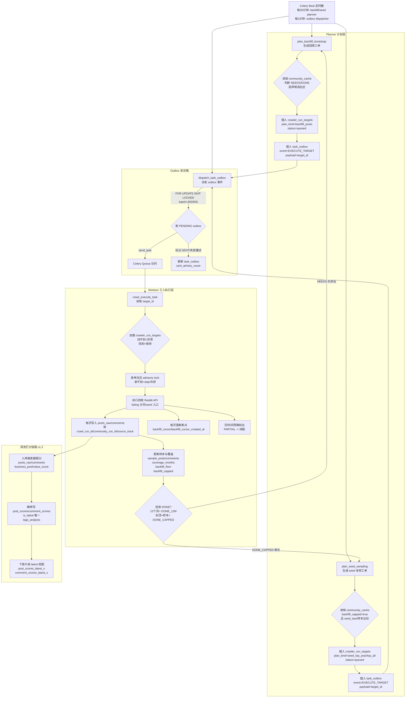

# Reddit Signal Scanner - 数据抓取系统操作手册 (SOP)

**版本**: 3.2（抓取-缓存-追踪-语义出口+语义回流对齐版）  
**生效日期**: 2025-12-29  
**维护人**: 架构组  

---

## 这份 SOP 覆盖什么
本 SOP 只管“抓取系统”这一段：把 Reddit 数据稳定搬回本地（DB + 缓存），并输出给分析引擎可直接消费的“语义任务入口”。  
一句话边界：**抓取负责搬运与标注；分析负责判断与产出。**（搬石头的人不要当珠宝鉴定师。）

---

## 读这份 SOP 的前提（请先对齐“唯一真相”）
你说的对：抓取系统和 DB 本来就是一根管子，**DB 是最终账本**，SOP 必须把“写到哪张表/更新哪条口径”说清楚。

- **DB 真实结构（表/字段/约束）**：以 `docs/sop/2025-12-14-database-architecture-atlas.md` 为准（带 `alembic_version`，可直接回答“现在库里到底长啥样”）。
- **配置/YAML 的真实来源**：以 `backend/config/` 与根目录 `config/` 为准（别把关键参数硬编码散落在脚本/代码里）。

---

## 0.3 全链路流程图（flowchart）


## 0. 执行层工具栈（v3.x）
- **Reddit 主数据**：PRAW / asyncpraw（posts/comments/authors/subreddit 元数据）  
- **通用 HTTP**：aiohttp（外链、产品页、品牌官网等）  
- **不使用第三方爬虫平台**：保持与内部 community_pool / YAML 配置强一致

---

## 0.1 关键约束（必须遵守）
- **速率上限**：Reddit 限制约 60 请求/分钟。抓取系统默认目标：**< 20 请求/分钟**（给分析引擎实时补充留余量）。  
- **幂等**：同一条 post/comment 反复抓取，不得产生重复数据或“翻倍写入”。  
- **可追溯**：每次运行必须能回答三件事：**跑了哪些社区、写了多少、失败原因是什么**。  
- **缓存优先**：分析引擎依赖预抓取缓存，抓取系统要负责把缓存喂饱（以 `community_cache.ttl_seconds` 与 DB TTL 为准，`posts_hot` 当前为 180 天）。

---

## 0.2 配置文件地图（抓取相关，别再到处找）
这部分是“运行时旋钮”，让你不改代码也能调策略。

- `backend/config/crawler.yml`：抓取默认参数、限流/窗口等（巡航/回填基础配置）
- `backend/config/probe_hot_sources.yaml`：`probe_hot` 热源清单（phase1/phase2）
- `backend/config/warzones.yaml`：8 战区词典（warzone v0 规则版）
- `backend/config/deduplication.yaml`：去重策略
- `backend/config/community_blacklist.yaml`：社区黑名单（不抓/降权）
- `backend/config/semantic_sets/`：语义集合基线（探针 query 扩展只读 active）
- 根目录 `config/vertical_overrides.yaml`：运营侧的 vertical 覆写（影响分层/标签/规则）

开关类（env）请统一在 `backend/.env.example` 里找：
- `PROBE_HOT_BEAT_ENABLED`：`probe_hot` 每 12 小时跑一次（默认开）
- `PROBE_AUTO_EVALUATE_ENABLED`：probe 跑完后自动触发 evaluator（默认开）
- `DISCOVERY_CANDIDATE_VETTING_ENABLED` / `DISCOVERY_REQUIRE_VETTING`：candidate 验毒回填门禁（默认开）
- `INCREMENTAL_COMMENTS_PREVIEW_ENABLED`：预览评论（Top20, depth=1），默认关
- `INCREMENTAL_COMMENTS_BACKFILL_ENABLED`：智能浅回填评论（smart_shallow），默认开
- `ENABLE_COMMENTS_SYNC`：旧别名，仅影响预览评论（deprecated）
- `BACKFILL_BOOTSTRAP_WINDOW_DAYS`：回填窗口天数（默认 90d）
- `BACKFILL_MAX_PAGES_PER_RUN`：每单最大页数（默认 8）
- `BACKFILL_MAX_SECONDS_PER_RUN`：每单最大秒数（默认 480）
- `BACKFILL_POSTS_QUEUE`：回填 posts 队列（默认 `backfill_posts_queue_v2`）

---

## 1. 关键数据对象（对齐 PRD）
> 下面是“抓取系统必须读/写”的最小集合。字段名以 PRD 为准，缺的就补迁移。

### 1.1 community_pool（输入：抓哪些社区）
- 作用：提供“候选社区池”，由运营/配置决定抓取范围（可包含 vertical、role、状态等）
- 规则：抓取系统只读；评估/运营会写入状态与权重

### 1.2 community_cache（输入 + 输出：抓取游标 & 缓存状态）
PRD-01 定义了 `community_cache`（强建议作为游标与缓存统计的唯一来源）：
- `last_crawled_at`：该社区最近一次成功抓取时间（游标）  
- `posts_cached`：缓存中可用帖子数  
- `ttl_seconds`：缓存 TTL（默认 3600）  
- `hit_count / last_hit_at`：被分析任务使用次数（用于优先级）  
- `crawl_priority`：1-100 的抓取优先级（越高越先抓）
- **回填状态（P0 收口字段）**：
  - `backfill_status`：`NEEDS / RUNNING / DONE_12M / DONE_CAPPED / ERROR`
  - `coverage_months`：已覆盖月数（整数）
  - `sample_posts / sample_comments`：样本达标计数
  - `backfill_capped`：是否达到 API 上限
  - `backfill_cursor / backfill_cursor_created_at / backfill_updated_at`：断点续跑指针
- **回填水线**：`backfill_floor`（只会变老）+ `last_attempt_at`（冷却调度用）

**硬规则**：`last_crawled_at` 只在“成功完成该社区抓取”后更新；失败不动游标。

### 1.3 posts_raw / comments（输出：落地原料）
抓取层写入“原始层”，至少包含：
- Reddit 原始 ID（post_id / comment_id）
- `first_seen_at`（第一次见到这条数据的时间）
- `fetched_at`（本次抓取写入时间）
- `source_track`（抓取模式标签：incremental / hot / backfill / backfill_bootstrap / seed_top_year / seed_top_all / preview）
- `lang`（如已具备）
- （建议）`crawl_run_id`：本次运行 ID（用于逐条追溯）

> 注意：`source_track` 用来标记“来源/模式”；`crawl_run_id` 用来标记“哪次跑的”。别把它们混成一个字段。

### 1.4 crawler_runs（输出：运行追踪，强建议落表）
当前已落表，作为运行追踪的唯一口径：
- `run_id`（UUID，主键）
- `started_at / finished_at`
- `status`（running/success/failed/partial）
- `plan`（JSON：本次计划摘要）
- `counters`（JSON：新增 post/comment 数、失败数等）
- `error_breakdown`（JSON：按错误类型汇总）

### 1.5 crawler_run_targets（输出：单社区/单计划执行单）
- **定位**：每一条抓取计划落成一张“单”，执行器按 target 执行。
- **关键字段**：
  - `plan_kind` / `idempotency_key` / `idempotency_key_human`
  - `dedupe_key`：**活跃态唯一**（queued/running），防止重复下单
  - `status`：`queued / running / completed / partial / failed`
- **硬规则**：
  - 同一 `dedupe_key` 在活跃态只能有 1 条
  - 执行器只允许 `queued -> running`（非 queued 直接跳过）

### 1.6 语义任务视图（输出给分析引擎）
- `v_post_semantic_tasks`
- `v_comment_semantic_tasks`

抓取系统不做语义分析，但要确保视图“有稳定输入”。

---

## 2. Step 1：统一抓取入口（入口与职责）
### 2.1 入口类型
- **后台持续抓取（推荐）**：守护进程/定时器，24 小时不断喂缓存  
- **按需补抓（可选）**：分析引擎触发“补充少量实时数据”（严格限量）

### 2.2 配置优先级（从高到低）
1) 紧急黑名单 / 停用开关（立刻生效）  
2) YAML 覆盖（vertical/role/窗口/limit）  
3) community_pool 默认策略  
4) 系统默认参数（兜底）

---

## 3. Step 2：生成抓取计划（Plan）
目标：把“要抓什么”变成一份可执行、可复现的计划。

### 3.1 计划最小字段（建议写入 crawler_runs.plan）
- `targets[]`：每个元素包含
  - `community_name`
  - `mode`：incremental / hot / backfill / preview
  - `time_window`：如过去 24h/7d（或基于 last_crawled_at 的增量窗口）
  - `post_limit` / `comment_limit`
  - `priority`：最终优先级

### 3.2 优先级计算（建议规则）
- 基础：`community_cache.crawl_priority`
- 加权：长时间未抓取（last_crawled_at 距离越久，越优先）
- 加权：`hit_count` 高（近期被分析引擎频繁使用）
- 约束：总 API 预算（保证 < 20 req/min）

> 计划生成要做“预算守门”。预算不够就少抓，别硬上把系统跑崩。

### 3.3 巡航（patrol）Planner 侧硬上限（必须写死）
巡航的定位是“持续新鲜”，不是“抓到爽”。所以 planner 必须先把牙齿装上：
- `post_limit`：默认 **80**，最大 **100**（超过直接夹住）
- `time_window`：默认 **24h**（允许更窄 `hour/day`，不允许 `week/month/year/all` 这种宽窗口）
- `comment_limit`：默认 **0**（巡航 plan 不做深评论回填）
  - 但增量抓取器默认 **开启 smart_shallow 评论回填**（见 3.4），不依赖 plan 的 `comment_limit`
  - 如果一定要开深评论：只能浅回填（建议：Top20 帖 × 每帖 Top50 评论 / depth<=2），并且要有显式开关，默认关闭
- “公平调度”：每轮心跳每个社区最多 1 条 queued 计划（用幂等键保证）
- “总量截断”：本轮 queued 的 targets 超过上限就**按 priority 截断**，剩下留到下一轮（别一次把队列塞爆）

### 3.4 评论回填（增量内置默认）
- 默认开启：`INCREMENTAL_COMMENTS_BACKFILL_ENABLED=1`
- 预览评论：`INCREMENTAL_COMMENTS_PREVIEW_ENABLED=0`（默认关，避免吞预算）
- 默认参数：
  - `mode=smart_shallow`
  - `max_posts=5`
  - `limit=50`（上限 50）
  - `depth=2`
- 目标：轻量回填 Top 帖评论，避免深抓爆量

### 3.5 计划去重与互斥（必须）
- **planner 全局锁**：同一时间只允许一份规划执行（多 beat/重试直接跳过）。
- **去重键**：`crawler_run_targets.dedupe_key` 在 `queued/running` 状态唯一。
  - 默认规则：`dedupe_key` 自动回退到 `idempotency_key`，全链路覆盖。

### 3.6 回填完成口径（DONE_12M / DONE_CAPPED）
- **低频社区**：`backfill_floor <= now-12m` → `DONE_12M`
- **高频社区**：listing 到顶 + 样本达标 → `DONE_CAPPED`
- **落库字段**：`community_cache.backfill_status / coverage_months / sample_posts / sample_comments / backfill_capped`

---

## 4. Step 3：执行抓取（Fetch）
### 4.1 速率限制与并发
- 全局限速：令牌桶/队列控制到 **< 20 req/min**
- 并发：建议小并发（如 3-5），让重试与退避可控
- 429（Too Many Requests）：指数退避重试（带随机抖动），最多 N 次；超过则该社区标记 partial

### 4.1.1 回填窗口取数口径（已定型）
- 不再依赖 timestamp search（会空跑）
- 统一用 listing 分页 + 本地时间窗过滤（可写 backfill_cursor）
- 默认回填窗口：90 天（`BACKFILL_BOOTSTRAP_WINDOW_DAYS=90`）

### 4.2 错误分级（必须写进 crawler_runs.error_breakdown）
- **401/403**：鉴权/权限问题，直接失败（不重试），提示检查密钥/权限  
- **429**：限流，退避重试  
- **5xx/网络**：短重试（例如 2-3 次），持续失败则该社区 partial  
- **数据异常**：记录并跳过单条，不能拖垮整批

### 4.3 巡航（patrol）Executor 二次保险（强烈建议写死）
就算 planner 配置写错，executor 也要再套一层安全带：
- 再次强制夹住 `post_limit/time_window`（不信任 plan/config）
- 单 target 设“时间预算”（建议 60-120 秒）
  - 超时：标记 **partial**（不自动当 failed 重跑），后续走“补偿 plan”再补缺口
- 发现异常膨胀（返回量/耗时远超预期）时：直接降级（只写 posts，不拉评论/不做额外动作）

### 4.4 partial 的口径 & 自动补偿 targets（必须落地）
系统要“可运营”，就得把 partial 变成可控的自动收尾，而不是靠人盯着跑。

**什么情况算 partial（建议只认 4 类）**
- 时间预算耗尽（被主动中断）
- 全局配额不够（token bucket 触顶，主动截断）
- 分页没跑完（cursor 还有，但达到 posts/comments 上限）
- 子任务部分失败（例如 posts 成功但 comments 失败，且错误可恢复）

**什么情况直接 failed（不走 partial，不自动补偿）**
- 401/403 鉴权失败
- Plan schema 校验失败（计划本身不合法）
- DB 写入失败（事务/迁移缺失等）

**补偿 targets 的原则**
- 不重跑老 target：原 target 状态保持 `partial`，补偿用新的 target（可审计）
- 补的是“缺口”：优先用 `cursor_after` / `missing_set_hash` 继续往后补
- 低优先级：统一进 `compensation_queue`（避免挤死正常巡航/回填）
- **早退口径统一**：`community_locked/timeout/schema_mismatch` 也必须写 `metrics_schema_version=2` + `stop_reason` + 归零计数（避免 v0 混入口径）

### 4.5 垃圾/重复处理默认口径（增量）
- **垃圾策略**：默认 `incremental_spam_filter_mode=tag`（保留但打标）
- **重复策略**：默认 `incremental_duplicate_mode=tag`（保留但打标）
- 如需丢弃必须显式设为 `drop`，否则不会自动删除
- 必须幂等：补偿 target 也要有稳定 `idempotency_key`（避免重复插入）

### 4.5 队列保底（必须写进部署/启动配置）
为了防止 backfill/probe 抢走巡航资源，必须强制隔离：
- Patrol Worker：只监听 `patrol_queue`
- Bulk Worker：监听 `backfill_queue/compensation_queue/...`，**明确不监听 `patrol_queue`/`probe_queue`**
- Probe Worker：只监听 `probe_queue`（并发更小，避免探针挤占 backfill）
  - **回填 posts 队列切流**：`backfill_posts_queue_v2` 为新口径专用队列；`backfill_queue` 保留给评论回填等旧任务（避免口径混跑）。

（本仓库已提供 `backend/start_celery_worker_patrol.sh` / `backend/start_celery_worker_bulk.sh` / `backend/start_celery_beat.sh` 作为标准启动方式。）

### 4.6 全局 token bucket（必须）
目的：一次大回填/探针不要把 API/DB 打爆，巡航永远有固定配额。
- 两桶配额：
  - `patrol_bucket`：固定份额（默认 40%）
  - `bulk_bucket`：剩余份额（默认 60%，backfill+probe 共用）
- token 不够：executor 直接标记 `partial(budget_exhausted)`，并自动下发补偿 target（延迟到下个窗口再补）

---

## 5. Step 4：落库与幂等（Write）
### 5.1 去重键（现状）
- posts_raw：`(source, source_post_id, version)` 唯一  
- comments：`reddit_comment_id` 唯一
- crawler_run_targets：`dedupe_key` 在 `queued/running` 唯一（防重复下单）

写入策略：**upsert**（重复写入更新 `fetched_at`、必要字段；不产生重复行）。

### 5.2 断点续跑（建议）
- 增量：以 `community_cache.last_crawled_at` 为游标推进  
- 回填：按时间窗分片（例如按天/按周），分片成功才标记完成  
- 失败恢复：允许“重跑同一 run”或“新 run 接着跑”，但都必须可追溯

### 5.3 历史版本（现状：SCD2 已启用）
- 当前使用 SCD2：`version` / `is_current` / `valid_from` / `valid_to` 已在 `posts_raw` 生效  
- 触发器：`trg_posts_raw_enforce_scd2` 负责版本化逻辑  
> 排查 SQL 可直接使用 `is_current=true` 过滤最新版本

---

## 6. Step 5：更新缓存与语义出口（Cache & Hand-off）
### 6.1 更新 community_cache（强制）
每个社区抓取结束后（成功/partial 都要写，但策略不同）：
- 成功：更新 `last_crawled_at=now()`、更新 `posts_cached`、更新时间戳
- partial：更新 `updated_at` 与计数，但 **不更新 last_crawled_at**（避免游标跳过）
- 回填任务：每页更新 `backfill_cursor`，任务收口时更新 `backfill_status/coverage_months/sample_*`
- 空页自然结束（`no_more_pages` + `items_api_returned=0`）：不更新 `backfill_cursor_created_at/backfill_updated_at`，只记 `last_attempt_at`（避免把“无数据”误当“推进”）

### 6.1.1 回填验收 SQL 模板（6h / 24h）
目的：把回填“空转 / 推进 / 落库”拆清楚，避免只看 completed 误判。

**6h 快照（定位 A/B/C）**
1) backfill targets 行为摘要（6h 内）  
```sql
SELECT
  t.id,
  t.crawl_run_id,
  t.subreddit,
  t.plan_kind,
  t.status,
  t.started_at,
  t.completed_at,
  t.error_code,
  t.error_message_short,
  t.metrics,
  t.config
FROM crawler_run_targets t
WHERE t.plan_kind LIKE 'backfill%'
  AND t.started_at >= now() - interval '6 hours'
ORDER BY t.started_at DESC;
```

2) metrics key 分布（防止字段缺失/命名漂移）  
```sql
SELECT
  k AS metric_key,
  count(*) AS cnt
FROM crawler_run_targets t
CROSS JOIN LATERAL jsonb_object_keys(t.metrics) AS k
WHERE t.plan_kind LIKE 'backfill%'
  AND t.started_at >= now() - interval '6 hours'
GROUP BY k
ORDER BY cnt DESC, metric_key;
```

3) 每个 target 的事实层触达（community_run_id 口径，避免 source_track 误差）  
```sql
WITH bt AS (
  SELECT id, subreddit, started_at, completed_at
  FROM crawler_run_targets
  WHERE plan_kind LIKE 'backfill%'
    AND started_at >= now() - interval '6 hours'
)
SELECT
  bt.id AS target_id,
  bt.subreddit,
  bt.started_at,
  bt.completed_at,
  COALESCE(p.posts_cnt, 0) AS posts_cnt,
  p.min_post_created_at,
  p.max_post_created_at,
  COALESCE(c.comments_cnt, 0) AS comments_cnt,
  c.min_comment_created_at,
  c.max_comment_created_at
FROM bt
LEFT JOIN LATERAL (
  SELECT
    count(*) AS posts_cnt,
    min(created_at) AS min_post_created_at,
    max(created_at) AS max_post_created_at
  FROM posts_raw
  WHERE community_run_id = bt.id
) p ON true
LEFT JOIN LATERAL (
  SELECT
    count(*) AS comments_cnt,
    min(created_at) AS min_comment_created_at,
    max(created_at) AS max_comment_created_at
  FROM comments
  WHERE community_run_id = bt.id
) c ON true
ORDER BY bt.started_at DESC;
```

4) 断点推进快照（只用更新时间判断“是否推进”）  
```sql
SELECT
  community_name,
  backfill_status,
  backfill_floor,
  last_attempt_at,
  coverage_months,
  sample_posts,
  sample_comments,
  backfill_cursor,
  backfill_cursor_created_at,
  backfill_updated_at
FROM community_cache
WHERE backfill_updated_at >= now() - interval '6 hours'
ORDER BY backfill_updated_at DESC;
```

**24h 验收（推进速度 + 状态闭环）**
1) 断点更新次数（必须以更新时间为准）  
```sql
SELECT count(*) AS backfill_cursor_updates_24h
FROM community_cache
WHERE backfill_updated_at >= now() - interval '24 hours';
```

2) 状态分布与空断点比例  
```sql
SELECT
  backfill_status,
  count(*) AS cnt,
  count(*) FILTER (WHERE backfill_cursor IS NULL) AS cursor_null_cnt,
  count(*) FILTER (WHERE backfill_cursor_created_at IS NULL) AS cursor_created_null_cnt
FROM community_cache
GROUP BY backfill_status
ORDER BY cnt DESC;
```

3) 断点推进“最老时间”抽样（看是否在往过去推）  
```sql
SELECT
  community_name,
  backfill_status,
  backfill_cursor_created_at,
  backfill_updated_at
FROM community_cache
WHERE backfill_cursor_created_at IS NOT NULL
ORDER BY backfill_cursor_created_at ASC
LIMIT 20;
```

4) 回填写入量（按 target 归因）  
```sql
SELECT
  t.plan_kind,
  count(*) AS rows_touched
FROM posts_raw p
JOIN crawler_run_targets t ON t.id = p.community_run_id
WHERE p.fetched_at >= now() - interval '24 hours'
  AND t.plan_kind LIKE 'backfill%'
GROUP BY t.plan_kind;
```

### 6.2 Redis 缓存（对齐 PRD-03：缓存优先）
抓取系统建议把“分析常用的帖子集合”写入 Redis（DB 仍是最终真相）：
- Key 建议：`rss:reddit:{community}:posts:{window}`（示例）
- TTL：使用 `community_cache.ttl_seconds`
- 内容：post_id 列表 + 必要的轻量字段（标题、时间、score 等）

如果你们决定“Redis 由分析引擎维护”，也必须在这里写一句：**抓取系统不写 Redis，只更新 community_cache 与 DB**。  
（不要出现“两边都以为对方会写”的经典惨剧。）

### 6.3 语义任务出口
- 抓取系统不负责生成语义内容，但要保证：
  - posts_raw/comments 有稳定、完整的原料字段
  - `v_post_semantic_tasks / v_comment_semantic_tasks` 能稳定产出待处理任务

---


### 6.4 语义回流（Semantic Feedback Loop：慢模式反哺快模式）
> 目的：把“深度分析”里新出现的吐槽表达/痛点短语，变成可运营的语义资产，用来提升“问题驱动探针”的命中率与社区发现效率。  
> 边界：抓取系统**不负责**创造语义，只负责**接收、存储、门禁、供探针读取**。抽取/归纳由分析引擎完成（或由独立任务完成）。

#### 6.4.1 现状资产
- **semantic_rules**：语义规则库（已落地，供发现/评分/标签使用）
- **evidence_posts**：探针审计证据帖（已落地，但不是“语义证据表”）
- **语义证据/统计表**：`semantic_rule_evidence / semantic_rule_stats` 尚未落地，属于规划

#### 6.4.2 现状数据结构（已落地）
1) `semantic_rules`（语义库）
- `id`（PK）
- `concept_id`
- `term`
- `rule_type`（示例：pain_keywords / candidate_term / global_filter_keywords）
- `weight`
- `is_active`（是否启用）
- `hit_count` / `last_hit_at`
- `meta`（JSONB：候选/审批/来源等信息）
- `domain` / `aspect` / `source`
- `created_at` / `updated_at`

2) `evidence_posts`（探针审计）
- 用于 probe 证据留存，与语义规则 **无直接关联键**（字段见 DB Atlas）

3) 规划中（未落地）
- `semantic_rule_evidence`
- `semantic_rule_stats`

#### 6.4.3 触发时机与任务链（现状）
- **候选抽取（已落地）**：`tasks.semantic.extract_candidates`  
  - 从 DB 抽取候选词 → 写 `semantic_candidates` 并 upsert `semantic_rules(is_active=false, meta.status=candidate)`
- **语义打标（已落地）**：`tasks.semantic.tag_post_semantics` / `tasks.semantic.tag_posts_batch`  
  - 只写 `post_semantic_labels`，不改 `semantic_rules`
- **激活/淘汰（未自动化）**：当前主要靠脚本/人工审核，不依赖门禁统计表

#### 6.4.4 门禁规则（规划中，未落地）
为了防止词库膨胀成垃圾桶，建议口径保留为方向：
- **数量门槛（7d）**：`hit_comments ≥ 10` 或 `hit_posts ≥ 3`
- **覆盖门槛（7d）**：`unique_subreddits ≥ 2`
- **准确率代理（precision_proxy）建议定义**：
  - 命中样本中 “吐槽/负向” 占比
  - 若命中高度集中在同一帖子/同一作者/同一时间段，降权
- **晋升阈值**：`precision_proxy ≥ 0.6` 才允许 candidate → active  
- **回滚策略**：active 规则若连续 N 天 precision_proxy 低于阈值，自动降级

#### 6.4.5 快模式（问题驱动/热门探针）如何使用语义库
在 `probe_planner` 生成 search query 时，增加一个“可控扩展项”：

- query_terms =
  - 用户问题关键词（主）
  + 业务 topic 词典（已有）
  + `semantic_rules` 中 `is_active=true AND rule_type='pain_keywords'` 的 Top K（建议 K=10～30）
- **Top K 排序建议**：按 weight/最近命中（meta 里 last_seen_at）  
- **去噪**：过泛短语保持 `is_active=false`，不要进扩展词

这样语义库越跑越准，探针命中率会越跑越高（而不是越跑越散）。

#### 6.4.6 与抓取主干的衔接关系（闭环）
- 探针层输出：`evidence_posts`、`discovered_communities`
- 社区回流：`discovered_communities` → CommunityEvaluator → `community_pool`
- 慢模式产出：深度分析 → 抽取新短语 → `semantic_rules`（语义回流）
- 语义回流再反哺：`semantic_rules(active)` → probe_planner 扩展 query

> 结果：形成你们要的“双向流动”：**社区回流 + 语义回流** 一起闭环。

**P1 验毒闭环（当前落地口径 v2）**
- 触发点：`discovered_communities.status='pending'`（新社区进入 candidate）
- 自动动作（先验毒、后评估、再入池）：
  1) 先下单“验毒回填 posts 30 天”的一组 targets（丢到 `backfill_queue` 执行）
     - 时间切片：默认 7 天一片（30 天 ≈ 5 片）
     - 固定配额上限：每个社区总预算默认 `total_posts_budget=300`（均分到各 slice 的 `posts_limit`）
     - 配额标记：`config.meta.budget_cap=true`（表示这是“额度回填”，不追求把窗口扫干净）
     - reason：`candidate_vetting`（用于审计/口径统一）
  2) 每个 backfill_posts target 结束（completed/partial）后，`execute_target` 会 best-effort 触发一次 `tasks.discovery.check_candidate_vetting`
  3) 当该社区所有验毒切片都 `completed/partial` 后，自动触发 `tasks.discovery.evaluate_community(r/xxx)`（单社区评估）
  4) evaluator 只在 vetting completed 时才跑，并且优先用 DB 样本（`posts_raw`）来评估（不足才回退 Reddit API）
- 结果：新社区从 0 → 有样本 → 出评估 → 入池，全自动跑完，不需要人手动跑 B

**开关与默认值（可用 env 调整）**
- `DISCOVERY_CANDIDATE_VETTING_ENABLED=1`：开启“pending → 自动验毒回填”
- `DISCOVERY_REQUIRE_VETTING=1`：评估前必须 vetting completed（默认开）
- `DISCOVERY_VETTING_DAYS=30`
- `DISCOVERY_VETTING_SLICE_DAYS=7`
- `DISCOVERY_VETTING_TOTAL_POSTS_BUDGET=300`

**（保留但不推荐依赖）评估通过后的自动补数**
- `DISCOVERY_AUTO_BACKFILL_ENABLED=1`：仍保留“approved → 自动回填 30 天”的逻辑作为兼容层
- 但新口径下它不是验毒主流程，验毒主流程以 `candidate_vetting` 为准

**P0 探针输入端（probe_search v1）**
- 定位：探针是“纯输入层”，只产证据帖 + 候选社区，不碰水位线，也不直接触发回填
- 入口（Planner）：下单到 `crawler_run_targets.config`，执行统一走 `execute_target(target_id)`，路由到 `probe_queue`
  - 任务名：`tasks.probe.run_search_probe`
  - plan 合同：`plan_kind=probe` + `meta.source=search` + `target_type=query`
- （可选但推荐）自动触发评估：`PROBE_AUTO_EVALUATE_ENABLED=1`
  - 含义：每次 probe target 执行完（completed/partial）都会自动触发一次 `tasks.discovery.run_community_evaluation`
  - 默认开启：如需降载可显式设为 0
- 落库（Executor）：只写两张表
  - `evidence_posts`：证据帖资产（可审计）
    - 去重键：`(probe_source, source_query_hash, source_post_id)`（同一 query 重跑不会刷爆）
  - `discovered_communities`：候选社区（待 evaluator 审核）
    - upsert 唯一键：`name`（`r/<slug>`）
- 额度护栏（写死在执行器里）：
  - `max_evidence_posts`（默认 = posts_limit）
  - `max_discovered_communities`（默认 50）
  - 超限：标记 `partial(caps_reached)`，但 **不自动生成补偿 targets**（避免探针越补越大）

**P0 探针输入端（probe_hot v1）**
- 目的：当一个“可控雷达”——不用用户问题也能发现新社区，但必须限额，不能把库灌爆
- 入口（Planner）：下单到 `crawler_run_targets.config`，执行统一走 `execute_target(target_id)`，路由到 `probe_queue`
  - 任务名：`tasks.probe.run_hot_probe`
  - plan 合同：`plan_kind=probe` + `meta.source=hot` + `meta.hot_sources=[...]`
- 热源（先稳再放开，两阶段）
  - Phase 1（默认）：5 个强相关锚点社区的 `hot`
    - `r/ecommerce` `r/shopify` `r/dropshipping` `r/aliexpress` `r/marketing`
  - Phase 2（跑稳 3～7 天再加）：`r/all` 的 `rising` + `top(day)`
- 可调旋钮（允许在 config 里调参）
  - `hot_sources` / `posts_per_source`（默认 25）
  - `max_candidate_subreddits`（默认 30）/ `max_evidence_per_subreddit`（默认 3）
  - `min_score`（默认 100）/ `min_comments`（默认 30）/ `max_age_hours`（默认 72）
- 写死保险丝（executor 兜底夹住，不允许 config 放大）
  - `posts_per_source<=50`、`max_candidate_subreddits<=100`、`max_evidence_per_subreddit<=5`、`hot_sources<=20`
  - `max_age_hours` 夹在 `[24, 168]`（避免扫太老/太宽）
- 超限：标记 `partial(caps_reached)`，但 **不自动生成补偿 targets**（探针只负责“发现”，不负责“补齐”）
- 列表替换：只需要改 `hot_sources`（参数/配置），不需要改 executor 代码
  - 默认配置文件：`backend/config/probe_hot_sources.yaml`（支持 phase1/phase2）
  - 环境变量：`PROBE_HOT_SOURCES_FILE` / `PROBE_HOT_SOURCES_PHASE`
- 可选定时跑（默认开）：`PROBE_HOT_BEAT_ENABLED=1` 会在 Celery Beat 加入 `probe-hot-12h`（每 12 小时一次）

**P0 评论回填（backfill_comments v1）**
- 定位：评论回填也必须走同一条主干（CrawlPlan → `execute_target(target_id)`），不允许在 `comments_task.py` 里直抓直写库
- plan 合同：
  - `plan_kind=backfill_comments`
  - `target_type=post_ids`（一张 plan = 一个 post_id）
  - `limits.comments_limit>0`
  - `meta.subreddit` 必填（用于落库归属）
- 执行器落库：`execute_crawl_plan(backfill_comments)` 内部统一调用 `persist_comments(...)`

**P0 warzone 归类（v0）**
- 定位：给候选社区一个“可解释的 8 战区猜测”，方便运营筛选
- 输入：探针证据帖（`evidence_posts` 的 title/body）
- 输出：写回 `discovered_communities.metrics.warzone` + `tags` 增加 `warzone:<name>`
- 词典文件：`backend/config/warzones.yaml`（先规则版，后面再迭代）


## 7. Step 6：运行与排查（Runbook）
### 7.1 最小运行方式（示例）
> 下面是“命令形态”，脚本名按你们仓库实际替换；核心是参数语义要一致。

- 一键智能启动（推荐：按 DB 现状自动给建议）
  - 只看现状+建议（不启动）：`make crawler-smart-status`
  - 按建议一键启动：`make crawler-smart-start`
  - 默认会起：Beat + `patrol_queue` worker + `bulk` worker（不抢巡航）
  - `probe_queue` worker 只有在你打开相关开关时才会起（例如 `PROBE_HOT_BEAT_ENABLED=1`）

- 跑一次增量（喂缓存主流程）  
  - 参数：`mode=incremental`, `window=since_last_crawled`, `limit=...`
- 跑一次热门（补充趋势）  
  - 参数：`mode=hot`, `window=24h`
- 跑一次回填（少量、高价值）  
  - 参数：`mode=backfill`, `selector=high_value_posts`, `comment_limit=...`

### 7.2 排查必备查询（建议）
- 看语义任务是否有货：  
  - `SELECT count(*) FROM v_post_semantic_tasks;`  
  - `SELECT count(*) FROM v_comment_semantic_tasks;`
- 按 run 查写入量（如果有 crawl_run_id）：  
  - `SELECT source_track, count(*) FROM posts_raw WHERE crawl_run_id = :run_id GROUP BY 1;`
- 看社区游标是否推进：  
  - `SELECT community_name, last_crawled_at, posts_cached, crawl_priority FROM community_cache ORDER BY updated_at DESC LIMIT 50;`
- 看失败类型 Top：  
  - 从 `crawler_runs.error_breakdown` 或日志聚合查看

### 7.3 常见故障快速定位
- **数据翻倍**：检查唯一约束是否存在、是否真的在用 upsert  
- **视图没数据**：检查原始表是否写入、字段是否缺失、WHERE 条件是否过严  
- **一直 429**：预算超了（降并发/降目标数/减 window/减 limit）  
- **游标乱跳**：确认 partial 不更新 `last_crawled_at`

---

## 8. 验收清单（能交接的最低标准）
- 能跑一次增量，`community_cache.last_crawled_at` 正常推进  
- 重跑同一批不会重复写入（幂等 OK）  
- 有 `run_id` 可追溯：能回答“这批数据谁跑的、跑了啥、失败啥”  
- `v_post_semantic_tasks / v_comment_semantic_tasks` 有稳定产出  
- 429/网络失败可恢复，不会把系统卡死

---

**附记**：本 SOP v3.1 对齐 PRD-03（缓存优先）与 PRD-01（community_cache），补齐了 v3.0 里缺失的 Step 2–5，重点解决：可追溯、幂等、游标、缓存职责四件事。
