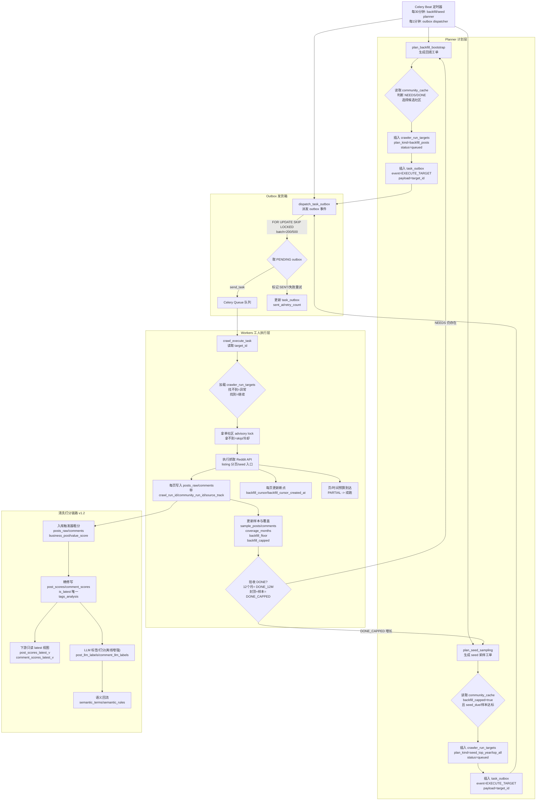

# 数据清洗与价值打分规范 v1.2.1（对齐验收版，以本地生产库为准）

**版本**: 1.2.1（对齐验收版：主干口径不变，新增补丁验收与新能力对齐点）
**日期**: 2025-12-29
**适用对象**: 数据工程师, 算法工程师, 产品经理

---

## 0. 唯一真相（先把口径钉死）
这份文档一切以“代码 + 本地数据库”当前真实行为为准。

- **默认写库 (Dev)**：`localhost:5432/reddit_signal_scanner_dev`
- **金库 (对照/验收)**：`localhost:5432/reddit_signal_scanner`
- **测试库 (Pytest)**：`localhost:5432/reddit_signal_scanner_test`
- **表/字段/约束真相**：`docs/sop/2025-12-14-database-architecture-atlas.md`（金库结构快照）
  - 你只要记一句：**字段名以 DB Atlas 为准**，别靠“印象”写 SQL。
- 本文只讲“清洗/打分怎么跑、结果落到哪张表、下游该看哪套口径”。

### 0.1 输入边界（抓取侧默认口径）
- **垃圾策略**：默认 `incremental_spam_filter_mode=tag`（保留但打标），不是 drop。
- **评论链路解耦**：预览与回填用两个开关（避免混口径）：
  - `INCREMENTAL_COMMENTS_PREVIEW_ENABLED`：仅预览评论（Top20, depth=1），默认关
  - `INCREMENTAL_COMMENTS_BACKFILL_ENABLED`：智能浅回填（smart_shallow），默认开
  - 兼容：`ENABLE_COMMENTS_SYNC` 仅作为预览旧别名，不再影响回填
- **评论回填参数**（smart_shallow）：
  - `incremental_comments_backfill_max_posts=5`
  - `incremental_comments_backfill_limit=50`（上限 50）
  - `incremental_comments_backfill_depth=2`

### 0.2 与门禁/报告的边界
- 本文止于“清洗/打分”口径；**facts_v2 门禁与报告**请看 `docs/sop/2025-12-13-facts-v2-落地SOP.md`。

---

### 0.3 全链路流程图（抓取→清洗→打分）
与 `数据抓取系统SOP_v3_修正版_v3.2.md` 保持一致，便于全链路对齐。



### 0.4 KAG 增强（新增口径）
清洗打分之后进入“知识增强”阶段，统一口径如下：
- **向量化**：posts -> `post_embeddings`；comments -> `comment_embeddings`（core/lab + 长尾抽样）。
- **混合检索**：关键词检索 + 向量检索合并召回池，提升命中率。
- **向量去重**：在文本去重后再做向量相似度去重，降低重复污染。
- **结构化骨架**：输出 `sources.knowledge_graph`（社区→痛点→证据→场景/驱动力），供前端直接渲染。

## 1. 核心理念：从“囤数据”到“鉴宝”

我们的数据库不再是一个“垃圾场”，而是一个**“分层金库”**。
每一条进入系统的数据，都必须经过四道工序的严苛筛选，最终获得一个 **0-10 分的商业价值评分 (`value_score`)** 和一个 **业务分池标签 (`business_pool`)**。

**只有进入 Core 池的高分数据，才配消耗昂贵的 GPU 算力。**

---

## 2. 数据分层体系 (The Four Layers)

### Layer 1: 扫地 (Hygiene)
*   **目标**: 剔除“非数据”。
*   **规则**:
    *   **Ghost**: 标题为空 / 内容为 `[deleted]`, `[removed]` -> **拦截入库**，写入 `posts_quarantine`（留证据），不进 `posts_raw`。
    *   **Short**: 正文+标题 < 10 字符 -> **拦截入库**，写入 `posts_quarantine`，不进 `posts_raw`。
    *   **Duplicate（当前真实做法）**：
        *   `text_norm_hash` 只负责“算出来”，**不会因为 hash 相同就自动删库**。
        *   现状是“后置标记/归并”：用 `posts_raw.is_duplicate` / `posts_raw.duplicate_of_id` 打标（可选任务/脚本），而不是触发器当场删。
    *   **Archive/Ancient（当前真实做法）**：
        *   归档对象是 **SCD2 历史版本**（`posts_raw.is_current=false`），按保留期归档到 `posts_archive`。
        *   默认保留期不是“3 年”，而是运维配置的 `retention_days`（常见默认 90 天）。

### Layer 2: 分类 (Tagging)
*   **目标**: 识别“广告”与“信号”。
*   **字段**: `posts_raw.spam_category` (广告), `metadata->'value_tier'` (信号类型)。
*   **规则**:
    *   **Ad/Spam**: 链接堆砌 (>2个)、包含 `promo code`/`affiliate`、短链 -> 标记为 `ad_*`。
    *   **Gold Decision**: 包含 `vs`, `recommend`, `worth it` 等决策词 -> 标记为 `gold_decision`。
    *   **Gold Problem**: 包含 `broken`, `issue`, `how to` 等痛点词 -> 标记为 `gold_problem`。
    *   **Normal**: 其他所有内容。

### Layer 3: 打分 (Scoring)
*   **目标**: 量化“含金量” (0-10分)。
*   **字段（两套口径，别混）**:
    *   **入库粗分（快）**：`posts_raw.value_score` / `posts_raw.business_pool`（由 DB 触发器写入，方便快速分流/兼容老查询）
    *   **正式评分（主口径）**：`post_scores` → `post_scores_latest_v`（下游选“核心/实验/噪音”优先看这套）
    *   **评论同理（如果你要查评论分）**：
        *   入库粗分：`comments.value_score` / `comments.business_pool`（入库触发器写）
        *   正式评分：`comment_scores` → `comment_scores_latest_v`（有数据时同理；字段以 DB Atlas 为准）
    *   **LLM 标签/打分（离线增强，不改主口径）**：
        *   **结果入库**：`post_llm_labels` / `comment_llm_labels`
        *   **范围**：只跑 **Core/Lab + 近 90 天**
        *   **用途**：提升颗粒度、回流语义库（不替代 `post_scores_latest_v` 主口径）
*   **分数定义**:
    *   **0-2 (Noise)**: 垃圾广告、纯水贴、无效内容。
    *   **3-5 (Normal)**: 普通讨论、背景信息、长尾知识。
    *   **6-7 (Silver)**: 明确的痛点 (`gold_problem`) 或 简单的交易意图 (`[WTS]`)。
    *   **8-10 (Gold)**: **强决策信号**。具备“三筹码”特征（对象+行为+钱）。

### Layer 4: 分池 (Pooling)
*   **目标**: 业务用途导向的分组。
*   **字段（主口径优先）**:
    *   主口径：`post_scores_latest_v.business_pool`
    *   兼容口径：`posts_raw.business_pool`
*   **约束**: 数据库级检查约束 `CHECK (business_pool IN ('core', 'lab', 'noise'))`，确保数据纯净。
*   **池子定义**:
    *   💎 **Core Pool (>= 8分)**: **决策池**。只给“要做决策的人看”，用于写报告、选品、看板。
    *   🧪 **Lab Pool (3-7分)**: **实验池**。给“要挖新东西的人看”，用于趋势挖掘、长尾分析、新品牌发现。
    *   🗑️ **Noise Pool (<= 2分)**: **噪音池**。给“要调算法的人看”，用作负样本训练。

---

## 3. 自动化执行机制 (Automation)

系统不是“只靠脚本”，而是三层一起工作：**DB 触发器先守门**，然后 **Celery/脚本做二次加工**，最后下游都从“主口径视图/表”读。

### A. 守门员：数据库触发器（入库就做，不等 Celery）
**帖子 posts_raw（入库守门）**
- 触发器：`trg_auto_score_posts`（函数 `trg_func_auto_score_posts()`），`BEFORE INSERT`
  - Ghost/Short：写入 `posts_quarantine`，并 `RETURN NULL`（不进入 `posts_raw`）
  - 规则粗分：写入 `posts_raw.value_score` / `posts_raw.business_pool` / `posts_raw.spam_category` / `posts_raw.score_source` / `posts_raw.score_version`
- 归一化：`trg_fill_normalized_fields`（函数 `fill_normalized_fields()`）会填 `body_norm` / `text_norm_hash`
- SCD2：`enforce_scd2_posts_raw`（函数 `trg_posts_raw_enforce_scd2()`）负责版本化字段（`version/is_current/valid_from/valid_to`）

**评论 comments（入库清洗）**
- 触发器：`trg_clean_comments_on_insert`（函数 `trg_func_auto_clean_comments()`），`BEFORE INSERT`
  - `[deleted]/[removed]`、短文本、垃圾词：直接 `business_pool='noise'` / `value_score=0`
  - 其他：写入基础 `value_score` + 分池（主要用于快速过滤/兼容）

### B. 规则评分：Celery 任务写 `post_scores`（主口径）
- 任务：`tasks.analysis.score_new_posts_v1`
  - 作用：为新入库帖子补一份“规则评分账本”，写入 `post_scores`（`rule_version='rulebook_v1'`，并保持 `is_latest=true` 唯一）
  - 下游查询建议优先用视图：`post_scores_latest_v`（这就是“核心/实验/噪音”的主口径来源）

### C. 精修师：AI 精修脚本（可选，属于二次加工）
- 脚本（现有多种实现）：
  - `backend/scripts/score_refinement_fast_direct.py`（Gemini Direct）
  - `backend/scripts/score_refinement_openrouter.py`（OpenRouter）
  - `backend/scripts/score_refinement_local_lmstudio.py`（本地 LMStudio）
- 作用：对“规则粗分/规则评分”覆盖不到的边角做二次提升（例如把 Lab 提升为 Core）
- 注意：当前脚本会直接更新 `posts_raw.value_score/business_pool`（属于“兼容口径”），并写 `data_audit_events` 留痕；正式口径仍以 `post_scores_latest_v` 为准。

### C2. LLM 标签/打分回流（离线增强，主链路不阻塞）
**目标**：用 LLM 只补“颗粒度”，不改主口径评分。

**执行任务**：
- `tasks.llm.label_posts_batch`
- `tasks.llm.label_comments_batch`
- `tasks.llm.backfill_legacy_labels`（把历史 LLM 结果回填到新表 + 语义库）

**落表**：
- `post_llm_labels` / `comment_llm_labels`（LLM 结构化标签与打分）

**范围/成本控制**：
- 仅处理 `business_pool IN ('core','lab')` 且 **近 90 天**数据
- 关键环境变量：
  - `GEMINI_API_KEY`（LLM 标签/打分专用）
  - `LLM_LABEL_MODEL_NAME=gemini-2.5-flash-lite`

### C3. 向量写入自动化（KAG 必需，主链路用、写入独立）
**目标**：保证 `post_embeddings` / `comment_embeddings` 持续补齐，让混合检索/向量去重可用。

**执行方式**：
- **Celery Beat 周期任务**（默认开启）：
  - `embeddings-backfill-posts`：每小时补齐 posts 向量（maintenance_queue）
  - `embeddings-backfill-comments`：每小时补齐 comments 向量（maintenance_queue）
- **环境开关**：
  - `EMBEDDING_BEAT_ENABLED=0`：关闭全部向量自动补齐
  - `EMBEDDING_COMMENTS_BEAT_ENABLED=0`：仅关闭 comments 向量补齐

**手工补齐（兜底）**：
- `make data-embeddings`（按批次补齐 posts + comments）
  - `LLM_LABEL_LOOKBACK_DAYS=90`
  - `LLM_LABEL_POST_LIMIT`
  - `LLM_LABEL_COMMENT_LIMIT`
  - `LLM_LABEL_BODY_CHARS`
  - `LLM_LABEL_COMMENT_CHARS`

**默认规则（避免漏网 + 控成本）**：
- **Core 池优先**：Core 走长截断（正文更长 + 2 条高赞评论）。
- **Lab 池收敛**：Lab 走短截断（正文更短 + 1 条高赞评论）。
- **小比例深挖**：Lab 里 **15%** 抽样用长截断；或 **中间分数段 5–7** 自动放长。
- **明显分数跳过**：规则分太高/太低（>=9 或 <=2）直接跳过 LLM，避免浪费。
- **文本去重**：`text_norm_hash` 已打过的直接跳过。
- **批量请求**：默认小批量提交（降低 API 调用开销）。

**语义回流**：
- LLM 输出的 pain/feature/brand 会写入：
  - `semantic_terms`（权重 + 分类）
  - `semantic_rules`（rule_type=痛点/关键词）
  
> 这条链路只“加细节”，不改变主口径评分和业务分池。

### D. 噪声联动 (Noise Linkage)
*   **对象**: `backend/scripts/sync_noise_labels.sql`。
*   **机制**: 定期将 `noise_labels` 表中的人工/算法判定同步至主表，强制将 `value_score` 归零并移入 **Noise** 池，实现跨表联动。

### E. 归档（冷数据收纳）
- DB 函数：`archive_old_posts(days_to_keep=90, batch_size=1000)`
  - 把 `posts_raw` 里 **历史版本**（`is_current=false`）按保留期搬到 `posts_archive`
- Celery 任务：`tasks.maintenance.archive_old_posts`

### F. 重复标记（可选，不阻塞入库）
- 字段：`posts_raw.is_duplicate` / `posts_raw.duplicate_of_id`（辅助归并/降噪）
- 脚本示例：`backend/scripts/mark_duplicates.py`（基于向量相似度后置标记）

---

## 4. 业务使用指南 (How to Use)

### 4.1 分析师/开发同学
**推荐：主口径查询（优先用 `post_scores_latest_v`）**
*   **找神贴 (做报告)**:
    ```sql
    SELECT p.*
    FROM post_scores_latest_v ps
    JOIN posts_raw p ON p.id = ps.post_id
    WHERE ps.business_pool = 'core'
    ORDER BY p.created_at DESC;
    ```
*   **挖趋势 (做分析)**: 
    ```sql
    SELECT p.*
    FROM post_scores_latest_v ps
    JOIN posts_raw p ON p.id = ps.post_id
    WHERE ps.business_pool = 'lab'
    ORDER BY p.created_at DESC;
    ```
*   **做训练 (负样本)**: 
    ```sql
    SELECT p.*
    FROM post_scores_latest_v ps
    JOIN posts_raw p ON p.id = ps.post_id
    WHERE ps.business_pool = 'noise'
    ORDER BY p.created_at DESC;
    ```

### 4.2 运维操作 (Operations)
*   **配置 Key**: 确保 `.env` 中配置了 `GEMINI_API_KEY`。
*   **启动精修进程**:
    ```bash
    # 启动极速版 AI 精修任务（并发以脚本实现为准；当前版本为高并发模式）
    nohup python3 backend/scripts/score_refinement_fast_direct.py > logs/scoring_fast.log 2>&1 &
    
    # 查看进度
    tail -f logs/scoring_fast.log
    ```

---

## 5. 对齐验收 v1.2.1（本次新增）

> 目标：把“补丁完成度 + 新能力边界”写成可验收口径，避免口径漂移。

### 5.1 四个补丁验收

**补丁 1：community_id 强归属（自动补齐）**  
**状态**：已完成（posts_raw 空值为 0；comments 通过 post_id 归属）  
**验收 SQL / 口径**：
```sql
-- posts_raw 必须有 community_id
SELECT COUNT(*) AS posts_null_community_id
FROM posts_raw
WHERE community_id IS NULL;

-- comments 通过 post_id 归属到 posts_raw（FK 保障）
SELECT COUNT(*) AS comments_missing_post
FROM comments c
LEFT JOIN posts_raw p ON p.id = c.post_id
WHERE p.id IS NULL;
```

**补丁 2：noise_labels 影响 latest 视图（主口径联动）**  
**状态**：已完成（latest 视图覆盖 noise_labels；噪声命中自动降级为 noise）  
**验收 SQL / 口径**：
```sql
-- 噪声命中后，latest 视图应为 noise（若 >0 说明未收口）
SELECT COUNT(*) AS post_noise_mismatch
FROM noise_labels nl
JOIN post_scores_latest_v ps ON ps.post_id = nl.content_id
WHERE nl.content_type = 'post'
  AND ps.business_pool <> 'noise';

SELECT COUNT(*) AS comment_noise_mismatch
FROM noise_labels nl
JOIN comment_scores_latest_v cs ON cs.comment_id = nl.content_id
WHERE nl.content_type = 'comment'
  AND cs.business_pool <> 'noise';
```

**补丁 3：business_pool 约束覆盖评分表**  
**状态**：已完成（评分表有 CHECK 约束，数据无脏值）  
**验收 SQL / 口径**：
```sql
SELECT conname, pg_get_constraintdef(oid) AS def
FROM pg_constraint
WHERE conrelid = 'post_scores'::regclass
  AND contype = 'c'
  AND pg_get_constraintdef(oid) ILIKE '%business_pool%';

SELECT conname, pg_get_constraintdef(oid) AS def
FROM pg_constraint
WHERE conrelid = 'comment_scores'::regclass
  AND contype = 'c'
  AND pg_get_constraintdef(oid) ILIKE '%business_pool%';
```

**补丁 4：粗分 vs 精修版本边界**  
**状态**：已完成（主口径只读 latest 视图；粗分仅作兜底）  
**验收 SQL / 口径**：
```sql
-- latest 视图存在且可用
SELECT to_regclass('public.post_scores_latest_v') AS post_scores_latest_v;
SELECT to_regclass('public.comment_scores_latest_v') AS comment_scores_latest_v;
```
**说明**：精修允许更新 `posts_raw.value_score/business_pool/score_version` 这类派生列；禁止修改事实列（title/body/created_at）。

### 5.2 两个新能力对齐点

**对齐点 1：DONE_12M / DONE_CAPPED 进入门禁口径**  
**状态**：已对齐（facts_v2 门禁读取 coverage 生成 coverage_tier/flags）  
**验收 SQL / 口径**：
```sql
SELECT backfill_status, COUNT(*) AS cnt
FROM community_cache
GROUP BY backfill_status
ORDER BY cnt DESC;

SELECT backfill_status, coverage_months, sample_posts, sample_comments
FROM community_cache
WHERE backfill_status IN ('DONE_12M','DONE_CAPPED')
ORDER BY coverage_months DESC;
```
**口径**：
- DONE_12M：允许趋势类结论  
- DONE_CAPPED：只做横截面洞察，趋势要降级或标注 coverage_months

**对齐点 2：seed 来源必须可解释**  
**状态**：机制已落地；数据出现与否取决于是否执行 seed  
**验收 SQL / 口径**：
```sql
SELECT source_track, COUNT(*) AS cnt
FROM posts_raw
WHERE source_track IN ('seed_top_year','seed_top_all','seed_controversial_year')
GROUP BY source_track
ORDER BY cnt DESC;
```
**口径**：seed 是“偏置样本”，报告必须保留来源占比解释。

---

**文档维护者**: David (Reddit Data Architect)  
**最后更新**: 2025-12-26 (v1.2.1)
