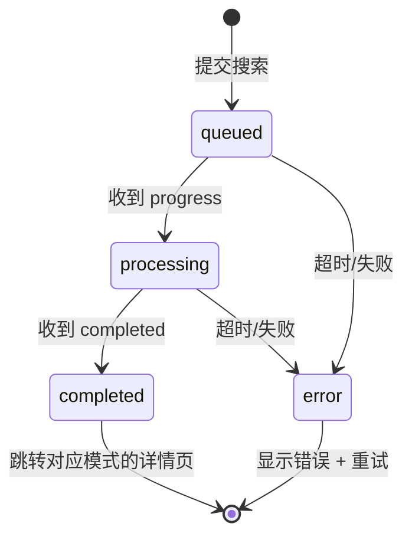

# 爆帖速递小程序 — UE/UI PRD

> **文档版本**: v2.0
> **日期**: 2026-03-25
> **作者**: Antigravity × 产品经理
> **定位**: 独立微信小程序 UE/UI PRD，后端复用 RedditSignalScanner 系统

---

## 一、产品定位

**一句话**：一个轻量级的 Reddit 市场信号"报告阅读器"——输入关键词，1 分钟拿到热度/吐槽/机会的叙事报告。

**产品形态**：独立微信小程序（数据后台走 RedditSignalScanner 系统）
**目标用户**：跨境电商卖家、选品运营、市场研究员
**核心场景**：碎片化时间快速扫描海外消费者真实声音

**V1 核心原则**：
- 简单可用，不堆功能
- 三个叙事详情页是灵魂——报告读得爽比什么都重要
- 不做深挖、不做重扫，底部操作只保留"分享"

---

## 二、设计规范（Alexandria 学术编辑风）

### 2.1 视觉系统

> 设计哲学："The Digital Curator" — 学术感、高端杂志阅读体验。
> **详细 Design Token 见 `/DESIGN.md`**

| 属性 | 规范 |
|------|------|
| **主题** | Light Mode 亮色学术风 |
| **背景色** | `#faf9fa`（主背景/奶白）/ `surface-container-lowest`~`surface-dim` 色阶分层 |
| **主色** | `#094cb2`（编辑蓝，链接和主操作） |
| **辅色/高亮** | `#6d5e00`（Archival Gold，历史/徽章） |
| **文字色** | `#1a1a1a`（主文字）/ `#6B7280`（辅助灰） |
| **标题字体** | **Noto Serif**（大标题，权威衬线体） |
| **正文字体** | **Inter**（正文，现代清晰） |
| **标签字体** | **Public Sans**（元数据/编号，档案感） |
| **圆角** | 最小 `sm` 圆角，不用直角 |
| **间距** | 页面左右 `32rpx`，卡片内 `24rpx`，元素间 `16rpx` |
| **无线条规则** | 不用 1px border，用背景色阶分层定义层次 |
| **浮动菜单** | 毛玻璃（80% opacity + 20px backdrop-blur） |
| **CTA 按钮** | 渐变填充（`primary` → `primary_container`） |

### 2.2 颜色语义

| 用途 | 颜色 | 说明 |
|------|------|------|
| VELOCITY 热点模式 | `#F97316`（橙） | 编号归类 `01 / VELOCITY` |
| FRICTION 痛点模式 | `#EF4444`（红） | 编号归类 `02 / FRICTION` |
| ALPHA 机会模式 | `#EAB308`（金黄） | 编号归类 `03 / ALPHA` |
| 正面标签 | `#22C55E`（绿） | SIGNAL ROBUST 等 |
| 负面/严重 | `#EF4444`（红） | SEVERITY: HIGH 等 |
| 中性 | `#6B7280`（灰） | 中性标签 |

### 2.3 编号系统（Alexandria 特色）

所有内容使用学术期刊式的编号系统强化"档案馆"气质：
- 模式编号：`01 / VELOCITY`、`02 / FRICTION`、`03 / ALPHA`
- 章节编号：`01 / ANALYTICS`、`02 / CORE FRICTIONS`、`03 / ECOSYSTEM DYNAMICS`
- 历史编号：`VOLUME.05 / ARCHIVE`

---

## 三、页面结构（V1 信息架构）

```
小程序（共 7 个页面）
 ├── 🏠 首页（搜索 + 模式选择）     ← Tab 1「首页」
 │
 ├── ⏳ 分析状态加载页               ← 全屏过渡页
 │
 ├── ⭐ 热点追踪详情页               ← 核心叙事页 ①
 ├── ⭐ 痛点挖掘详情页               ← 核心叙事页 ②
 ├── ⭐ 机会发现详情页               ← 核心叙事页 ③
 │
 ├── 📋 分析记录列表页               ← Tab 2「分析记录」
 │
 └── 👤 我的                         ← Tab 3「我的」
```

**底部导航（3 个 Tab）**：首页 / 分析记录 / 我的

---

## 四、页面详细设计

### 4.1 首页（搜索 + 模式选择）— ✅ 已定稿

> 首页采用 Alexandria 左对齐杂志排版，中文主标题+英文副标题。

#### 视觉规范参考

首页已在 Stitch 中定稿（项目 "Analysis Progress"），核心元素：

```
┌───────────────────────────────────┐
│  ← Alexandria                  🔄 │ ← 顶部导航
│                                   │
│  THE DIGITAL CURATOR               │ ← 小标题（小号 Public Sans）
│  Reddit 爆帖速递                   │ ← 大标题（Noto Serif 衬线）
│  Scholarly intelligence for        │ ← 英文副标题（斜体）
│  the social web.                   │
│                                   │
│   ╭──────────────────────────╮    │
│   │  📈  VELOCITY.01         │    │ ← 模式卡片 1
│   │  热点追踪                │    │   中文主标题 + 英文描述
│   │  Analysis of high-velocity │    │
│   │  discourse...             │    │
│   │  SELECT MODE →           │    │
│   ╰──────────────────────────╯    │
│                                   │
│   ╭──────────────────────────╮    │
│   │  💬  FRICTION.02         │    │ ← 模式卡片 2
│   │  痛点挖掘                │    │
│   │  Deep semantic mining... │    │
│   │  SELECT MODE →           │    │
│   ╰──────────────────────────╯    │
│                                   │
│   ╭──────────────────────────╮    │
│   │  💡  ALPHA.03            │    │ ← 模式卡片 3
│   │  机会发现                │    │
│   │  Synthesizing unmet needs│    │
│   │  SELECT MODE →           │    │
│   ╰──────────────────────────╯    │
│                                   │
│  ┌───────────────────────────┐    │
│  │ Keyword or Core Topic     │    │ ← 搜索框
│  │  e.g. SaaS AI workflow...│    │
│  └───────────────────────────┘    │
│                                   │
│  SUBREDDIT FOCUS (UP TO 5)        │ ← 社区筛选
│  [r/startups ×] [+ ADD]          │
│                                   │
│  ╔═══════════════════════════╗    │
│  ║      SCAN NOW  ⚡         ║    │ ← 主 CTA（蓝色渐变）
│  ╚═══════════════════════════╝    │
│                                   │
│  ESTIMATED SCAN DURATION: 14      │
│  SECONDS — HIGH FIDELITY MODE     │
│                                   │
│  ┌────────┐┌────────┐┌──────┐    │
│  │TRENDING││ RANT   ││OPPOR.│    │ ← 底部导航
│  └────────┘└────────┘└──────┘    │
└───────────────────────────────────┘
```

> [!IMPORTANT]
> 底部导航在最终实现时统一为：**首页 / 分析记录 / 我的**（截图中的 TRENDING/RANT/OPPORTUNITY 是 Stitch 原始生成，需替换）

#### 交互说明

| 元素 | 交互行为 |
|------|---------|
| **模式卡片** | 点击选中，选中态加蓝色左描边 + 微缩放 `scale(1.02)` |
| **搜索框** | 焦点态：蓝色底部高亮；placeholder 随模式切换 |
| **社区筛选** | 默认显示，点击 +ADD 弹出输入；逗号分隔，最多 5 个 |
| **SCAN NOW** | 点击后按钮变 loading 态（旋转 + "Processing..."），跳转加载页 |

#### Placeholder 文案（按模式）

| 模式 | Placeholder |
|------|------------|
| 热点追踪 | "e.g. AI Tools, K-Pop, 跨境电商..." |
| 痛点挖掘 | "e.g. Adobe, Salesforce, 扫地机器人..." |
| 机会发现 | "e.g. Video Editing, EDC, Home Gym..." |

---

### 4.2 分析状态加载页

> 全屏过渡页，展示排队位置和分析进度。Alexandria 风格的大号衬线标题 + 步骤列表。

#### 线框图

```
┌───────────────────────────────────┐
│  THE SIGNAL CURATOR            🔍 │
│                                   │
│  02 / VELOCITY                    │ ← 编号标签（橙色）
│                                   │
│  Processing Digital               │ ← 大标题（Noto Serif）
│  Discourse                        │   "Discourse" 使用蓝色斜体
│                                   │
│  CURRENT STATUS                   │
│  ──────────────────────────       │
│  PROCESSING — Extracting signals  │ ← 当前状态
│  from 12 subreddits...            │
│                                   │
│  QUEUED — Position #3             │
│  Estimated wait: ~15s             │
│                                   │
│  ① COLLECTING DISCOURSE           │ ← 步骤 1（完成态 ✓）
│     Archival ingestion successful.│
│                                   │
│  ② SEMANTIC ANALYSIS              │ ← 步骤 2（进行中，加粗）
│     Identifying signal clusters   │
│     and high-fidelity themes...   │
│                                   │
│  ③ SIGNAL SYNTHESIS               │ ← 步骤 3（等待态，灰色）
│     Awaiting structural export.   │
│                                   │
│  ──────────────────────────       │
│  LOW DENSITY         △  ALPHA TGT │
│                                   │
│  SYSTEM.V3 // EXPRESS   LIVE FEED │ ← 底部状态栏
└───────────────────────────────────┘
```

#### 状态流转



---

### 4.3 热点追踪详情页 ⭐

> **核心叙事：这个话题在 Reddit 上最近最火的讨论是什么？趋势往哪走？**

#### 叙事结构

```
导航头 → Executive Brief → 热点话题卡片列表 → 证据帖引用 → 来源社区 → 分享按钮
```

#### 独有模块：话题卡片 + 趋势标签

```
┌───────────────────────────────────┐
│ ← 返回   扫地机器人   [VELOCITY.01]│ ← 固定头部
│         3分钟前 · 53 signals     │
├───────────────────────────────────┤
│                                   │
│  01 / ANALYTICS                   │ ← 章节编号
│                                   │
│  EXECUTIVE BRIEF                  │ ← Noto Serif 大标题
│  ─────────────────────────        │
│  市场共识正在向「全能基站」集中，  │ ← 中文摘要（Inter）
│  用户对避障精度及毛发自动化处理    │
│  的讨论热度持续攀升，品类体验化    │
│  趋势明显。                        │
│                                   │
│  ┌ SIGNAL ROBUST ┐ 53条证据       │ ← 置信度 Badge
│                                   │
│  ═══════════════════════════      │
│                                   │
│  02 / VELOCITY INDEX              │ ← 章节编号
│                                   │
│  ╭──────────────────────────╮     │
│  │ #01 自清洁功能            │     │ ← 话题卡片（编号）
│  │          SUSTAINED HEAT ↗│     │   趋势标签：持续/上升/爆发
│  │                          │     │
│  │ 自清洁基站是今年最大卖   │     │ ← 中文叙事摘要
│  │ 点，但用户反馈实际效果   │     │
│  │ 参差不齐……                │     │
│  │                          │     │
│  │ 📄 12 evidence posts     │     │ ← 证据计数
│  │             [🔍 DEEP DIVE]│     │   ← 展开按钮（V1 展开证据）
│  ╰──────────────────────────╯     │
│                                   │
│  ╭──────────────────────────╮     │
│  │ #02 避障精度    RISING ↑ │     │
│  │ ……                       │     │
│  ╰──────────────────────────╯     │
│                                   │
│  ╭──────────────────────────╮     │
│  │ #03 全能基站  BREAKING 🆕│     │
│  │ ……                       │     │
│  ╰──────────────────────────╯     │
│                                   │
│  [查看更多话题（+4）]              │ ← 渐进展开
│                                   │
│  ═══════════════════════════      │
│                                   │
│  03 / ARCHIVAL EVIDENCE           │ ← 证据帖章节
│                                   │
│  ╭──────────────────────────╮     │
│  │ "TESS series felt sensor  │     │ ← 原文引述（斜体衬线）
│  │  failures reporting       │     │
│  │  increased significantly  │     │
│  │  after firmware..."       │     │
│  │                          │     │
│  │  r/RobotVacuum · 156↑    │     │ ← 社区 + 热度
│  │  VIEW ON REDDIT ↗        │     │
│  ╰──────────────────────────╯     │
│                                   │
│  [查看更多证据（+12）]             │
│                                   │
│  ── 来源社区 ──                   │
│  [r/RobotVacuum] [r/CleaningTips] │ ← 社区胶囊标签
│  [r/homeautomation]               │
│                                   │
│  DATA SCOPE: 30 days · 8 comms    │
│                                   │
│  ╔═══════════════════════════╗    │
│  ║      分享 SHARE 📤        ║    │ ← 唯一底部操作
│  ╚═══════════════════════════╝    │
│                                   │
│  ┌────────┐┌────────┐┌──────┐    │
│  │ 首页   ││分析记录 ││ 我的 │    │ ← 底部导航
│  └────────┘└────────┘└──────┘    │
└───────────────────────────────────┘
```

---

### 4.4 痛点挖掘详情页 ⭐

> **核心叙事：用户到底在骂什么？哪些品牌被提及？有多少人打算跑了？**

#### 叙事结构

```
导航头 → Executive Brief → 痛点卡片（严重度排序）→ 原文引述 → 竞品提及 & 迁移意向 → 证据帖 → 分享
```

#### 独有模块：痛点严重度 + 英文原文引述 + 竞品迁移

```
┌───────────────────────────────────┐
│ ← 返回   扫地机器人  [FRICTION.02]│
│         3分钟前 · 45 signals     │
├───────────────────────────────────┤
│                                   │
│  01 / ANALYTICS                   │
│                                   │
│  EXECUTIVE BRIEF                  │
│  ─────────────────────────        │
│  本期数据覆盖过去 30 天内 4,250   │
│  条讨论。用户主要不满集中在 APP   │
│  控制体验和清扫路径规划两个方向，  │
│  迁移意愿持续攀升。                │
│                                   │
│  ┌ SIGNAL ROBUST ┐                │
│                                   │
│  ═══════════════════════════      │
│                                   │
│  02 / CORE FRICTIONS              │
│                                   │
│  ╭──────────────────────────╮     │
│  │ APP 控制体验差            │     │ ← 痛点标题
│  │              SEVERITY:HIGH│     │   红色严重度标签
│  │                          │     │
│  │ 用户主要抱怨 APP 连接不  │     │ ← 中文叙事
│  │ 稳定、清扫路线设置反人类 │     │
│  │                          │     │
│  │ "Every time I open the   │     │ ← 英文原文引述（斜体）
│  │  app it asks me to re-   │     │
│  │  verify my account or    │     │
│  │  update something. I     │     │
│  │  just want to turn on    │     │
│  │  the lights."            │     │
│  ╰──────────────────────────╯     │
│                                   │
│  ╭──────────────────────────╮     │
│  │ 清扫路径规划不合理        │     │
│  │          SEVERITY:MODERATE│     │
│  │ ……                       │     │
│  ╰──────────────────────────╯     │
│                                   │
│  ═══════════════════════════      │
│                                   │
│  03 / ECOSYSTEM DYNAMICS          │
│                                   │
│  跨品牌协议碎片化                  │ ← Noto Serif 标题
│                                   │
│  ┌─ COMPETITIVE ──┬── MIGRATION ─┐│
│  │  MENTIONS      │   INTENT     ││ ← 两栏布局
│  │                │              ││
│  │ iRobot   1,240 │ PLANNING EXIT││
│  │                │  ▓▓▓▓░░ 35% ││
│  │ Roborock   890 │ CONSIDERING  ││
│  │                │  ▓▓▓░░░ 28% ││
│  │ Ecovacs    567 │ STAYING      ││
│  │                │  ▓▓▓▓▓░ 37% ││
│  └────────────────┴──────────────┘│
│                                   │
│  03 / ARCHIVAL EVIDENCE           │
│  ╭──────────────────────────╮     │
│  │ 原文引述 + 社区 + 热度    │     │
│  ╰──────────────────────────╯     │
│                                   │
│  ╔═══════════════════════════╗    │
│  ║      分享 SHARE 📤        ║    │
│  ╚═══════════════════════════╝    │
│                                   │
│  ┌────────┐┌────────┐┌──────┐    │
│  │ 首页   ││分析记录 ││ 我的 │    │
│  └────────┘└────────┘└──────┘    │
└───────────────────────────────────┘
```

---

### 4.5 机会发现详情页 ⭐

> **核心叙事：市场哪里有空白？谁最着急要这个产品？现有替代品差在哪？**

#### 叙事结构

```
导航头 → Executive Brief → 市场机会卡（金色高亮）→ 未满足需求 & 强度 → 用户画像 → 现有替代品对比 → 证据帖 → 分享
```

#### 独有模块：金色机会卡 + 需求强度 + 用户画像 + 替代品

```
┌───────────────────────────────────┐
│ ← 返回   扫地机器人    [ALPHA.03] │
│         3分钟前 · 38 signals     │
├───────────────────────────────────┤
│                                   │
│  01 / MARKET OPPORTUNITY          │ ← 金色编号标签
│                                   │
│  ╭─────── 金色高亮卡片 ──────╮    │
│  │                           │    │
│  │ 高增长空白：针对多宠家庭  │    │ ← 机会标题
│  │ 的「静音级」深度除毛      │    │
│  │ 智能洗地机                │    │
│  │                           │    │
│  │ 目标用户: 3+ 宠物家庭     │    │ ← 关键指标
│  │ 价格锚点: $200–400        │    │
│  │ 渠道建议: Amazon + TikTok │    │
│  ╰───────────────────────────╯    │
│                                   │
│  ═══════════════════════════      │
│                                   │
│  02 / CRITICAL GAP                │
│                                   │
│  宠物毛发清理能力                  │ ← Noto Serif
│  INTENSITY: HIGH                  │ ← 金色 Badge
│  ▓▓▓▓▓▓▓▓▓░ 89% 共鸣度           │ ← 进度条
│                                   │
│  CURRENT WORKAROUNDS              │ ← 子标题
│  · 手动吸 → 太累，效率低         │
│  · 另买除毛器 → 多花钱，占空间   │
│                                   │
│  ═══════════════════════════      │
│                                   │
│  ┌── WHO NEEDS ──┬── EXISTING ──┐│
│  │  THIS MOST    │  ALTERNATIVES││ ← 两栏布局
│  │               │              ││
│  │ 养宠物家庭    │ Dyson V15    ││
│  │ ▓▓▓▓▓▓░ 64%  │ ✓ 吸力强     ││
│  │               │ ✗ 价格高     ││
│  │ 过敏体质用户  │              ││
│  │ ▓▓▓░░░░ 28%  │ Tineco Floor ││
│  │               │ ✓ 性价比     ││
│  │               │ ✗ 除毛弱     ││
│  └───────────────┴──────────────┘│
│                                   │
│  03 / ARCHIVAL EVIDENCE           │
│  ╭──────────────────────────╮     │
│  │ 原文引述 + 社区 + 热度    │     │
│  ╰──────────────────────────╯     │
│                                   │
│  ── 来源社区 ──                   │
│  [r/RobotVacuum] [r/Pets]         │
│  [r/CleaningTips]                 │
│                                   │
│  ╔═══════════════════════════╗    │
│  ║      分享 SHARE 📤        ║    │
│  ╚═══════════════════════════╝    │
│                                   │
│  ┌────────┐┌────────┐┌──────┐    │
│  │ 首页   ││分析记录 ││ 我的 │    │
│  └────────┘└────────┘└──────┘    │
└───────────────────────────────────┘
```

---

### 4.6 分析记录列表页

> Alexandria 风格的时间线列表，每条记录显示模式图标 + 编号 + 查询词 + 信号数。

```
┌───────────────────────────────────┐
│  THE SIGNAL CURATOR               │
│                                   │
│  VOLUME.05 / ARCHIVE              │ ← 编号标签
│                                   │
│  INQUIRY                          │ ← Noto Serif 大标题
│  ARCHIVE                          │
│                                   │
│  A chronological ledger of high-  │ ← 英文描述
│  signal research queries and      │
│  market friction analysis.        │
│                                   │
│  ╭──────────────────────────╮     │
│  │ 📈 VELOCITY.01    3 MIN AGO│    │ ← 历史记录卡片
│  │  扫地机器人                │     │
│  │  53 SIGNALS DETECTED      │     │
│  ╰──────────────────────────╯     │
│                                   │
│  ╭──────────────────────────╮     │
│  │ 💡 ALPHA.03    2 HOURS AGO│     │
│  │  Web3 Gaming Infra       │     │
│  │  110 SIGNALS DETECTED    │     │
│  ╰──────────────────────────╯     │
│                                   │
│  ╭──────────────────────────╮     │
│  │ 💬 FRICTION.02   YESTERDAY│     │
│  │  Affordable Housing Tech │     │
│  │  46 SIGNALS DETECTED     │     │
│  ╰──────────────────────────╯     │
│                                   │
│  END OF ARCHIVE                   │
│                                   │
│  ┌────────┐┌────────┐┌──────┐    │
│  │ 首页   ││▌记录▐ ││ 我的 │    │ ← 当前 Tab 高亮
│  └────────┘└────────┘└──────┘    │
└───────────────────────────────────┘
```

#### 交互说明

| 元素 | 行为 |
|------|------|
| 点击任意记录 | 跳转到对应模式的详情页（带缓存数据） |
| 下拉 | 刷新列表 |
| 空态 | 显示引导文案："暂无分析记录，去首页发起你的第一次扫描" |

---

### 4.7 我的页面

> V1 极简，提供基本设置和使用统计。

```
┌───────────────────────────────────┐
│  THE SIGNAL CURATOR               │
│                                   │
│  PROFILE                          │ ← Noto Serif 标题
│                                   │
│  ╭──────────────────────────╮     │
│  │ 👤 微信用户               │     │ ← 头像 + 昵称
│  │ namcodog@gmail.com       │     │
│  ╰──────────────────────────╯     │
│                                   │
│  ── 使用统计 ──                   │
│  总分析次数          12           │
│  最常用模式        热点追踪       │
│  上次分析          3 分钟前       │
│                                   │
│  ── 设置 ──                       │
│  默认分析模式       热点追踪 >    │
│  语言偏好           中文 >        │
│  关于爆帖速递                 >   │
│  版本               v1.0.0       │
│                                   │
│  ┌────────┐┌────────┐┌──────┐    │
│  │ 首页   ││分析记录 ││▌我的▐│    │
│  └────────┘└────────┘└──────┘    │
└───────────────────────────────────┘
```

---

## 五、三个详情页的统一叙事骨架

三个详情页共享统一结构，但各有独特的核心模块：

```
┌─────────────────────────────────────────────────┐
│              通用骨架（所有详情页共享）            │
│                                                 │
│  ① 固定头部: ← 返回 + 查询词 + 模式徽章 + 时间  │
│  ② Executive Brief: 中文摘要 + 置信度 Badge     │
│  ③ ────── 核心模块区（按模式不同）──────         │
│  ④ 证据帖引用区（Archival Evidence）             │
│  ⑤ 来源社区标签                                 │
│  ⑥ 底部操作：分享按钮（唯一操作）               │
│  ⑦ 底部导航：首页 / 分析记录 / 我的             │
└─────────────────────────────────────────────────┘
```

| 模式 | ③ 核心模块内容 |
|------|--------------|
| **热点追踪** | 话题卡片列表（#01 #02 #03），每个话题带趋势标签（SUSTAINED / RISING / BREAKING） |
| **痛点挖掘** | 痛点严重度排序 + 英文原文引述（斜体卡片）+ 竞品提及数 + 迁移意向百分比条 |
| **机会发现** | 金色市场机会卡 + 未满足需求强度进度条 + 用户画像（谁最着急）+ 替代品优劣对比 |

---

## 六、底部导航栏

| 属性 | 规范 |
|------|------|
| Tab 数 | 3 个：首页 / 分析记录 / 我的 |
| 形状 | 圆角胶囊（`border-radius: 40rpx`） |
| 背景 | 白色 + 微透明毛玻璃（80% opacity + 20px backdrop-blur） |
| 选中态 | 图标 + 文字变为蓝色（`#094cb2`） |
| 未选中态 | `#9CA3AF`（灰色） |
| 高度 | `100rpx`（含安全区） |
| 距底部 | `20rpx`（悬浮） |

---

## 七、微动效规范

| 场景 | 动效 | 参数 |
|------|------|------|
| 页面切换 | 从右滑入 | `300ms ease-out` |
| 模式卡片选中 | 微缩放 + 左描边渐变 | `scale(1.02)`, `200ms` |
| 加载步骤高亮 | 文字加粗 + 颜色渐变 | `400ms` |
| 排队脉冲 | 进度条脉冲 | `1.5s ease-in-out infinite` |
| 详情页入场 | 卡片依次淡入上滑 | `400ms stagger 80ms` |
| 展开更多 | 高度动画 | `300ms ease-out` |
| 按钮按下 | 缩放反馈 | `scale(0.97)`, `100ms` |

---

## 八、数据接口映射

小程序直接复用现有后端 API，无需额外开发。

| 小程序页面 | 后端 API | 方法 |
|-----------|---------|------|
| 搜索提交 | `/api/hotpost/search` | POST |
| 获取结果 | `/api/hotpost/result/{query_id}` | GET |
| 进度查询 | `/api/hotpost/result/{query_id}` | GET（轮询） |
| 历史列表 | `/api/hotpost/history` | GET |

> [!WARNING]
> **SSE 降级方案**：微信小程序不原生支持 SSE，需改为**轮询**。每 2 秒调用 `GET /api/hotpost/result/{query_id}`，根据 status 字段判断状态。

---

## 九、适配说明

| 差异点 | Web 端 | 小程序端 |
|--------|--------|---------|
| Reddit 链接 | 直接打开新标签页 | 复制链接 + Toast 提示 |
| SSE 实时推送 | EventSource 直连 | 改为 2s 轮询 |
| 登录验证 | AuthDialog 弹窗 | 微信授权登录 |
| 分享功能 | 不支持 | 原生分享（小程序卡片 + 朋友圈海报） |
| 底部导航 | 无 | 浮动胶囊 TabBar |
| 响应式布局 | PC + 移动 | 纯移动端（750rpx 设计稿） |

---

## 十、页面汇总 & 优先级

| 优先级 | 页面 | 复杂度 | 说明 |
|--------|------|--------|------|
| **P0** | 首页（搜索） | ⭐⭐ | 已定稿，入口页 |
| **P0** | 分析状态加载 | ⭐ | 状态展示 + 进度动画 |
| **P0** | 热点追踪详情 ⭐ | ⭐⭐⭐⭐ | 话题排序 + 趋势标签 |
| **P0** | 痛点挖掘详情 ⭐ | ⭐⭐⭐⭐ | 痛点 + 竞品 + 迁移意向 |
| **P0** | 机会发现详情 ⭐ | ⭐⭐⭐⭐⭐ | 数据结构最复杂 |
| **P1** | 分析记录列表 | ⭐⭐ | 列表页 |
| **P2** | 我的 | ⭐ | 设置 + 统计 |

---

## 十一、V1 不做的功能（V2 规划）

| 功能 | 原因 |
|------|------|
| 继续深挖 | V1 只读报告，不做二次分析 |
| 重新扫描 | V1 只从首页发起新扫描 |
| 分享海报生成 | V2 增强分享能力 |
| 多语言切换 | V1 默认中文 |

---

## 十二、设计交付清单

| # | 交付物 | 格式 |
|---|--------|------|
| 1 | 设计稿（Stitch + 手动优化） | 750rpx 设计稿，含所有 7 个页面 |
| 2 | 切图资源 | @2x / @3x PNG + SVG 图标 |
| 3 | 动效标注 | CSS 参数 |
| 4 | 交互流程图 | Mermaid + Stitch Prototype |
| 5 | 组件库 | 按钮 / 卡片 / Badge / Input / TabBar |
| 6 | Design Token | 见 `/DESIGN.md` |
