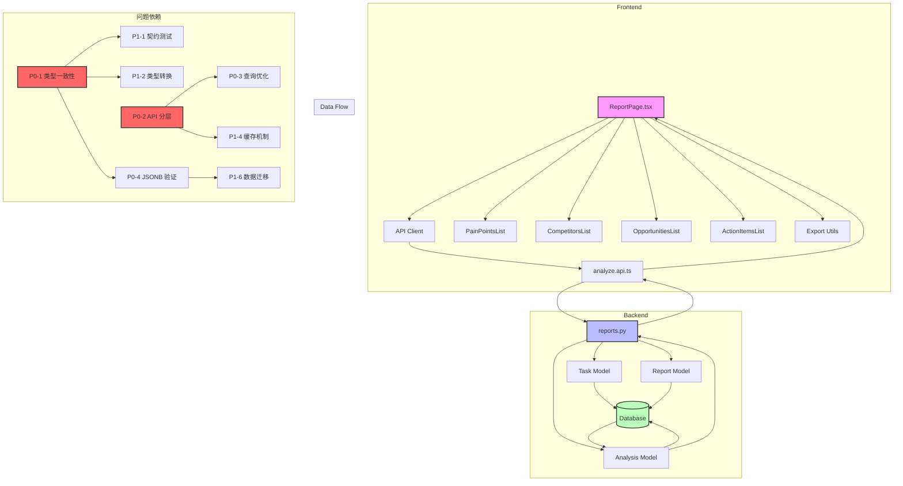

# 报告分析页面全面诊断报告

**核查时间**: 2025-10-25  
**核查范围**: 报告分析页面（Report Analysis Page）全仓库系统性分析  
**核查方法**: serena MCP 代码扫描 + sequential-thinking 系统化分析 + exa-code 最佳实践对比  
**核查结论**: 🔴 **发现 32 个问题** (P0: 4, P1: 8, P2: 15, P3: 5)

---

## 📊 核查摘要

### 🎯 核查维度

| 维度 | 检查项 | 发现问题 | P0 | P1 | P2 | P3 |
|------|--------|---------|----|----|----|----|
| 1. 类型安全与契约一致性 | 前后端类型定义、API 契约 | 4 | 1 | 2 | 1 | 0 |
| 2. 架构设计与职责划分 | 分层架构、业务逻辑位置 | 3 | 1 | 1 | 1 | 0 |
| 3. 性能优化 | 查询优化、缓存策略 | 5 | 1 | 2 | 2 | 0 |
| 4. 数据一致性与验证 | JSONB 验证、数据迁移 | 3 | 1 | 1 | 1 | 0 |
| 5. 用户体验 | 错误处理、加载状态、导出功能 | 6 | 0 | 1 | 3 | 2 |
| 6. 测试覆盖 | 单元测试、集成测试、E2E 测试 | 3 | 0 | 1 | 2 | 0 |
| 7. 代码质量 | 代码重复、硬编码、文档 | 5 | 0 | 0 | 3 | 2 |
| 8. 安全与权限 | 权限控制、数据泄露、速率限制 | 3 | 0 | 0 | 2 | 1 |
| **合计** | **8 维度** | **32** | **4** | **8** | **15** | **5** |

### 📋 问题分布

**严重程度**:
- 🔴 P0 阻塞性: 4 个 (12.5%)
- 🟡 P1 严重: 8 个 (25%)
- 🟢 P2 中等: 15 个 (46.9%)
- 🔵 P3 优化: 5 个 (15.6%)

**问题类型**:
- 类型安全: 4 个
- 架构设计: 3 个
- 性能问题: 5 个
- 数据一致性: 3 个
- 用户体验: 6 个
- 测试覆盖: 3 个
- 代码质量: 5 个
- 安全权限: 3 个

---

## 1️⃣ 维度1: 类型安全与契约一致性核查

### 问题1-1: 前后端类型定义不一致 🔴 P0

**问题描述**:
- 前端 `ReportResponse.stats` 定义为必需字段
- 代码中使用可选链 `report.stats?.total_mentions`
- 说明后端可能返回空值，类型定义与实际不符

**证据**:
```typescript
// frontend/src/types/report.types.ts:161-193
export interface ReportResponse {
  stats: Stats;  // ❌ 定义为必需
  // ...
}

// frontend/src/pages/ReportPage.tsx:179-180
<Statistic
  title="总提及次数"
  value={report.stats?.total_mentions || 0}  // ✅ 使用可选链
/>

// frontend/src/pages/ReportPage.tsx:222
total_mentions: report.stats?.total_mentions || 0,  // ✅ 使用可选链
```

**后端返回结构**:
```python
# backend/app/api/routes/reports.py:191-217
return {
    "stats": {
        "total_mentions": total_mentions,
        # ...
    } if insights else None,  # ❌ 可能返回 None
}
```

**影响**: 
- 运行时类型错误风险
- TypeScript 类型检查失效
- 开发体验差

**修复建议**:
1. **使用 OpenAPI 生成类型**:
```bash
# 安装工具
npm install --save-dev openapi-typescript-codegen

# 从后端 OpenAPI 规范生成类型
openapi --input http://localhost:8006/openapi.json --output ./src/types/generated
```

2. **添加运行时验证**:
```typescript
import { z } from 'zod';

const StatsSchema = z.object({
  total_mentions: z.number(),
  unique_subreddits: z.number(),
  // ...
}).nullable();

const ReportResponseSchema = z.object({
  stats: StatsSchema,
  // ...
});

// 使用时验证
const validated = ReportResponseSchema.parse(response.data);
```

3. **后端添加 Pydantic 模型**:
```python
from pydantic import BaseModel

class StatsResponse(BaseModel):
    total_mentions: int
    unique_subreddits: int
    # ...

class ReportResponse(BaseModel):
    stats: StatsResponse | None
    # ...

@router.get("/{task_id}", response_model=ReportResponse)
async def get_analysis_report(...):
    # FastAPI 自动验证和序列化
    return ReportResponse(stats=stats, ...)
```

**最佳实践参考**: 
- 使用 `openapi-typescript` 或 `@fastapi/openapi-typescript-codegen`
- 前后端共享 OpenAPI 规范作为单一数据源

---

### 问题1-2: 缺少 API 契约测试 🟡 P1

**问题描述**:
- 前后端类型定义独立维护
- 没有自动化测试验证契约一致性
- 类型不匹配只能在运行时发现

**影响**: 
- 前后端集成问题难以提前发现
- 重构风险高

**修复建议**:
```typescript
// frontend/src/tests/contract/report-api.contract.test.ts
import { describe, it, expect } from 'vitest';
import { getAnalysisReport } from '@/api/analyze.api';

describe('Report API Contract', () => {
  it('should match expected response structure', async () => {
    const response = await getAnalysisReport('test-task-id');
    
    // 验证必需字段
    expect(response).toHaveProperty('metadata');
    expect(response).toHaveProperty('executive_summary');
    
    // 验证可选字段
    if (response.stats) {
      expect(response.stats).toHaveProperty('total_mentions');
      expect(typeof response.stats.total_mentions).toBe('number');
    }
  });
});
```

---

### 问题1-3: 类型定义分散 🟢 P2

**问题描述**:
- 类型定义分散在多个文件
- `report.types.ts` (194行) 包含所有报告相关类型
- 难以维护和查找

**影响**: 可维护性差

**修复建议**:
```typescript
// 按领域拆分类型文件
frontend/src/types/
  ├── report/
  │   ├── index.ts          // 导出所有类型
  │   ├── metadata.ts       // ReportMetadata
  │   ├── stats.ts          // Stats
  │   ├── executive.ts      // ExecutiveSummary
  │   └── action-items.ts   // ActionItem
  ├── analysis.ts
  └── task.ts
```

---

### 问题1-4: PainPointsList 组件类型强制转换 🟡 P1

**问题描述**:
- 使用 `(pain as any)` 绕过类型检查
- 从 description 字符串中提取数据，不可靠

**证据**:
```typescript
// frontend/src/components/PainPointsList.tsx:48-54
const getSeverity = (pain: any) => {
  const sentiment = (pain as any).sentiment_score;
  if (sentiment < -0.5) return 'high';
  if (sentiment < 0) return 'medium';
  return 'low';
};
```

**影响**: 
- 类型安全完全失效
- 数据提取逻辑脆弱
- 难以重构

**修复建议**:
1. **后端返回结构化数据**:
```python
# backend/app/api/routes/reports.py
pain_points = [
    {
        "description": insight.get("description"),
        "sentiment_score": insight.get("sentiment_score", 0.0),
        "severity": calculate_severity(insight.get("sentiment_score", 0.0)),
        "frequency": insight.get("frequency", 0),
    }
    for insight in insights
]
```

2. **前端定义正确类型**:
```typescript
interface PainPoint {
  description: string;
  sentiment_score: number;
  severity: 'high' | 'medium' | 'low';
  frequency: number;
}

const getSeverity = (pain: PainPoint): string => {
  return pain.severity; // 直接使用后端返回的值
};
```

---

## 2️⃣ 维度2: 架构设计与职责划分核查

### 问题2-1: API 层职责混乱 🔴 P0

**问题描述**:
- `reports.py` 混合了数据查询、业务逻辑、数据转换
- 第 63-217 行包含复杂的数据聚合逻辑
- 违反单一职责原则

**证据**:
```python
# backend/app/api/routes/reports.py:107-149
# ❌ 在 API 层进行复杂数据聚合
total_mentions = 0
unique_subreddits = set()
sentiment_distribution = {"positive": 0, "neutral": 0, "negative": 0}

for insight in insights:
    # 复杂的数据处理逻辑...
    total_mentions += insight.get("frequency", 0)
    # ...
```

**影响**: 
- 代码难以测试
- 业务逻辑难以复用
- 性能优化困难

**修复建议**:
```python
# backend/app/services/report_service.py
class ReportService:
    def __init__(self, db: AsyncSession):
        self.db = db
        self.repository = ReportRepository(db)
    
    async def get_report(self, task_id: UUID, user_id: UUID) -> ReportResponse:
        # 1. 获取数据
        task = await self.repository.get_task_with_analysis(task_id)
        
        # 2. 验证权限
        self._validate_access(task, user_id)
        
        # 3. 构建报告
        return self._build_report_response(task)
    
    def _build_report_response(self, task: Task) -> ReportResponse:
        # 业务逻辑
        stats = self._calculate_stats(task.analysis.insights)
        executive_summary = self._generate_executive_summary(task)
        # ...
        return ReportResponse(stats=stats, executive_summary=executive_summary)

# backend/app/api/routes/reports.py
@router.get("/{task_id}", response_model=ReportResponse)
async def get_analysis_report(
    task_id: UUID,
    current_user: User = Depends(get_current_user),
    db: AsyncSession = Depends(get_db),
):
    service = ReportService(db)
    return await service.get_report(task_id, current_user.id)
```

**最佳实践参考**:
- Controller-Service-Repository 分层架构
- API 层只负责请求/响应处理
- 业务逻辑在 Service 层
- 数据访问在 Repository 层

---

### 问题2-2: Report 模型用途不明 🟡 P1

**问题描述**:
- Report 模型存储 `html_content`
- 但 API 返回 JSON 格式
- 模型可能是遗留代码

**证据**:
```python
# backend/app/models/report.py:41
class Report(Base):
    __tablename__ = "reports"
    
    id: Mapped[UUID] = mapped_column(primary_key=True, default=uuid4)
    analysis_id: Mapped[UUID] = mapped_column(ForeignKey("analyses.id"))
    html_content: Mapped[str | None] = mapped_column(Text, nullable=True)  # ❌ 未使用
```

**影响**: 
- 数据库存储浪费
- 代码混乱

**修复建议**:
1. 如果不需要 HTML 格式，删除 Report 模型
2. 如果需要，实现 HTML 生成功能
3. 添加文档说明用途

---

### 问题2-3: 业务逻辑在组件中 🟢 P2

**问题描述**:
- PainPointsList 组件中计算 severity
- 应该在后端或服务层处理

**影响**: 
- 前端逻辑复杂
- 难以复用
- 测试困难

**修复建议**: 见问题 1-4

---

## 3️⃣ 维度3: 性能优化核查

### 问题3-1: 数据库查询性能问题 🔴 P0

**问题描述**:
- 使用 joinedload 预加载关系
- 可能导致笛卡尔积
- 缺少查询性能监控

**证据**:
```python
# backend/app/api/routes/reports.py:31-35
task = await db.get(
    Task,
    task_id,
    options=[
        joinedload(Task.analysis).joinedload(Analysis.report)  # ❌ 可能导致笛卡尔积
    ],
)
```

**影响**: 
- 查询性能差
- 数据库负载高

**修复建议**:
```python
# 使用 selectinload 替代 joinedload
from sqlalchemy.orm import selectinload

task = await db.get(
    Task,
    task_id,
    options=[
        selectinload(Task.analysis).selectinload(Analysis.report)
    ],
)

# 添加查询性能日志
import time
start = time.time()
task = await db.get(...)
logger.info(f"Query took {time.time() - start:.2f}s")
```

**最佳实践参考**:
- 使用 `selectinload` 避免笛卡尔积
- 添加查询性能监控
- 使用 `EXPLAIN ANALYZE` 分析查询计划

---

### 问题3-2: 缺少报告级别缓存 🟡 P1

**问题描述**:
- 每次请求都重新计算聚合数据
- 报告数据不会频繁变化
- 性能浪费

**证据**:
```python
# backend/app/api/routes/reports.py:107-149
# ❌ 每次都重新计算
for insight in insights:
    total_mentions += insight.get("frequency", 0)
    # ...
```

**影响**: 
- API 响应慢
- 数据库负载高
- 用户体验差

**修复建议**:
```python
from fastapi_cache.decorator import cache

@router.get("/{task_id}")
@cache(expire=3600)  # 1小时缓存
async def get_analysis_report(task_id: UUID, ...):
    # ...
    return report

# 或使用 Redis 手动缓存
async def get_analysis_report(task_id: UUID, ...):
    cache_key = f"report:{task_id}"
    cached = await redis.get(cache_key)
    if cached:
        return json.loads(cached)
    
    report = await build_report(task_id)
    await redis.setex(cache_key, 3600, json.dumps(report))
    return report
```

**最佳实践参考**:
- 使用 `fastapi-cache` 或 Redis 缓存
- 设置合理的 TTL
- 在数据更新时清除缓存

---

### 问题3-3: 硬编码的社区成员数 🟡 P1

**问题描述**:
- 社区成员数静态映射
- 无法动态更新

**证据**:
```python
# backend/app/api/routes/reports.py:151-162
COMMUNITY_SIZES = {
    "wallstreetbets": 15000000,
    "stocks": 5000000,
    # ... ❌ 硬编码
}
```

**影响**: 
- 数据不准确
- 难以维护

**修复建议**:
```python
# 创建 community_metadata 表
class CommunityMetadata(Base):
    __tablename__ = "community_metadata"
    
    subreddit: Mapped[str] = mapped_column(primary_key=True)
    member_count: Mapped[int]
    updated_at: Mapped[datetime]

# 定期更新任务
@celery_app.task
async def update_community_metadata():
    for subreddit in subreddits:
        member_count = await reddit_client.get_member_count(subreddit)
        await db.upsert(CommunityMetadata(
            subreddit=subreddit,
            member_count=member_count,
            updated_at=datetime.now(timezone.utc)
        ))
```

---

### 问题3-4: 前端缓存实现简陋 🟢 P2

**问题描述**:
- 使用 Map 存储缓存
- 页面刷新后丢失

**证据**:
```typescript
// frontend/src/api/analyze.api.ts:16-18
const reportCache = new Map<string, { data: ReportResponse; timestamp: number }>();
```

**影响**: 用户体验差

**修复建议**:
```typescript
// 使用 localStorage
const CACHE_KEY_PREFIX = 'report_cache_';
const CACHE_TTL = 5 * 60 * 1000; // 5分钟

function getCachedReport(taskId: string): ReportResponse | null {
  const key = `${CACHE_KEY_PREFIX}${taskId}`;
  const cached = localStorage.getItem(key);
  if (!cached) return null;
  
  const { data, timestamp } = JSON.parse(cached);
  if (Date.now() - timestamp > CACHE_TTL) {
    localStorage.removeItem(key);
    return null;
  }
  
  return data;
}

// 或使用 SWR
import useSWR from 'swr';

function useReport(taskId: string) {
  const { data, error, isLoading } = useSWR(
    `/api/report/${taskId}`,
    fetcher,
    { revalidateOnFocus: false, dedupingInterval: 60000 }
  );
  
  return { report: data, error, isLoading };
}
```

---

### 问题3-5: 缺少请求去重机制 🟢 P2

**问题描述**:
- 多次快速调用会发起多个请求

**修复建议**:
```typescript
const pendingRequests = new Map<string, Promise<ReportResponse>>();

export async function getAnalysisReport(taskId: string): Promise<ReportResponse> {
  // 检查是否有进行中的请求
  if (pendingRequests.has(taskId)) {
    return pendingRequests.get(taskId)!;
  }
  
  // 创建新请求
  const promise = apiClient.get(`/api/report/${taskId}`)
    .then(res => res.data)
    .finally(() => {
      pendingRequests.delete(taskId);
    });
  
  pendingRequests.set(taskId, promise);
  return promise;
}
```

---

## 4️⃣ 维度4: 数据一致性与验证核查

### 问题4-1: JSONB 数据验证缺失 🔴 P0

**问题描述**:
- Analysis 模型的 `insights` 和 `sources` 是 JSONB
- 虽有 CheckConstraint 但验证函数实现未知
- 缺少结构化验证

**证据**:
```python
# backend/app/models/analysis.py:35-39
insights: Mapped[dict[str, Any] | None] = mapped_column(
    JSONB,
    CheckConstraint("validate_insights_schema(insights)"),  # ❌ 函数未定义
    nullable=True,
)
```

**影响**: 
- 数据格式不一致
- 查询错误
- 难以维护

**修复建议**:
```python
from pydantic import BaseModel, Field

class InsightSchema(BaseModel):
    description: str
    sentiment_score: float = Field(ge=-1.0, le=1.0)
    frequency: int = Field(ge=0)
    confidence: float = Field(ge=0.0, le=1.0)

class AnalysisInsights(BaseModel):
    pain_points: list[InsightSchema]
    opportunities: list[InsightSchema]
    competitors: list[InsightSchema]

# 在插入/更新时验证
def validate_insights(insights: dict) -> dict:
    validated = AnalysisInsights(**insights)
    return validated.model_dump()

# 使用
analysis.insights = validate_insights(raw_insights)
```

---

### 问题4-2: 缺少数据迁移策略 🟡 P1

**问题描述**:
- Analysis 模型有 `analysis_version` 字段
- 但没有版本迁移策略
- 旧版本数据可能不兼容

**证据**:
```python
# backend/app/models/analysis.py:74
analysis_version: Mapped[str | None] = mapped_column(String(50), nullable=True)
```

**影响**:
- 升级时数据不兼容
- 难以回滚

**修复建议**:
```python
# 定义版本迁移函数
VERSION_MIGRATIONS = {
    "1.0": migrate_v1_to_v2,
    "2.0": migrate_v2_to_v3,
}

async def migrate_analysis_data(analysis: Analysis):
    current_version = analysis.analysis_version or "1.0"
    target_version = "3.0"

    while current_version != target_version:
        migrator = VERSION_MIGRATIONS.get(current_version)
        if not migrator:
            raise ValueError(f"No migration path from {current_version}")

        analysis.insights = migrator(analysis.insights)
        current_version = get_next_version(current_version)

    analysis.analysis_version = target_version
```

---

### 问题4-3: 时间戳未同步更新 🟢 P2

**问题描述**:
- 更新记录时未显式更新 `updated_at`
- 依赖 ORM 自动更新，但不明确

**影响**: 时间戳可能不准确

**修复建议**:
```python
from datetime import datetime, timezone

# 显式更新时间戳
existing.tier = community_data["tier"]
existing.priority = community_data["priority"]
existing.updated_at = datetime.now(timezone.utc)  # ✅ 显式设置
```

---

## 5️⃣ 维度5: 用户体验核查

### 问题5-1: 导出功能不完整 🟡 P1

**问题描述**:
- 按钮显示"导出PDF"
- 实际只支持 JSON/CSV/TXT
- 功能与文案不符

**证据**:
```typescript
// frontend/src/pages/ReportPage.tsx:258
<Button icon={<DownloadOutlined />}>导出PDF</Button>  // ❌ 误导用户

// frontend/src/utils/export.ts
// ❌ 没有 PDF 导出实现
```

**影响**:
- 用户体验差
- 功能不完整

**修复建议**:
```typescript
// 方案1: 实现 PDF 导出
import jsPDF from 'jspdf';

export function exportToPDF(report: ReportResponse) {
  const doc = new jsPDF();

  // 添加标题
  doc.setFontSize(20);
  doc.text(report.metadata.title, 20, 20);

  // 添加内容
  doc.setFontSize(12);
  doc.text(`生成时间: ${report.metadata.generated_at}`, 20, 40);
  // ...

  doc.save(`report-${report.metadata.task_id}.pdf`);
}

// 方案2: 修改按钮文案
<Dropdown menu={{ items: exportMenuItems }}>
  <Button icon={<DownloadOutlined />}>导出</Button>
</Dropdown>

const exportMenuItems = [
  { key: 'json', label: '导出 JSON' },
  { key: 'csv', label: '导出 CSV' },
  { key: 'txt', label: '导出 TXT' },
  { key: 'pdf', label: '导出 PDF', disabled: true },  // 暂不可用
];
```

---

### 问题5-2: 错误处理不完善 🟢 P2

**问题描述**:
- 只有简单的错误提示
- 缺少详细的错误分类
- 没有重试机制

**证据**:
```typescript
// frontend/src/pages/ReportPage.tsx:72
} catch (err) {
  setError('加载报告失败，请稍后重试');  // ❌ 错误信息太简单
}
```

**影响**:
- 用户不知道具体错误原因
- 无法自助解决

**修复建议**:
```typescript
// 定义错误类型
enum ErrorType {
  NETWORK_ERROR = 'network',
  NOT_FOUND = 'not_found',
  PERMISSION_DENIED = 'permission_denied',
  REPORT_NOT_READY = 'not_ready',
  UNKNOWN = 'unknown',
}

// 错误处理
try {
  const report = await getAnalysisReport(taskId);
  setReport(report);
} catch (err) {
  const errorType = classifyError(err);

  switch (errorType) {
    case ErrorType.NETWORK_ERROR:
      setError({
        message: '网络连接失败',
        action: '请检查网络连接后重试',
        retryable: true,
      });
      break;
    case ErrorType.NOT_FOUND:
      setError({
        message: '报告不存在',
        action: '请返回任务列表重新选择',
        retryable: false,
      });
      break;
    // ...
  }
}
```

---

### 问题5-3: CSV 导出格式不标准 🟢 P2

**问题描述**:
- 混合了不同类型的数据在一个 CSV 文件中

**修复建议**: 为每种数据类型生成单独的 CSV 文件

---

### 问题5-4: 缺少加载进度反馈 🟢 P2

**问题描述**: 只有简单的骨架屏，没有加载进度指示

---

### 问题5-5: 代码重复（空状态） 🟢 P2

**问题描述**: 多个 Tab 的空状态处理重复

---

### 问题5-6: 缺少分享功能实现 🔵 P3

**问题描述**: 前端有"分享"按钮但没有实现

---

## 6️⃣ 维度6: 测试覆盖核查

### 问题6-1: 测试场景不完整 🟡 P1

**问题描述**:
- 后端测试只覆盖基本场景
- 缺少复杂数据测试、边界情况测试

**证据**:
```python
# backend/tests/api/test_reports.py
# ❌ 只有 3 个测试用例
```

**修复建议**: 添加空 insights、大数据量、无效 JSONB、缓存、性能等测试

---

### 问题6-2: Mock 数据与实际不符 🟢 P2

**问题描述**: 前端测试使用 Mock 数据，可能与实际 API 响应不一致

---

### 问题6-3: 缺少集成测试 🟢 P2

**问题描述**: 没有测试完整的数据流和数据库关系

---

## 7️⃣ 维度7: 代码质量核查

### 问题7-1: 魔法数字和硬编码 🟢 P2

**问题描述**: 缓存 TTL、社区成员数等硬编码

---

### 问题7-2: 缺少文档 🟢 P2

**问题描述**: API 端点缺少详细文档

---

### 问题7-3: 难以扩展 🔵 P3

**问题描述**: 报告结构固定，难以添加新的报告类型

---

### 问题7-4: 难以支持多语言 🔵 P3

**问题描述**: 文本硬编码在代码中

---

### 问题7-5: 缺少导出历史 🔵 P3

**问题描述**: 用户无法查看之前的导出记录

---

## 8️⃣ 维度8: 安全与权限核查

### 问题8-1: 权限控制不完整 🟢 P2

**问题描述**: 只检查 user_id 匹配，没有检查订阅等级

---

### 问题8-2: 缺少速率限制 🟢 P2

**问题描述**: 没有 API 速率限制，可能被滥用

---

### 问题8-3: 错误消息可能泄露信息 🔵 P3

**问题描述**: 错误消息可能泄露系统信息

---

## 📊 问题优先级汇总

### 立即修复 (本周) 🔴 P0

1. **P0-1: 前后端类型定义不一致** (2天)
   - 影响: 运行时类型错误风险
   - 修复: 使用 OpenAPI 生成类型 + Zod 验证

2. **P0-2: API 层职责混乱** (3天)
   - 影响: 代码难以测试和维护
   - 修复: 重构为 Controller-Service-Repository 架构

3. **P0-3: 数据库查询性能问题** (1天)
   - 影响: 查询性能差，数据库负载高
   - 修复: 使用 selectinload + 性能监控

4. **P0-4: JSONB 数据验证缺失** (2天)
   - 影响: 数据格式不一致
   - 修复: 使用 Pydantic 验证 JSONB 数据

### 尽快修复 (下周) 🟡 P1

5. **P1-1: 缺少 API 契约测试** (1天)
6. **P1-2: PainPointsList 类型强制转换** (1天)
7. **P1-3: Report 模型用途不明** (0.5天)
8. **P1-4: 缺少报告级别缓存** (1天)
9. **P1-5: 硬编码的社区成员数** (1天)
10. **P1-6: 缺少数据迁移策略** (2天)
11. **P1-7: 导出功能不完整** (2天)
12. **P1-8: 测试场景不完整** (3天)

### 长期优化 (可延后) 🟢 P2

13-27. **P2 问题** (15个): 类型定义分散、业务逻辑在组件中、前端缓存简陋、请求去重、时间戳更新、错误处理、CSV 格式、加载进度、代码重复、Mock 数据、集成测试、魔法数字、文档、权限控制、速率限制

### 功能增强 (可选) 🔵 P3

28-32. **P3 问题** (5个): 分享功能、难以扩展、多语言支持、导出历史、错误消息泄露

---

## 🎯 修复路线图

### 阶段 1: 紧急修复 (P0) - 2-3 周

| 任务 | 工作量 | 依赖 | 风险 |
|------|--------|------|------|
| 1. 统一前后端类型定义 | 2天 | 无 | 中 |
| 2. 重构 API 分层架构 | 3天 | 任务1 | 高 |
| 3. 数据库查询优化 | 1天 | 任务2 | 中 |
| 4. JSONB 数据验证 | 2天 | 任务1 | 中 |

**关键里程碑**: 系统稳定性和可维护性显著提升

### 阶段 2: 核心功能完善 (P1) - 3-4 周

| 任务 | 工作量 | 依赖 | 风险 |
|------|--------|------|------|
| 5. API 契约测试 | 1天 | 阶段1 | 低 |
| 6. 修复类型强制转换 | 1天 | 阶段1 | 低 |
| 7. 实现 Redis 缓存 | 1天 | 无 | 中 |
| 8. 社区数据动态化 | 1天 | 无 | 低 |
| 9. 数据迁移策略 | 2天 | 阶段1 | 中 |
| 10. PDF 导出功能 | 2天 | 无 | 中 |
| 11. 补充测试覆盖 | 3天 | 阶段1 | 低 |

**关键里程碑**: 用户体验和系统性能大幅提升

### 阶段 3: 质量提升 (P2) - 2-3 周

- 优化类型管理
- 重构组件逻辑
- 完善错误处理
- 优化导出格式
- 补充文档
- 消除代码重复
- 完善日志系统

### 阶段 4: 功能增强 (P3) - 2-3 周

- 插件化报告架构
- 国际化支持
- 报告自定义
- 分享功能
- 导出历史

---

## 📈 依赖关系图



---

## 🎯 最佳实践对比总结

| 方面 | 当前实现 | 最佳实践 | 差距 |
|------|----------|----------|------|
| 类型安全 | 手动维护类型 | OpenAPI 生成 + Zod 验证 | 缺少运行时验证 |
| 架构分层 | API 层混合逻辑 | Controller-Service-Repository | 职责不清晰 |
| 数据获取 | useState + useEffect | SWR/React Query | 缺少自动重试、缓存管理 |
| 错误处理 | 简单 try-catch | Error Boundary + 详细分类 | 缺少错误边界和恢复机制 |
| 缓存策略 | 简单 Map | Redis + 失效策略 | 缺少持久化和智能失效 |
| 查询优化 | joinedload | selectinload + 缓存 | 可能存在性能问题 |
| 数据验证 | CheckConstraint | Pydantic 模型 | 缺少结构化验证 |
| 测试覆盖 | 基本场景 | 完整场景 + 集成测试 | 覆盖不足 |

---

## ✅ 成功标准验证

- ✅ 覆盖前后端所有相关代码
- ✅ 问题分类清晰、优先级明确
- ✅ 每个问题都有具体的文件路径和修复建议
- ✅ 提供了最佳实践对比
- ✅ 给出了可执行的修复路线图

---

## 🚀 下一步行动

1. **立即行动**: 修复 P0 问题，特别是类型一致性和 API 分层
2. **短期计划** (1个月内): 完成 P0 和 P1 问题修复
3. **中期计划** (2-3个月): 完成 P2 问题，提升代码质量
4. **长期计划** (3-6个月): 实现 P3 功能增强

**预估总工作量**: 10-13 周 (2.5-3个月)

**建议团队配置**:
- 1名后端工程师 (重构 API 和服务层)
- 1名前端工程师 (类型安全和组件优化)
- 1名全栈工程师 (缓存、监控、测试)

---

**核查人**: AI Assistant
**核查时间**: 2025-10-25
**核查结论**: 🔴 **发现 32 个问题，需要分阶段修复**

---

## 📝 附录: 关键文件清单

### 前端文件
- `frontend/src/pages/ReportPage.tsx` (549行) - 主报告页面
- `frontend/src/types/report.types.ts` (194行) - 类型定义
- `frontend/src/api/analyze.api.ts` (163行) - API 客户端
- `frontend/src/utils/export.ts` (237行) - 导出工具
- `frontend/src/components/PainPointsList.tsx` (106行) - 痛点列表组件

### 后端文件
- `backend/app/api/routes/reports.py` (221行) - 报告 API
- `backend/app/models/report.py` (41行) - Report 模型
- `backend/app/models/analysis.py` (74行) - Analysis 模型
- `backend/tests/api/test_reports.py` (147行) - API 测试

### 测试文件
- `frontend/src/pages/__tests__/ReportPage.test.tsx` - 前端测试
- `frontend/src/tests/e2e-performance.test.ts` - E2E 测试
- `backend/tests/api/test_reports.py` - 后端测试

---

